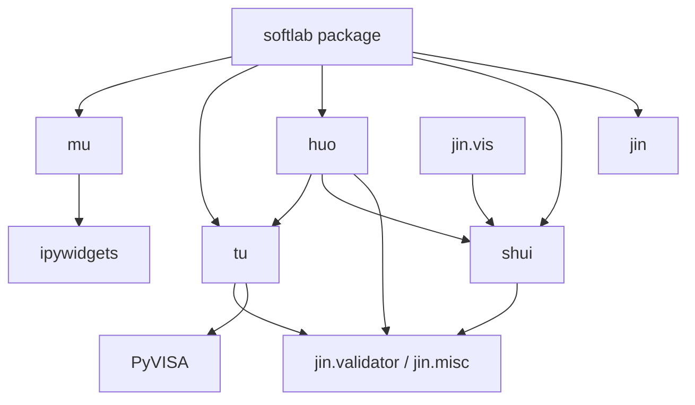
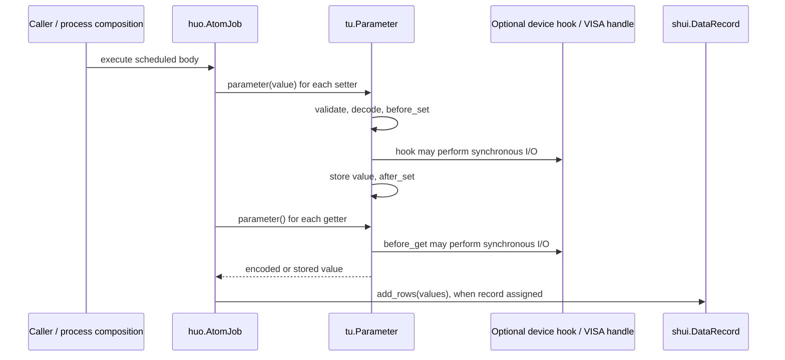

# softlab architecture

## Status and scope

This describes the implementation inspected on 2026-09-26, before the proposed
`tu` changes. softlab is a Python library inspired by QCoDeS, not a deployed
service. The domain goal is software-defined experimentation across laboratories;
the current extensible primitives do not establish support for every domain.
No future contract below is claimed to exist. Workflow policy lives in
[principles.md](principles.md) and [AGENTS.md](AGENTS.md).

## Existing module boundaries

| Context | Responsibility and implemented entry points |
| --- | --- |
| `jin` (metal) | Validators, delegated/limited attributes, signal processing and visualization. `dp` is a placeholder. |
| `mu` (wood) | Applications/services boundary. Current implementations are notebook interaction and file selection; `cli`, `server`, `services` are placeholders. |
| `shui` (water) | `DatabaseBackend`, data charts/records/groups, HDF5 and SQLite persistence, memory/JSON profiles. |
| `huo` (fire) | Asyncio scheduler, `Process`, serial/parallel/branch/sweep composition, count/scan/grid scan. |
| `tu` (earth) | Experimental objects: parameters, devices, stations, VISA access, theoretical models and ndarray mappings. |

These are responsibility boundaries, not independently deployed bounded contexts.
Do not impose repositories, service frameworks or new aggregate layers merely to
match a pattern. Existing data backends are the persistence extension boundary.

### Static dependency view

Arrows mean selected existing imports, not a proposed strict layering. Package
initializers re-export APIs; the top-level initializer eagerly imports all five
modules. In particular, visualization already couples `jin` back to `shui`.

Evidence: [package initialization](softlab/__init__.py),
[common processes](softlab/huo/process/common.py),
[plotting](softlab/jin/vis/plot.py), [data](softlab/shui/data/base.py),
[notebooks](softlab/mu/notebooks/).

## Existing `tu` contracts and extension points

### Parameters

[Parameter](softlab/tu/station/parameter.py) represents a degree of freedom,
measurement or analysis result. Values may be arbitrary Python objects. Calling
with no arguments gets; calling with arguments sets using the first argument.

Setting checks permission, validates the caller's value, decodes it, calls
`before_set(old, new)`, stores it, then calls `after_set(new)`. Getting checks
permission, updates stored state through `before_get`, then encodes the returned
value. `init_value` can invoke setting hooks. These orders and value boundaries
are compatibility contracts. `QuantizedParameter` specializes representation;
`ProxyParameter` forwards reads/writes to another parameter.

The current base `snapshot()` describes access and identity without reading the
value; its `type` field is a Python class, not JSON data. Subclasses can override
it. A portable description must not silently change these existing snapshots or
restrict allowed parameter values to JSON.

### Devices and stations

[Device](softlab/tu/station/device.py) composes parameters and child devices.
`Delegated` enables attribute access; `parameter()` supports dotted child paths.
Addition/removal maintains parameter owners and child parents. Names are mutable,
so container lookup keys must not be assumed to be immutable global identities.
`set_parameters()` performs sequential calls and has no rollback transaction.

`DeviceBuilder.build()` and its model-keyed global registry construct specialized
devices. [Station](softlab/tu/station/station.py) groups devices, supports builders,
and recursively snapshots the setup. A global default station is replaceable.
Neither base class defines a connection/readiness/close protocol or resource
ownership rules. Removing an object is not a documented resource-release action.

### VISA

[VisaHandle](softlab/tu/station/visa.py) opens a message-based resource during
construction, optionally clears it, and exposes synchronous I/O. It is a handle,
not a `Device` subclass. Its timeout property directly forwards to the resource;
the documented unit and underlying unit must be characterized before any change.
Construction timing, defaults and exception propagation are compatibility-sensitive.

`VisaParameter` uses hooks for formatted writes and queries, including optional
pre/post commands. An empty get command uses stored state. `VisaCommand` is a
read-only parameter whose get hook **writes a command**. `VisaIDN` parses identity
responses. Thus parameter reads can have physical side effects. An explicit
command API must initially coexist with this established invocation path.

### Theory

[TheoryModel](softlab/tu/theory/model.py) delegates validated attributes through
`LimitedAttribute`; subclasses implement feature calculations and mapping
selection. Its `features` property currently catches failures and returns `{}`.
An explicit failure path would be an addition; silently changing that property
would change observable behavior.

[Mapping](softlab/tu/theory/mapping.py) accepts exactly one ndarray with a declared
input shape and validates the ndarray output shape. It already has arbitrary
metadata. `batch_mapping` partitions arrays according to mapping shapes. Preserve
this numerical specialization and its validation; do not replace it with an
unmotivated general data framework.

Public import paths are aggregated in [station](softlab/tu/station/__init__.py)
and [theory](softlab/tu/theory/__init__.py). New exports require circular-import
checks as well as direct-module tests.

### TU-001 characterization status (existing behavior and planned decisions)

The [compatibility matrix](log/release_1/compatibility.md) and
`tests/test_tu_contracts.py` characterize value calls, hook order, snapshots,
composition, builders, VISA side effects, theory fallbacks and mapping shapes
without production changes. The tests establish observed behavior; they do not
turn every observation into a desired long-term contract. Six observations need
explicit later decisions before Release 1 acceptance:

| Observation | Existing finding | Planned disposition |
| --- | --- | --- |
| OBS-001 | VISA timeout docstrings say seconds; values forward unchanged to PyVISA. | TU-006 documents compatible units and defaults before any conversion decision. |
| OBS-002 | `write_raw` delegates to resource `write`. | TU-006 reproduces and resolves with a focused regression. |
| OBS-003 | VISA resource acquisition has no cleanup guard for later initialization failures; manager ownership is unspecified. | TU-004 defines optional ownership/lifecycle; TU-006 applies it to VISA. |
| OBS-004 | Quantized/VISA subclass fields are initialized after base initialization may invoke set hooks. | TU-005/TU-006 reproduce non-None initialization and decide compatible correction. |
| OBS-005 | `TheoryModel.features` returns `{}` on evaluation exceptions. | TU-007 adds an opt-in strict path while preserving the legacy fallback. |
| OBS-006 | Delegated names can collide with methods; longer parent cycles lack coverage. | TU-004 evaluates explicit lookup and cycle policy without assuming new guarantees. |

These are tracked design decisions and possible defects, not closed issues.
`tu` owns device and model contracts; `huo` remains responsible for scheduling,
`shui` for persistence, and `mu` for application services. The TU-001 tests do
not establish hardware, concurrency, exhaustive failure or new lifecycle
behavior.

## Existing execution interaction

The simplified sequence below describes `AtomJob.body()` in a normal non-dry run.
Setters/getters are supplied parameter objects; a station is not required.
Persistence is a separate caller action, not automatic in `AtomJob`.

Async delays surround synchronous parameter calls. Driver blocking/timeout
contracts belong in `tu`; execution pools, scheduling and run cancellation belong
in `huo`. Physical abort support cannot be inferred from coroutine cancellation.

## Dependencies and verification boundaries

[pyproject.toml](pyproject.toml) declares Python >=3.9 and setuptools packaging.
The repository uses a local Python 3.13 environment; declarations are not proof
of tested version coverage. Existing dependencies have these purposes:

| Dependency | Existing role / reason for retention |
| --- | --- |
| NumPy, pandas | Numerical arrays, records and data manipulation. |
| Matplotlib, imageio | Plotting and image/chart handling. |
| PyVISA | Instrument resource integration. |
| h5py | HDF5 persistence. |
| ipywidgets | Notebook controls. |
| SciPy, Plotly | Declared scientific/visualization dependencies; this inspection does not establish that every dependency is necessary for runtime imports. Audit separately before removing them. |
| JupyterLab, nest_asyncio, pyvisa-sim (optional) | Notebook execution and simulated VISA validation. |

No new runtime dependency is proposed by workflow preparation. Existing SQLite
storage is not being redesigned or asserted to satisfy a new normalization gate.

[Compatibility tests](tests/test_compatibility.py) exercise selected quantization,
process, data round-trip and VISA simulation paths. They do not by themselves
prove lifecycle, command-side-effect, all hook-order, or theory compatibility.
Actual baseline results belong in `log/release_0/`; this architecture inspection
is source verification, not a test execution or hardware qualification.

## Proposed evolution (not implemented or authorized)

The [ordered backlog](log/release_0/tasks.md) starts with characterization of
existing behavior. Subsequent proposals are additive portable descriptions,
explicit commands, optional lifecycle/capabilities, measurement metadata/results,
driver operation contracts and model descriptions/strict evaluation. Preserve
value-only calls, lightweight virtual devices, snapshots, fixed-shape mappings
and public imports unless a separately approved migration explicitly changes them.
Run services, persistence policy, calibration workflows, schedulers and remote
applications remain outside this `tu` scope.
