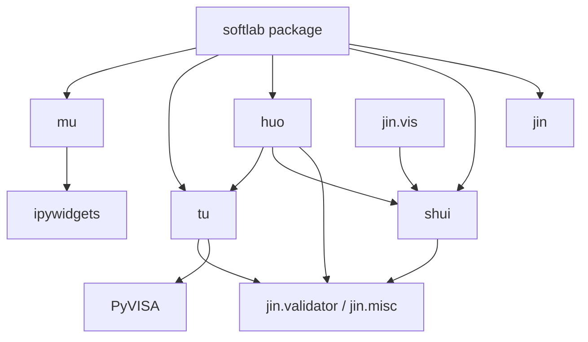
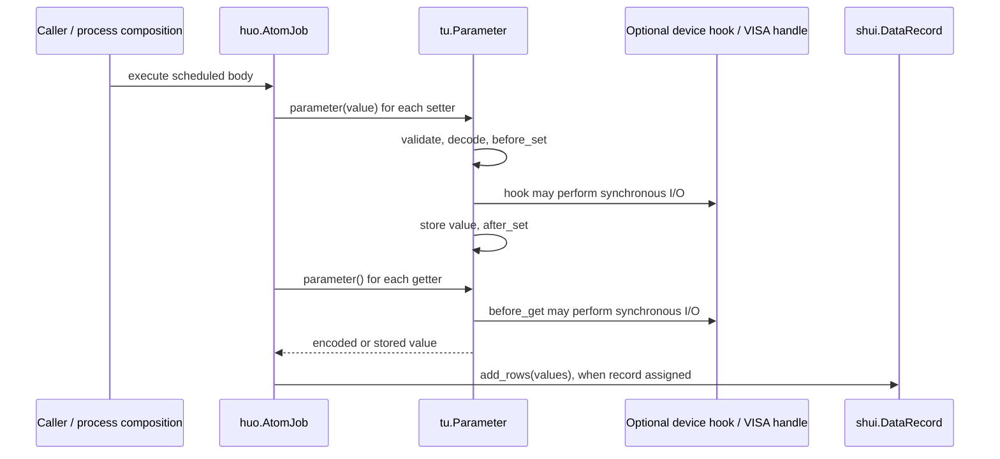

# softlab architecture

## Status and scope

This describes the implemented state at the Release 1 integration point
(2026-10-01, softlab 0.3.0, `dev` tip `e2d31ce`; TU-001–TU-008 integrated,
full suite 99 tests green). softlab is a Python library inspired by QCoDeS,
not a deployed service. The domain goal is software-defined experimentation
across laboratories; the current extensible primitives do not establish
support for every domain. Sections marked **[PLANNED]** describe future work,
not implemented capability. Workflow policy lives in
[principles.md](principles.md) and [AGENTS.md](AGENTS.md). The user-facing
description of the Release 1 additions is
[docs/tu_extensions.md](docs/tu_extensions.md).

## Existing module boundaries

| Context | Responsibility and implemented entry points |
| --- | --- |
| `jin` (metal) | Validators, delegated/limited attributes, signal processing and visualization. `dp` is a placeholder. |
| `mu` (wood) | Applications/services boundary. Current implementations are notebook interaction and file selection; `cli`, `server`, `services` are placeholders. |
| `shui` (water) | `DatabaseBackend`, data charts/records/groups, HDF5 and SQLite persistence, memory/JSON profiles. |
| `huo` (fire) | Asyncio scheduler, `Process`, serial/parallel/branch/sweep composition, count/scan/grid scan. |
| `tu` (earth) | Experimental objects: parameters, devices, stations, VISA access, theoretical models and ndarray mappings; Release 1 adds versioned descriptions, an opt-in device/VISA lifecycle, an explicit VISA operation path, measurement readings and model inspection/configuration (all additive and opt-in). |

These are responsibility boundaries, not independently deployed bounded contexts.
Do not impose repositories, service frameworks or new aggregate layers merely to
match a pattern. Existing data backends are the persistence extension boundary.

### Static dependency view

Arrows mean selected existing imports, not a proposed strict layering. Package
initializers re-export APIs; the top-level initializer eagerly imports all five
modules. In particular, visualization already couples `jin` back to `shui`.

Evidence: [package initialization](softlab/__init__.py),
[common processes](softlab/huo/process/common.py),
[plotting](softlab/jin/vis/plot.py), [data](softlab/shui/data/base.py),
[notebooks](softlab/mu/notebooks/).

## Existing `tu` contracts and extension points

### Parameters

[Parameter](softlab/tu/station/parameter.py) represents a degree of freedom,
measurement or analysis result. Values may be arbitrary Python objects. Calling
with no arguments gets; calling with arguments sets using the first argument.

Setting checks permission, validates the caller's value, decodes it, calls
`before_set(old, new)`, stores it, then calls `after_set(new)`. Getting checks
permission, updates stored state through `before_get`, then encodes the returned
value. `init_value` can invoke setting hooks. These orders and value boundaries
are compatibility contracts. `QuantizedParameter` specializes representation;
`ProxyParameter` forwards reads/writes to another parameter.

The base `snapshot()` describes access and identity without reading the
value; its `type` field is a Python class, not JSON data. Subclasses can
override it. Portable descriptions added by Release 1 (`describe()`) do not
change these existing snapshots and do not restrict allowed parameter values
to JSON.

**Measurement contract (TU-002/TU-005, implemented).** `describe(metadata)`
returns a fresh JSON-compatible description under the `schema_version` 1
namespace (`name`, `type` as a module-qualified string, validated/copied
`metadata`, `settable`, `gettable`); it never reads the value, never calls a
validator/codec/hook and performs no I/O. Metadata is restricted to exact
built-in dict/list/str/int/float/bool/None with str keys and finite floats
(`TypeError` for unsupported types/keys, `ValueError` for nonfinite floats or
self-referential containers). Six optional constructor keywords (`unit`,
`value_type`, `shape`, `channel`, `uncertainty`, `calibration`) declare
metadata stored verbatim. `read()` returns a frozen `Reading` dataclass
(`value`, `acquired_at`, `quality` with the closed vocabulary
`{'ok', 'failed'}`, `error`, plus echoed `uncertainty`/`calibration`); it
acquires through the identical chain as `get()`. `describe_reading()` returns
the `schema_version` 1 description of the reading declarations without
acquiring. **Error-identity policy (Release 1-wide):** failures propagate the
original exception object unchanged — `Reading.error` holds the identical
raised object, never wrapped. Legacy `()`/`get()` value-only semantics are
unchanged.

### Devices and stations

[Device](softlab/tu/station/device.py) composes parameters and child devices.
`Delegated` enables attribute access; `parameter()` supports dotted child paths.
Addition/removal maintains parameter owners and child parents. Names are mutable,
so container lookup keys must not be assumed to be immutable global identities.
`set_parameters()` performs sequential calls and has no rollback transaction.

`DeviceBuilder.build()` and its model-keyed global registry construct specialized
devices. [Station](softlab/tu/station/station.py) groups devices, supports builders,
and recursively snapshots the setup. A global default station is replaceable.

**Description surface (TU-002, implemented).** `Device.describe()` and
`Station.describe()` return `schema_version` 1 JSON-compatible aggregate
descriptions (`parameters`/`children` maps on devices, a `devices` map on
stations, keyed by lookup key). The built-in traversal never invokes subclass
`describe()` overrides, performs no device I/O and never opens a connection; a
device active on its own ancestry raises `ValueError`.

**Lifecycle contract (TU-004, implemented).** `Device` exposes
`prepare()`/`cleanup()`/`initialized`/`supports(capability)`. `prepare()` runs
the subclass hook `_prepare_impl()` once and marks the device initialized; on an
already-initialized device it is a no-op. `cleanup()` runs `_cleanup_impl()`
exactly once per acquisition attempt; repeated calls are safe no-ops, and
borrowed resources held by a device that never attempted acquisition are never
touched. `supports()` is side-effect-free: the base answers `True` for
`'prepare'`/`'cleanup'` and `False` for anything else. The contract is
single-threaded — no locking or cross-thread atomicity is claimed. After a
failed `prepare()`, `cleanup()` must be called before re-preparing. Virtual
devices need no connection operations: the plain base `Device` performs zero
I/O. Removing an object from a container remains a bookkeeping action, not a
resource-release action.

### VISA

[VisaHandle](softlab/tu/station/visa.py) opens a message-based resource during
construction, optionally clears it, and exposes synchronous I/O. It is a handle,
not a `Device` subclass. Construction timing, defaults and exception propagation
remain compatibility-sensitive.

**VISA lifecycle and timeout contract (TU-006, implemented).** `VisaHandle`
adopts the TU-004 lifecycle shape: `_acquire()` is the single acquisition site;
any post-acquisition failure closes the acquired resource exactly once and
propagates the original exception object (OBS-003 closed). The resource manager
is retained for the handle's lifetime; there is no manager-close API.
`prepare()` re-opens through the retained manager and re-applies the full
construction configuration; a cleaned-up borrowed handle raises `RuntimeError`
on re-open. `cleanup()` releases an owned resource exactly once; `close()` is an
alias of `cleanup()`. Two timeout surfaces coexist: the raw `timeout` property
forwards values to PyVISA unchanged and never rescales, while
`timeout_seconds` converts in both directions (`None` disables); default
construction forwards 5000 ms (OBS-001 resolved — the seconds-based property is
the documented unit surface). `write_raw` routes to `resource.write_raw` with
the identical bytes object, forwarded return and preserved error identity
(OBS-002 fixed).

**Abort surface (TU-006, implemented).** `abort()` is bookkeeping only — no I/O,
no waiting, no operation lock — and returns an advisory `AbortReport`
(`aborted`, `stopped`); `stopped` is always `False` there because an abort
request never claims the equipment stopped. `confirm_stop()` is the
device-confirmed stop path: one `*OPC?` query per call under the serialization
guard; only an exact `'1'` confirms, and the `stopped` latch holds until
`cleanup()` resets it. Cancelling software is never claimed to stop equipment.

`VisaParameter` uses hooks for formatted writes and queries, including optional
pre/post commands. An empty get command uses stored state. `VisaCommand` is a
read-only parameter whose get hook **writes a command**; that legacy invocation
path executes exactly once per get and remains unchanged.
`VisaCommand.execute()` (TU-003, implemented) is the explicit operation path,
with the handle's serialization guard and identical-object error propagation;
`describe_operation()` returns a `schema_version` 1 description of the
operation's side-effect semantics and executes nothing. `VisaIDN` parses
identity responses. Parameter reads can therefore still have physical side
effects; the explicit operation API coexists with the established invocation
path.

### Theory

[TheoryModel](softlab/tu/theory/model.py) delegates validated attributes through
`LimitedAttribute`; subclasses implement feature calculations and mapping
selection. Its legacy `features` property catches failures and returns `{}`;
that path is deliberately preserved unchanged.

**Model inspection/configuration contract (TU-007, implemented).**
`describe()` returns a `schema_version` 1 semantic description (`name`, model
kind, per-attribute semantic descriptions) and performs no evaluation.
`supported_configuration()` lists the registered attribute keys in registration
order; `configuration()` returns the current values as a fresh dict,
JSON-serializable exactly when the attribute values are (ndarray values are the
model author's responsibility); `configure()` applies a mapping in three phases
— non-mapping `TypeError`, unknown-key `KeyError`, per-value pre-validation —
with no partial application on rejection. `evaluate_features(strict=False)`
calls `calculate_features()` directly: lenient mode returns `{}` on any
`Exception` (process-control `BaseException`s propagate), while `strict=True`
re-raises the original exception object — the opt-in explicit failure path that
leaves the legacy fallback untouched.

[Mapping](softlab/tu/theory/mapping.py) accepts exactly one ndarray with a declared
input shape and validates the ndarray output shape. It already has arbitrary
metadata. `batch_mapping` partitions arrays according to mapping shapes. Preserve
this numerical specialization and its validation; do not replace it with an
unmotivated general data framework.

Public import paths are aggregated in [station](softlab/tu/station/__init__.py)
and [theory](softlab/tu/theory/__init__.py). New exports require circular-import
checks as well as direct-module tests.

### TU-001 characterization and Release 1 observation dispositions

The [compatibility matrix](log/release_1/compatibility.md) and
`tests/test_tu_contracts.py` characterize value calls, hook order, snapshots,
composition, builders, VISA side effects, theory fallbacks and mapping shapes.
They remain the regression baseline; the Release 1 extensions were verified
against them. The six observations reached these final dispositions (full
wording and evidence in `log/release_1/compatibility.md`; user-facing
workarounds in `docs/tu_extensions.md` §8):

| Observation | Finding | Final disposition |
| --- | --- | --- |
| OBS-001 | VISA timeout docstrings said seconds; values forwarded unchanged to PyVISA. | **Resolved (TU-006):** `timeout_seconds` is the seconds-based surface converting in both directions; raw `timeout` is never rescaled; default construction forwards 5000 ms. |
| OBS-002 | `write_raw` delegated to resource `write`. | **Fixed (TU-006):** routes to `resource.write_raw` with identical bytes, forwarded return, preserved error identity. |
| OBS-003 | No cleanup guard for post-acquisition initialization failures; manager ownership unspecified. | **Closed (TU-006):** `_acquire()` is the single acquisition site; failure closes the resource exactly once with the original exception propagated; the manager is retained for the handle's lifetime. |
| OBS-004 | Quantized/VISA subclass fields are initialized after base initialization may invoke set hooks. | **Known limitation:** a non-None settable `init_value` on `QuantizedParameter`/`VisaParameter` can fail; avoid it. Not corrected in Release 1. |
| OBS-005 | `TheoryModel.features` returns `{}` on evaluation exceptions. | **Known limitation by design:** the legacy fallback is preserved; the opt-in `evaluate_features(strict=True)` path re-raises the original error object. |
| OBS-006 | Delegated names can collide with methods; longer parent cycles lack coverage. | **Known limitation:** explicit `_attributes`/`device()` lookup remains the escape hatch for colliding names; the TU-002 traversal rejects a device active on its own ancestry (`ValueError`). |

Additionally **DEFECT-2** is a recorded known limitation: constructing a
`Parameter` that is neither settable nor gettable emits a deliberate,
documented programmer-error warning; it is not silenced.

Resolved items are closed; the open items above are technical debt, not desired
long-term contracts.
`tu` owns device and model contracts; `huo` remains responsible for scheduling,
`shui` for persistence, and `mu` for application services. Hardware,
concurrency and exhaustive driver-failure behavior remain unverified claims.

## Existing execution interaction

The simplified sequence below describes `AtomJob.body()` in a normal non-dry run.
Setters/getters are supplied parameter objects; a station is not required.
Persistence is a separate caller action, not automatic in `AtomJob`.

Async delays surround synchronous parameter calls. Driver blocking/timeout
contracts belong in `tu`; execution pools, scheduling and run cancellation belong
in `huo`. Physical abort support cannot be inferred from coroutine cancellation.

## Dependencies and verification boundaries

[pyproject.toml](pyproject.toml) declares Python >=3.9 and setuptools packaging.
The repository uses a local Python 3.13 environment; declarations are not proof
of tested version coverage. Existing dependencies have these purposes:

| Dependency | Existing role / reason for retention |
| --- | --- |
| NumPy, pandas | Numerical arrays, records and data manipulation. |
| Matplotlib, imageio | Plotting and image/chart handling. |
| PyVISA | Instrument resource integration. |
| h5py | HDF5 persistence. |
| ipywidgets | Notebook controls. |
| SciPy, Plotly | Declared scientific/visualization dependencies; this inspection does not establish that every dependency is necessary for runtime imports. Audit separately before removing them. |
| JupyterLab, nest_asyncio, pyvisa-sim (optional) | Notebook execution and simulated VISA validation. |

No new runtime dependency was added by Release 1. Existing SQLite
storage is not being redesigned or asserted to satisfy a new normalization gate.

[Compatibility tests](tests/test_compatibility.py) exercise selected quantization,
process, data round-trip and VISA simulation paths. Release 1 added the focused
suites `tests/test_tu_contracts.py` (characterization baseline),
`tests/test_tu_descriptions.py`, `tests/test_tu_operations.py`,
`tests/test_tu_lifecycle.py`, `tests/test_tu_measurements.py`,
`tests/test_tu_visa_contracts.py`, `tests/test_tu_theory.py` and
`tests/test_tu_integration.py`; the integrated suite is 99 tests, green on
`dev` at `e2d31ce` with zero warnings under `-W error` (evidence in
`log/release_1/tests/`). They do not by themselves
prove hardware behavior, concurrency or exhaustive driver failures.
Actual baseline results belong in `log/release_0/`; this architecture inspection
is source verification, not a test execution or hardware qualification.

## Release 1 implemented scope and remaining future work

The [Release 1 requirements](log/release_1/prd.md) are implemented: TU-001
characterized existing behavior; TU-002–TU-007 added the compatible,
opt-in contracts described above (versioned `schema_version` 1 descriptions,
the device/VISA lifecycle, the explicit VISA operation path, measurement
readings and model inspection/configuration); TU-008 shipped the user guide
[docs/tu_extensions.md](docs/tu_extensions.md), fixed DEFECT-1 (raw-string
regex literals in two `__main__` example blocks, zero behavior change) and
recorded the regression/compile/import and package-artifact verification.
Value-only calls, lightweight virtual devices, snapshots, fixed-shape mappings
and public imports are preserved; the release is migration-free for callers
that use none of the new APIs.

**[PLANNED — not implemented]** Run services, persistence policy, calibration
workflows, schedulers and remote applications remain outside this `tu` scope
and are future work. The known limitations OBS-004, OBS-005, OBS-006 and
DEFECT-2 (table above) are recorded technical debt; correcting them is future
work requiring its own approved change, not a silent follow-up.
