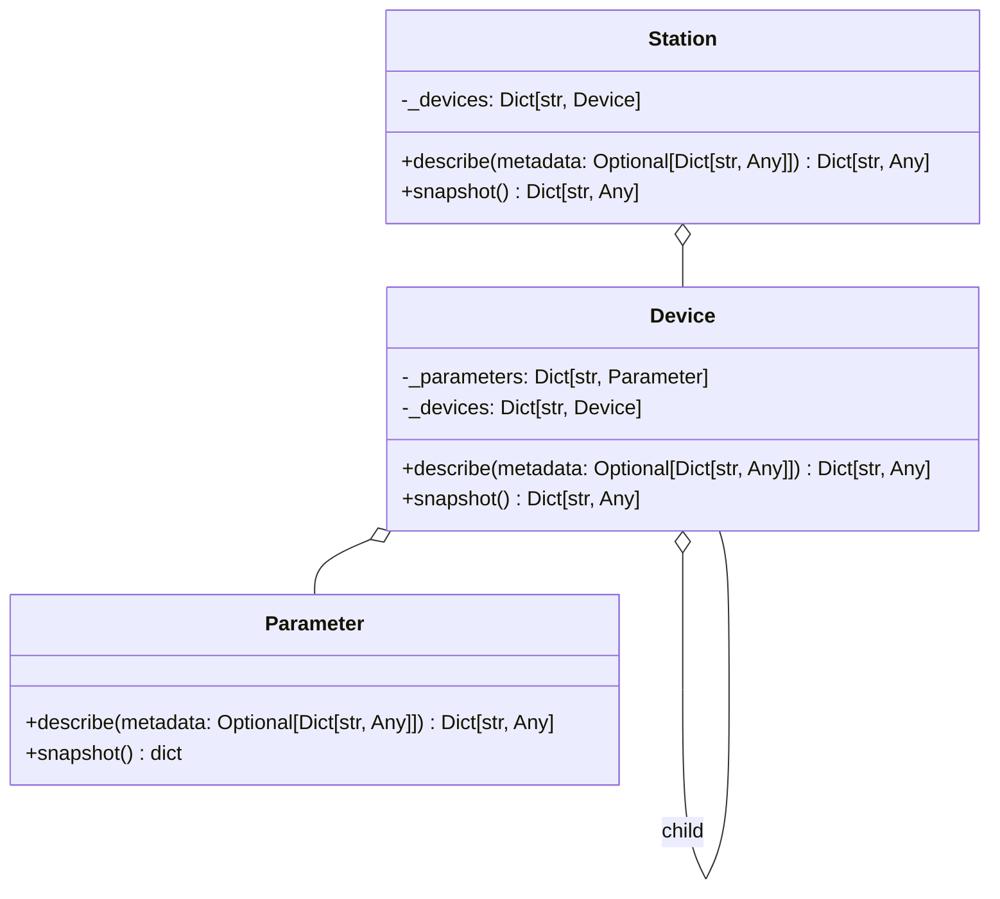
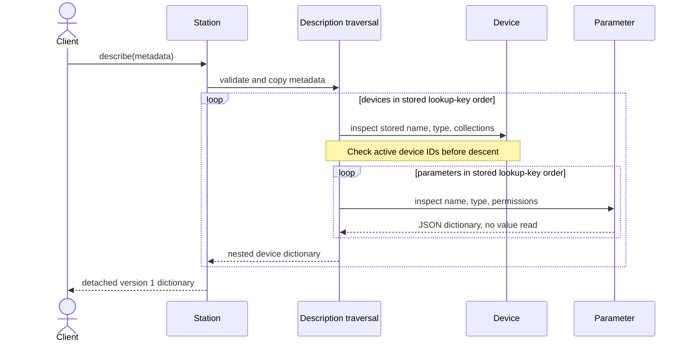

# TU-002 detailed design: portable setup descriptions

Designer: sw-celeste. Input: Release 1 PRD, TU-001 compatibility matrix,
TU-002 approved test cases, and current `tu.station` sources. Status: proposed
for architecture review; no production implementation exists at this gate.

## Intent and compatibility

Add `describe(metadata=None)` to `Parameter`, `Device`, and `Station`. Each call
builds a fresh, versioned, JSON-compatible dictionary describing structure and
permissions. It never calls `get`, `set`, `snapshot`, a validator, a codec, a
hook, or a VISA handle. Existing constructors, values, `snapshot()` shapes,
imports, and nested lookup behavior remain unchanged. A description contains
no runtime parameter value, cached value, validator representation, resource
address, command string, owner object, or station creation time. The last three
may have privacy or side-effect implications and are unnecessary for TU-002.
TU-003 and TU-005 may add explicitly reviewed fields in later schema versions;
they must not silently reinterpret version 1.

The existing dictionaries `_parameters`, `_devices`, and station `_devices`
provide the hierarchy. Serialize each dictionary's **lookup key** as the JSON
object key, and the contained object's current `name` separately. Thus a
parameter renamed after insertion remains at its working lookup path. Preserve
dictionary iteration order for predictable Python output; JSON consumers must
identify entries by keys because object-member order has no semantic meaning.

## Public surface and data contract

```python
Parameter.describe(metadata: Optional[Dict[str, Any]] = None) -> Dict[str, Any]
Device.describe(metadata: Optional[Dict[str, Any]] = None) -> Dict[str, Any]
Station.describe(metadata: Optional[Dict[str, Any]] = None) -> Dict[str, Any]
```

`metadata=None` means an empty metadata object. Explicit metadata applies only
to the object on which `describe` is called; descendants receive empty metadata.
All returned nodes include `schema_version: 1`, `name`, `type`, and `metadata`.
`type` is `type(obj).__module__ + "." + type(obj).__qualname__`, a descriptive
string, not an import/reconstruction instruction or a stable global ID. The
remaining fields by node are:

| Node | Fields beyond common fields |
| --- | --- |
| `Parameter` and subclasses | `settable: bool`, `gettable: bool` |
| `Device` and subclasses | `parameters: {lookup_key: parameter_description}`, `children: {lookup_key: device_description}` |
| `Station` and subclasses | `devices: {lookup_key: device_description}` |

Example: `{"schema_version": 1, "name": "reading", "type":
"softlab.tu.station.parameter.Parameter", "metadata": {}, "settable":
false, "gettable": true}`. `json.dumps(result, allow_nan=False)` must work.
There is no dependency on a new schema package. This dictionary is an
inspection result, not a persistence or deserialization format.

### Metadata validation and isolation

Accept an exact built-in `dict` at the top level and recursively accept exact
built-in `dict`, `list`, `str`, `int`, `float`, `bool`, and `None` values. Dictionary
keys must be exact `str`. Reject arbitrary objects, tuples, NumPy values,
non-string keys, and `NaN`/positive or negative infinity; never call their
`str`, `repr`, or JSON fallback encoder. Preserve unknown string keys under
`metadata`, with no reserved subkeys. Recursively copy accepted containers so
the returned description cannot mutate the caller's metadata. Shared but
acyclic metadata containers are copied at each occurrence; self-referential
metadata raises `ValueError`. Unsupported types and keys raise `TypeError`;
nonfinite floats raise `ValueError`. Errors identify the metadata path using
safe key/index text, without formatting unsupported values.

The validation order checks `bool` before `int`, because `bool` subclasses
`int`. It checks finite floats with `math.isfinite`; strings and integer values
are copied as immutable scalars. There is no call to a user object's conversion
method. Construction fails without publishing a partial description.

### Hierarchy and cycles

The current `Device.add_child` permits an indirect cycle. Description traversal
tracks object identities on the **active ancestry path**. Revisiting an active
device raises `ValueError` with the lookup path, before descending further.
Acyclic reuse of one object under distinct branches is allowed and yields two
independent descriptions. This policy makes `describe` terminate while leaving
the existing hierarchy mutation APIs and `snapshot()` behavior untouched.
Parameter nodes are leaves. Metadata recursion has its own active-path set.

## Static view



One private module-local helper can validate/copy metadata; one private
description traversal helper can handle device ancestry. These helpers are
implementation details, not new public interfaces. Base descriptions use
stored fields directly and do not dispatch through subclass `snapshot()`.
Subclasses inherit a valid minimal description; a subclass may override
`describe()` to provide additional behavior, but it is responsible for the
versioned JSON and no-I/O contracts. Version 1 does not auto-discover subclass
attributes or call arbitrary extension hooks.

## Dynamic view and algorithm



Pseudocode: validate/copy root metadata; create root scalar fields; for each
stored collection entry, copy its lookup key and recursively construct the
child node with empty metadata; add/remove device identity on entry/exit of
that recursion; raise on an active identity. Do not consult delegated attribute
lookup, which can collide with methods. Work is linear in the number of
emitted nodes and metadata elements, `O(N + M)`; recursion depth and active
set use `O(H)` space, plus `O(N + M)` output. Very deep acyclic graphs may reach
Python's recursion limit, matching ordinary recursive traversal limitations.

## Verification and dependencies

Existing eight TU-002 cases cover version/JSON output, no hook/snapshot/VISA
I/O, opaque values, renamed lookup keys, recursive station output, metadata
copying, and rejected metadata. Add focused cases before implementation for
cyclic metadata, indirect device cycles, and acyclic shared-device reuse; these
are observable decisions resolved here. Characterization and existing count,
scan, snapshot, and VISA tests must stay green. No runtime dependency, supported
Python change, hardware access, `huo` change, or `mu` service is needed.

| Dependency | Justification |
| --- | --- |
| Python standard library `math`, `typing` | Finite-number validation and public annotations. |
