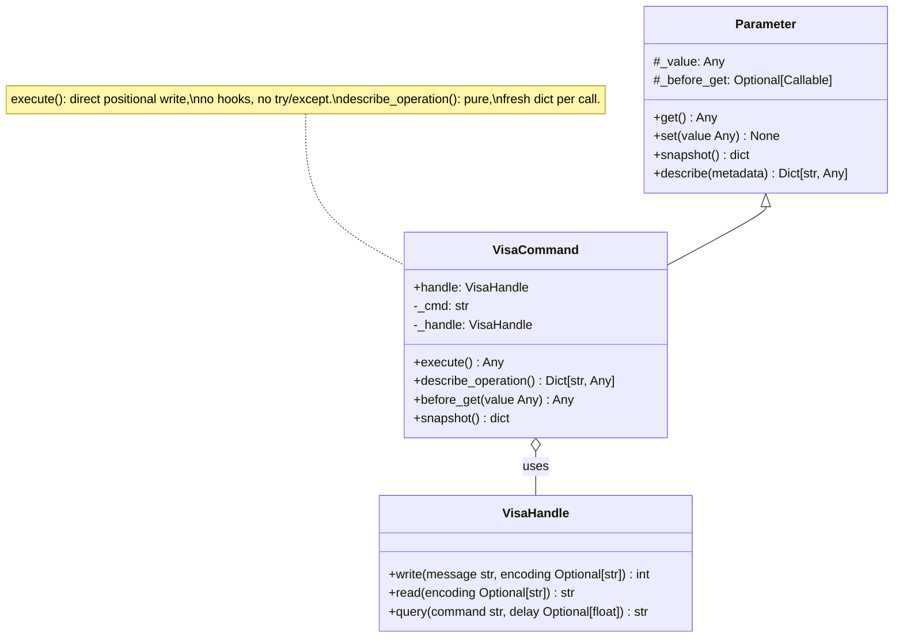
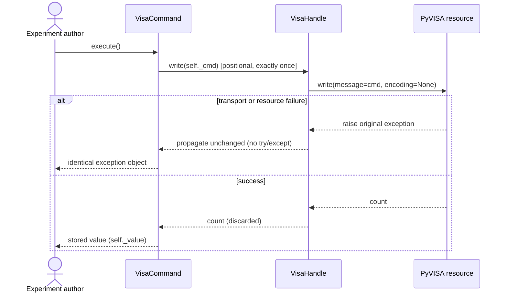
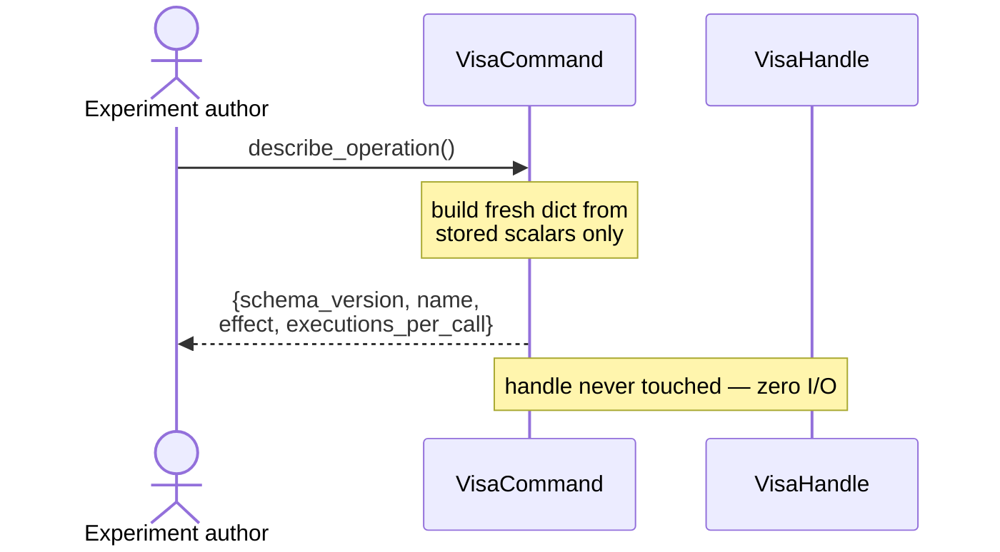

# TU-003 detailed design: explicit command operations

Designer: sw-celeste. Input: Release 1 PRD (TU-003 row), TU-003 approved test
contract (`log/release_1/tests/TU-003.md`), acceptance cases
(`tests/test_tu_operations.py`, six cases), TU-003 implementability review
(`log/release_1/tests/TU-003-implementability.md`, ACCEPTED with three
non-blocking observations), TU-002 detailed design (`log/release_1/design/TU-002.md`),
TU-001 compatibility matrix (`log/release_1/compatibility.md`), and current
`softlab/tu/station/visa.py` / `softlab/tu/station/parameter.py` sources.
Status: proposed for architecture review; no production implementation exists
at this gate.

## Intent and compatibility

Give experiment authors an **explicit** way to invoke a `VisaCommand` and a
pure way to discover its side-effect semantics, without touching the legacy
read-only `Parameter` invocation path. The change is confined to two new
public methods on the existing `VisaCommand` class in
`softlab/tu/station/visa.py`. No constructor, base-class, module-layout or
dependency changes; no other file is modified.

Compatibility invariants that this design must not disturb:

- `snapshot()` performs no device I/O and keeps its current shape (including
  the legacy `cmd` field, which TU-003 does not remove or reinterpret).
- `command()` and `command.get()` each route through `Parameter.get` →
  `before_get` and perform exactly one `handle.write` per call.
- Denied `set` (including `command(value)`) raises `RuntimeError` from
  `Parameter.set` before any hook runs — zero writes.
- TU-002 `describe()` (schema_version 1) stays byte-for-byte semantically
  unchanged: `VisaCommand` must **not** override `describe()` to add `cmd` or
  any other field. Version 1 is not reinterpreted; TU-003 information lives in
  a separate lookup (`describe_operation()`), never inside the TU-002 schema.

## Design decisions (implementability observations resolved)

The three non-blocking observations from the implementability review are
resolved as follows:

1. **Detached-copy guarantee.** `describe_operation()` builds and returns a
   **fresh dict literal on every call**. All four values are immutable
   scalars (`int`, `str`), so a fresh top-level dict is sufficient for full
   mutation independence — no copy helper is needed (simplicity check:
   adding one would be an abstraction that does not earn its keep). Because
   no current acceptance case asserts mutation independence, this design
   adds an explicit **note for the test phase**: sw-mike should extend the
   `describe_operation` case with a detachment assertion — mutate the
   returned dict (e.g. `info["effect"] = "mutated"`, `info["extra"] = 1`),
   call `describe_operation()` again, and assert the second result equals
   the original four-field dict. The design guarantees this passes; the
   assertion closes the gap between the gate record's word "detached" and
   the executable contract.
2. **Positional single write.** `execute()` performs exactly
   `self._handle.write(self._cmd)` — one positional argument, no keyword
   arguments, no `query`, no extra handle methods. This matches case 6's
   `handle.write.assert_called_once_with("*RST")` and, through the existing
   `VisaHandle.write` forwarding, case 1's
   `resource.write.assert_called_once_with(message="*RST", encoding=None)`.
3. **Direct write, not a `get()` alias.** `execute()` performs the write
   directly and never invokes `before_get`, `get()`, or `__call__`.
   Rationale: the explicit-path contract ("exactly one write, return stored
   value, propagate transport errors unchanged") must hold independently of
   overridable hooks. Aliasing `get()` would re-enter `before_get` — which
   a subclass may override — making the explicit path's side-effect count
   depend on hook behavior, and would make `execute()`'s error surface
   include hook exceptions rather than purely transport errors. Direct
   write keeps `execute()` decoupled from the legacy hook chain.

## Public surface and data contract

Two new public methods on `VisaCommand` only:

```python
VisaCommand.execute() -> Any
VisaCommand.describe_operation() -> Dict[str, Any]
```

### `execute()`

Explicit operation path. Semantics, in order:

1. Perform exactly one `self._handle.write(self._cmd)` (positional).
2. Return the stored value `self._value` verbatim.

Contract:

- **Per-call side effects**: exactly one command write per call, no reads,
  no other I/O. Two calls write exactly twice.
- **Return value**: the stored value. `VisaCommand` construction fixes
  `init_value=True`, `settable=False`, and `before_get` is identity on the
  value, so the stored value never changes after construction; the return is
  therefore stable (`True` for the standard configuration). No encoder or
  decoder is applied: an explicit command has no meaningful accessed value,
  and applying codecs would add surface without serving a requirement.
- **Error semantics — no wrapping**: `execute()` contains **no
  `try`/`except`**. Any exception raised by `handle.write` propagates as the
  identical exception object (case 5 asserts
  `assertIs(raised.exception, error)`).
  - Transport failure (e.g. `pyvisa.errors.VisaIOError`): the original
    exception object propagates unchanged, original cause preserved.
  - Unavailable resource: `VisaHandle.write` raises its
    `RuntimeError('Invalid visa resource')` after `execute()` has attempted
    exactly one write; that object propagates unchanged.
- **No permission check in `execute()`**: denied-set behavior is a legacy
  `Parameter.set` concern and is unaffected; `execute()` is always permitted
  on a `VisaCommand` because the command's whole purpose is to be executed.

### `describe_operation()`

Side-effect semantics lookup. Returns a fresh JSON-compatible dict:

| Field | Type | Value | Description |
| --- | --- | --- | --- |
| `schema_version` | `int` | `1` | Version of the operation-description schema (its own namespace, see below) |
| `name` | `str` | `self._name` | The command's parameter name |
| `effect` | `str` | `'write'` | The side-effect kind of one invocation; VISA commands always write |
| `executions_per_call` | `int` | `1` | Number of command writes performed by one `execute()` call |

Contract:

- **Zero I/O**: never touches `self._handle`, never calls `get`, `set`,
  `snapshot`, `describe`, a validator, a codec, or a hook. Case 2 asserts
  `self.resource.mock_calls == []`.
- **No secrets**: the dict never contains the command string (`self._cmd`),
  the resource address, or the handle. Only the four fields above exist.
- **Detached**: fresh dict per call; mutating a returned dict affects
  nothing (see decision 1).
- **JSON-compatible**: `json.dumps(result, allow_nan=False)` round-trips.

### Relationship to TU-002 `describe()`

`describe_operation()` is a **separate lookup with its own schema
namespace**. Its `schema_version: 1` versions the operation-description
schema, not the TU-002 structure-description schema; the two schemas evolve
independently and neither reinterprets the other. TU-002's `describe()`
answers "what is this object and what may I do with it?" (structure and
permissions); `describe_operation()` answers "what happens when I execute
this command?" (side-effect semantics). `VisaCommand` inherits TU-002
`describe()` unchanged and must not override it. A future schema bump of one
lookup does not imply a bump of the other.

## Static view



No new classes, no new module-level helpers, no new base class. The two
methods read existing stored fields (`self._handle`, `self._cmd`,
`self._name`, `self._value`) directly.

## Dynamic view

### `execute()`



### `describe_operation()`



## Algorithms

### `execute()`

- **Purpose**: perform the command's single write explicitly and report the
  stored value.
- **Pseudocode**:
  ```
  def execute(self):
      self._handle.write(self._cmd)   # exactly one positional write
      return self._value              # stored value, verbatim
  ```
- **Complexity**: O(1) besides the transport cost of one VISA write; O(1)
  space.
- **Edge cases**:
  - *Handle resource unavailable*: `VisaHandle.write` raises
    `RuntimeError('Invalid visa resource')`; propagates after exactly one
    attempted write (case 6).
  - *Transport error mid-write*: original exception object propagates; the
    stored value is not returned and not modified (case 5).
  - *Repeated calls*: each call writes exactly once; call count equals
    invocation count (case 1).

### `describe_operation()`

- **Purpose**: expose side-effect semantics without executing anything.
- **Pseudocode**:
  ```
  def describe_operation(self):
      return {
          'schema_version': 1,
          'name': self._name,
          'effect': 'write',
          'executions_per_call': 1,
      }
  ```
- **Complexity**: O(1) time and space; four-element fresh dict per call.
- **Edge cases**: none beyond construction-time invariants (`_name` is a
  validated non-empty string). Works identically on an unavailable resource
  because it never touches the handle.

## Docstring requirements

Both new public methods carry English docstrings in the surrounding repo
style (section headers `Args:`, `Returns:`, `Errors:`, `Side-effects:`), with
type annotations on the signatures:

- `execute() -> Any` — state that it writes the command to the device
  exactly once per call through the handle; `Returns:` the stored value;
  `Errors:` any exception raised by the handle's write (transport failures
  and unavailable-resource `RuntimeError`) propagates unchanged, with the
  original exception object preserved; `Side-effects:` exactly one command
  write per call, no reads.
- `describe_operation() -> Dict[str, Any]` — state that it returns a fresh,
  detached, JSON-compatible dict describing the operation's side-effect
  semantics (`schema_version`, `name`, `effect`, `executions_per_call`);
  `Returns:` the version-1 operation description; `Side-effects:` none —
  performs no device I/O and never includes the command string or resource
  address.

The `VisaCommand` class docstring gains one line under a `Public Methods:`
style note listing `execute` and `describe_operation`; no other docstrings
change.

## Verification and dependencies

Acceptance coverage: case 1 (explicit path, counts, return), case 2
(discovery without execution), cases 3–4 (legacy and TU-002 compatibility
guards), case 5 (denied set + identical-object transport error), case 6
(unavailable resource). Test-phase addition requested by this design:
mutation-independence assertion for `describe_operation()` (decision 1).
TU-001 baseline tests, TU-002 description tests, and the compatibility suite
must stay green; no CI/testing completion is claimed at this gate. No
hardware access (mocked PyVISA resource only).

Scope: changes are confined to `softlab/tu/station/visa.py`. No constructor,
import, or `__init__.py` export changes — both methods are instance methods
on an already-exported class.

| Dependency | Justification |
| --- | --- |
| Python standard library `typing` (`Any`, `Dict`) | Public signature annotations, already imported in `visa.py`. |

No new third-party module is introduced. The methods use only stored fields
and the existing `VisaHandle.write`; a description-schema package, copy
helpers, and error-wrapping utilities were considered and rejected as
unnecessary entities.

## Design review

- **Reviewer**: sw-jerry
- **Review date**: to be filled after review
- **Status**: PENDING
