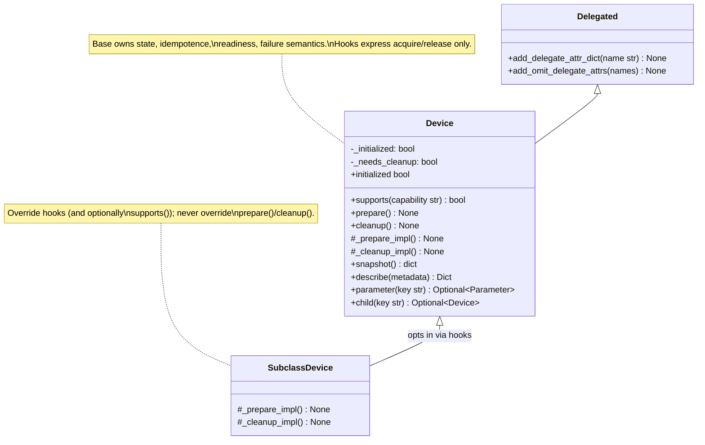
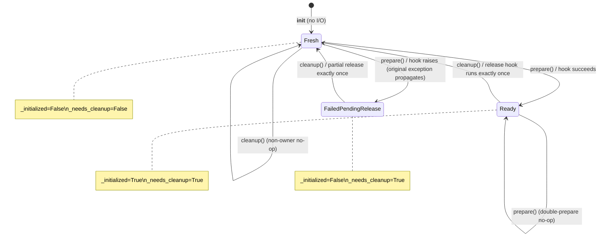
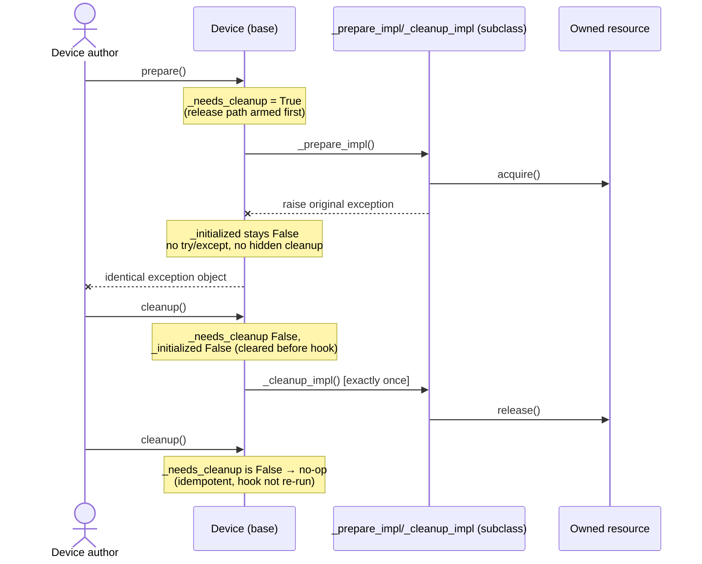
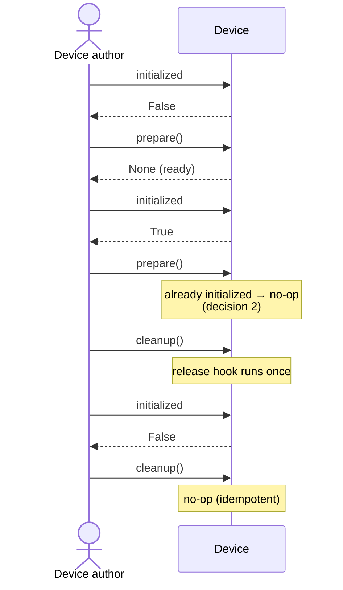

# TU-004 detailed design: opt-in device lifecycle and capabilities

Designer: sw-celeste. Input: Release 1 PRD (TU-004 row), TU-004 approved
test contract (`log/release_1/tests/TU-004.md`), acceptance cases
(`tests/test_tu_lifecycle.py`, nine cases), TU-004 implementability review
(`log/release_1/tests/TU-004-implementability.md`, ACCEPTED with four
non-blocking observation areas), TU-003 detailed design
(`log/release_1/design/TU-003.md`, structure precedent), TU-001
compatibility matrix (`log/release_1/compatibility.md`), and current
`softlab/tu/station/device.py` sources. Status: proposed for architecture
review; no production implementation exists at this gate.

## Intent and compatibility

Give device authors an **opt-in** lifecycle and capability contract on the
existing `Device` base class, so that virtual devices never perform
meaningless connection operations while real devices can express
preparation, readiness, capability detection and owned-resource release
with explicit failure and idempotence semantics.

The change is confined to additive members on `Device` in
`softlab/tu/station/device.py`: four public members (`supports`,
`prepare`, `initialized`, `cleanup`), two protected hooks
(`_prepare_impl`, `_cleanup_impl`), and two private state fields
initialized in `__init__`. No constructor-signature change, no new base
class, no new module, no `__init__.py` export change (`Device` is already
exported), no `Parameter`/`snapshot`/`describe`/`set_parameters` change,
and **no VISA change** — OBS-003 (eager-open lifecycle, failed-init
cleanup gap, resource-manager ownership) remains characterized legacy
behavior deferred to TU-006.

Verified grounding: there are **zero `Device` subclasses in production**
(implementability review §1), so the "subclass calls `super().__init__`"
assumption has no hidden consumer. Legacy subclasses that override nothing
remain virtual devices with unchanged behavior.

Compatibility invariants this design must not disturb (TU-001 matrix):

- Construction is pure container setup; a plain `Device` performs zero I/O
  at every point, including `prepare()` (case 1, case 9).
- Delegation (`Delegated.__getattr__`), nested lookup, parent/owner links,
  ordered batch setting, snapshot and `describe()` shapes are untouched.
- `VisaHandle`'s eager open/clear and direct error propagation are
  unchanged.

## Design decisions (implementability observations resolved)

The four non-blocking observation areas from the implementability review
are resolved as follows:

### 1. Failed-preparation partial release: LAZY, pinned

After `_prepare_impl()` raises, the base class does **not** invoke
`_cleanup_impl()` inside `prepare()`. The partial acquisition is released
by the **first subsequent `cleanup()` call**, exactly once; further
`cleanup()` calls are no-ops.

Rationale:

- **Single release site.** All release logic lives in `cleanup()`.
  Idempotence reasoning ("release at most once") has exactly one code
  path to audit, instead of two release sites that must be kept
  consistent (eager would release in `prepare()` and then require
  `cleanup()` to know the release already happened).
- **`prepare()` stays minimal.** It runs the subclass hook and manages
  readiness — nothing else. There is no hidden `try`/`except`/cleanup/
  re-raise chain, so exception identity propagation (case 6 asserts
  `assertIs(raised.exception, error)`) is structurally trivial: the hook
  exception simply propagates.
- **Symmetric ownership model.** A device that attempted acquisition is
  in the "release pending" state regardless of whether the attempt
  finished; `cleanup()` discharges that state. Borrowed resources held by
  a device that never attempted acquisition are never touched (case 8).

### 2. Double-prepare semantics: idempotent no-op while initialized

`prepare()` on an already-initialized device is a **no-op**: the hook is
not re-run, no exception is raised, readiness stays `True`. Rationale:
symmetry with idempotent `cleanup()`, and it prevents accidental
double-acquisition of an owned resource — the failure mode a device
author is most likely to hit. Re-preparation **after** `cleanup()` is
fully supported and runs the hook again: the lifecycle is a repeatable
cycle, not a one-shot.

### 3. Thread-safety: explicitly single-threaded

The lifecycle contract is **single-threaded**. `prepare()`, `cleanup()`,
`supports()` and `initialized` perform no locking and make no atomicity
guarantee across threads; concurrent calls are outside the contract. This
matches the TU-001 characterization that concurrency is unvalidated and
deferred: **TU-006 owns VISA concurrency**. Device authors needing
concurrent access must serialize externally. This is recorded in the
class docstring and the method docstrings, not enforced by code (adding
locks would be an entity without a necessity — no acceptance case
exercises concurrency).

### 4. Delegated-name collision (OBS-006 category): documented precedence

The four new public names (`supports`, `prepare`, `initialized`,
`cleanup`) are real methods/properties on `Device`, so normal attribute
lookup resolves them **before** `Delegated.__getattr__` fires. A
parameter or child named e.g. `"prepare"` would be shadowed for
attribute-style access. Resolution: **explicit lookup remains** —
`device.parameter("prepare")` and `device.child("prepare")` bypass
delegation entirely and keep working. This is the same disposition as
OBS-006 (`child`, `device`): the collision is documented in the new-API
docstrings rather than engineered around. No such names exist in the
repo today; no lookup-order change is made.

## Capability vocabulary and extension rule

`Device.supports(capability: str) -> bool` is explicit, side-effect-free
capability detection. Base-class results:

| Capability string | Base result | Meaning |
| --- | --- | --- |
| `'prepare'` | `True` | Device supports explicit preparation |
| `'cleanup'` | `True` | Device supports explicit cleanup |
| `'connection'` | `False` | Virtual device has no connection to open |
| any other string (including `''`) | `False` | Unknown capabilities are unsupported |

Detection is a pure string-membership test: it never performs I/O, never
touches a resource manager, and **never raises for unknown names**
(including the empty string — case 3).

**Extension rule for subclasses**: a subclass may override `supports()`
to advertise additional capabilities, with two mandatory constraints:

1. It must remain side-effect-free and must never raise for unknown
   capability strings — unknown names return `False`.
2. The recommended form is additive over the base result:
   `return capability in ('trigger',) or super().supports(capability)`.
   A subclass that drops `'prepare'`/`'cleanup'` from its result while
   still inheriting the base hooks would contradict its own behavior and
   is out of contract.

The vocabulary is string-based, not an enum: driver authors must be able
to describe optional behavior without a universal instrument hierarchy
(PRD goal), and an enum would force library releases for every new
capability name. Case-pinned literals are exactly the three above;
comparison is ordinary case-sensitive string equality.

## Public surface and state model

```python
Device.supports(capability: str) -> bool
Device.prepare() -> None
Device.initialized -> bool          # read-only property
Device.cleanup() -> None
Device._prepare_impl() -> None      # protected hook, base no-op
Device._cleanup_impl() -> None      # protected hook, base no-op
```

### State fields (private, initialized in `__init__`)

Two booleans are the entire lifecycle state. Nothing else is stored; no
resource references, no counters, no enum (simplicity check: a state
enum was considered and rejected — two booleans express all three
reachable states with less surface).

| Field | Type | Initial | Meaning |
| --- | --- | --- | --- |
| `_initialized` | `bool` | `False` | Readiness: `True` only between successful `prepare()` and the next `cleanup()` |
| `_needs_cleanup` | `bool` | `False` | Acquisition attempted: set when `_prepare_impl()` is entered, cleared when the release path discharges it |

State invariant: `_initialized ⇒ _needs_cleanup`. The reverse does not
hold — after a failed preparation `_needs_cleanup` is `True` while
`_initialized` is `False` (the partial-acquisition state).

| `_initialized` | `_needs_cleanup` | State |
| --- | --- | --- |
| `False` | `False` | Fresh / fully cleaned — non-owner, releases nothing |
| `False` | `True` | Failed preparation — partial acquisition pending release |
| `True` | `True` | Ready — owns acquired resources |
| `True` | `False` | **Unreachable** — invariant forbids it |

### `prepare()`

Explicit preparation. Semantics, in order:

1. If `_initialized` is `True`, return immediately (decision 2:
   double-prepare is a no-op).
2. Set `_needs_cleanup = True` — acquisition is about to be attempted, so
   the release path is armed **before** the hook runs. This is what makes
   the lazy partial-release guarantee (decision 1) hold for any hook
   that fails partway through.
3. Call `self._prepare_impl()`.
4. If the hook raises: `_initialized` stays `False`, `_needs_cleanup`
   stays `True`, and the **original exception object propagates
   unchanged** — no `try`/`except`, no wrapping, no chaining (case 6).
5. If the hook returns: set `_initialized = True`.

For the base virtual device, `_prepare_impl()` is a no-op, so `prepare()`
acquires and opens nothing: no resource manager, no connection, zero I/O
(case 1 asserts the PyVISA `ResourceManager` is never constructed).

### `initialized`

Read-only property returning `_initialized`. Readiness transitions:

- `False` on a freshly constructed device.
- `False → True` only on successful `prepare()`.
- `True → False` on `cleanup()` of an initialized device.
- Stays `False` through a failed `prepare()` (cases 2, 6).

### `cleanup()`

Explicit, idempotent release of **owned** resources only. Semantics, in
order:

1. If `_needs_cleanup` is `False`, return immediately — a non-owner
   releases nothing, so cleanup before any successful preparation is a
   safe no-op (case 5) and a device holding only borrowed resources never
   touches them (case 8).
2. Clear `_needs_cleanup = False` and `_initialized = False` **before**
   invoking the hook — the release is discharged exactly once, so a
   second `cleanup()` is a no-op even if the hook raises (cases 4, 7).
3. Call `self._cleanup_impl()`. If the hook raises, the exception
   propagates unchanged; the pending state is already cleared, so a
   failing release is never retried implicitly. (No acceptance case
   exercises a failing release hook; this pinning closes the ambiguity
   rather than leaving it to chance.)

Ownership rule: the base class gates *whether* the release path runs;
the subclass hook expresses *what* is released. A subclass is
responsible for releasing only what its own `_prepare_impl()` acquired.
Borrowed (externally owned) resources must not be released by a hook —
and the base gating guarantees the hook never runs for a device that
never attempted acquisition.

### Hooks

- `_prepare_impl() -> None` — base implementation is `pass` (acquires
  nothing). Subclass implementations perform actual acquisition; raising
  signals failure with partial acquisition permitted.
- `_cleanup_impl() -> None` — base implementation is `pass` (releases
  nothing). Invoked at most once per acquisition attempt (successful or
  failed), and never when no attempt was made.

Both hooks take no arguments beyond `self` and return `None` — the
signatures used consistently by every mock subclass in the acceptance
suite.

## Static view



No new classes, no new module-level helpers, no changes to
`DeviceBuilder` or the builder registry.

## Dynamic view

### Lifecycle state machine



### Failed preparation followed by cleanup (lazy release, decision 1)



### Successful lifecycle



## Algorithms

### `supports(capability)`

- **Purpose**: side-effect-free capability detection.
- **Pseudocode**:
  ```
  def supports(self, capability: str) -> bool:
      return capability in ('prepare', 'cleanup')
  ```
- **Complexity**: O(1) time and space.
- **Edge cases**: unknown names and `''` return `False` via the same
  membership test — no special-casing, no raising (case 3).

### `prepare()`

- **Purpose**: arm the release path, run the acquisition hook, set
  readiness on success only.
- **Pseudocode**:
  ```
  def prepare(self) -> None:
      if self._initialized:
          return                       # double-prepare no-op (decision 2)
      self._needs_cleanup = True       # arm release before hook (decision 1)
      self._prepare_impl()             # exception propagates unchanged
      self._initialized = True
  ```
- **Complexity**: O(1) besides subclass acquisition cost.
- **Edge cases**: hook raising partway through leaves
  `_needs_cleanup=True` so the first `cleanup()` releases the partial
  acquisition exactly once (case 7); re-prepare after `cleanup()` runs
  the hook again (repeatable cycle).

### `cleanup()`

- **Purpose**: discharge pending release exactly once; never release as a
  non-owner.
- **Pseudocode**:
  ```
  def cleanup(self) -> None:
      if not self._needs_cleanup:
          return                       # non-owner releases nothing
      self._needs_cleanup = False      # discharge before hook: never retried
      self._initialized = False
      self._cleanup_impl()
  ```
- **Complexity**: O(1) besides subclass release cost.
- **Edge cases**: before any preparation → no-op (cases 5, 8); twice
  after success → hook once (case 4); after failed preparation → hook
  exactly once, then idempotent (case 7); failing release hook propagates
  without implicit retry.

## Docstring requirements

New public members carry English docstrings in the surrounding repo style
(`Args:`, `Returns:`, `Errors:`, `Side-effects:` sections) with type
annotations:

- `supports(capability: str) -> bool` — state the base vocabulary and
  results, that detection is side-effect-free and never raises for
  unknown names, and the subclass extension rule (override additively,
  keep the two constraints).
- `prepare() -> None` — state idempotence while initialized, the
  repeatable-cycle semantics, and that a subclass-hook failure propagates
  the original exception unchanged and leaves the device not initialized
  with partial acquisition releasable via `cleanup()`.
- `initialized -> bool` — state the exact readiness transitions.
- `cleanup() -> None` — state idempotence, non-owner safety (borrowed
  resources never released by a non-owner), exactly-once release per
  acquisition attempt including failed preparation, and that a failing
  release hook propagates and is not implicitly retried.
- Hooks `_prepare_impl`/`_cleanup_impl` — state that the base
  implementations are no-ops and that subclasses express
  acquisition/release there only, releasing owned resources only.
- The `Device` class docstring gains the four public members in its
  `Public methods:`/`Public properties:` lists plus two explicit notes:
  (a) the lifecycle contract is **single-threaded** (decision 3;
  TU-006 owns VISA concurrency); (b) the new public names take precedence
  over delegated parameter/child attribute access, with explicit lookup
  via `parameter(key)`/`child(key)` remaining available (decision 4,
  OBS-006 category).

No other docstrings change.

## Verification and dependencies

Acceptance coverage: case 1 (virtual no-op prepare, zero resource-manager
activity), case 2 (readiness transitions), case 3 (capability detection,
zero I/O), case 4 (idempotent cleanup after success), case 5 (cleanup
before prepare is a safe no-op), case 6 (original exception identity,
stays not initialized), case 7 (lazy partial release exactly once, then
idempotent), case 8 (borrowed resource never released by a non-owner),
case 9 (legacy compatibility guard — already green on unchanged code).
TU-001 baseline tests, TU-002/TU-003 suites and the compatibility suite
must stay green; no CI/testing completion is claimed at this gate. All
resources in tests are mocks; no hardware access.

Scope: changes are confined to `softlab/tu/station/device.py`. No
constructor-signature change, no import change, no `__init__.py` change.

| Dependency | Justification |
| --- | --- |
| *(none)* | The design uses only two boolean instance fields, one property and plain methods. No new imports — not even `typing` additions beyond what `device.py` already has. |

No new third-party module is introduced. A state enum, a locking
primitive, a capability registry class and context-manager sugar were
considered and rejected as entities without necessity: two booleans
express every reachable state, concurrency is explicitly out of contract,
the capability vocabulary is three pinned literals, and no acceptance
case or PRD criterion requires `with` support.

## Design review

- **Reviewer**: sw-jerry
- **Review date**: to be filled after review
- **Status**: PENDING
