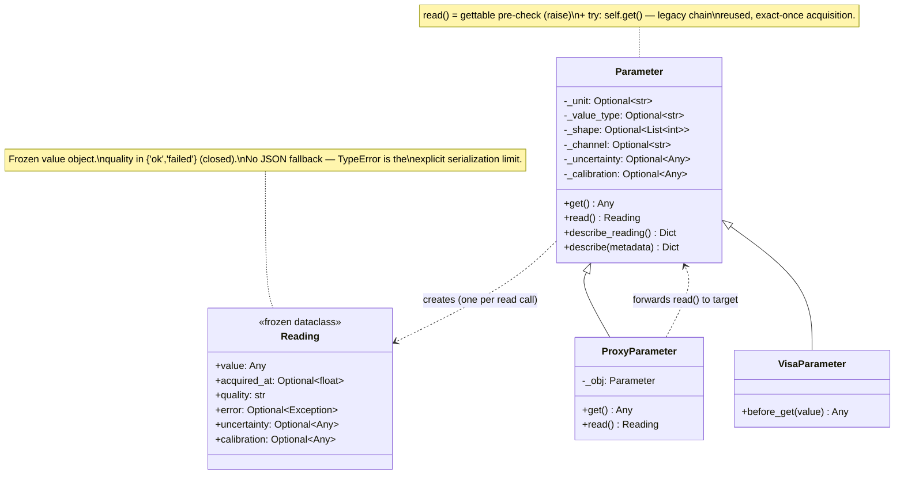
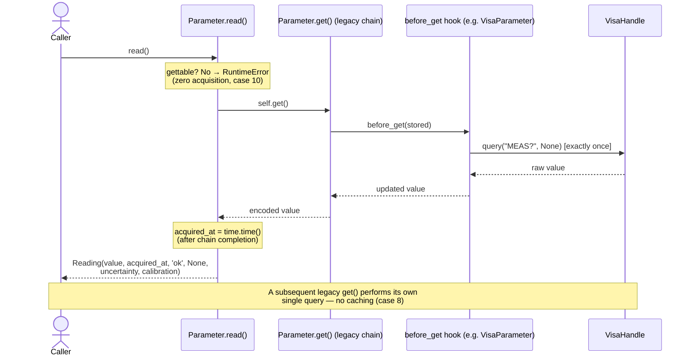
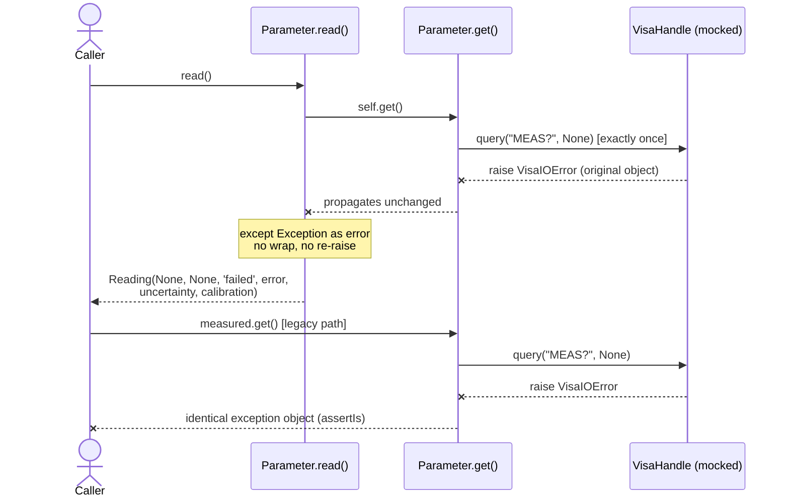

# TU-005 detailed design: opt-in measurement readings

Designer: sw-celeste. Input: Release 1 PRD (TU-005 row), TU-005 approved test
contract (`log/release_1/tests/TU-005.md`), acceptance cases
(`tests/test_tu_measurements.py`, ten cases), TU-005 implementability review
(`log/release_1/tests/TU-005-implementability.md`, ACCEPTED with three
non-blocking observation groups), TU-002/TU-003 detailed designs
(`log/release_1/design/TU-002.md`, `TU-003.md`, schema namespaces),
TU-004 detailed design (`log/release_1/design/TU-004.md`, structure
precedent), TU-001 compatibility matrix
(`log/release_1/compatibility.md`), and current
`softlab/tu/station/parameter.py` / `softlab/tu/station/visa.py` sources.
Status: proposed for architecture review; no production implementation
exists at this gate.

## Intent and compatibility

Give measurement consumers an **opt-in** richer read on the existing
`Parameter` base class, so that a single acquisition can expose its
completion time, quality, and the original failure object, while legacy
value-only `get()`/`__call__` callers (including the `huo` `AtomJob`
consumption path) observe byte-identical behavior. The change is confined
to additive members in `softlab/tu/station/parameter.py`: one new public
class (`Reading`), two new public methods on `Parameter` (`read`,
`describe_reading`), six new optional constructor keywords
(`unit`, `value_type`, `shape`, `channel`, `uncertainty`, `calibration`,
all defaulting to `None`), one overriding method on `ProxyParameter`
(`read`), and one additive export in `softlab/tu/station/__init__.py`
(`Reading`). No signature change to any existing method, no new module,
no new base class, no `VisaParameter`/`VisaCommand` code change (the
keywords flow through the existing `**kwargs` chain), no `tu/__init__.py`
change, no change to `get()`/`__call__`/`set()`/`snapshot()`/`describe()`.

Compatibility invariants this design must not disturb (TU-001 matrix and
TU-005 gate grounding):

- `get()`/`__call__` remain strictly value-only: permission check,
  `before_get` hook, encoder — identical code, identical exception
  propagation, identical acquisition counts (`huo` count/scan contract).
- `VisaParameter.before_get` remains the single acquisition site: exactly
  one `handle.query(get_cmd, delay)` per `get()` — `read()` inherits this
  exact-once property for free because it delegates to `get()`.
- TU-002 `describe()` schema version 1 keeps exactly its six fields; the
  reading description lives in its own versioned namespace and never
  reinterprets v1 (TU-003 architecture-review precedent).
- Arbitrary nonserializable stored values remain readable via both
  `get()` and `read().value` with identical object identity (TU-002
  case-3 opaque-object contract).
- OBS-004 (base-`__init__`-before-hook-fields) is untouched: it is a
  recorded defect, avoided by construction in the acceptance suite, and
  is not asserted as behavior.

## Design decisions (implementability observations resolved)

The three non-blocking observation groups from the implementability
review (`TU-005-implementability.md`, "Non-blocking observations" 1–3)
are resolved as follows.

### 1. `Reading` semantics pinned (observation group 1)

**Time source and `acquired_at` meaning.** On success, `read()` stamps
`acquired_at = time.time()` **after** `self.get()` returns. The
timestamp therefore means "completion of the acquisition chain"
(permission check, `before_get` hook, encoder), which is the only
reading consistent with the bounded-window assertions in cases 1 and 8
when hooks are slow (observation group 3). The time source is a plain
`time.time()` epoch-seconds float: the tests bound it between caller-side
`time.time()` calls, making the source self-certifying. No clock
injection, no timezone object, no monotonic clock (simplicity check:
`time.monotonic` was considered and rejected — epoch seconds are the
asserted contract, and a second clock would be an entity without
necessity).

**Failed-read field states.** On acquisition failure, `read()` returns
`Reading(value=None, acquired_at=None, quality='failed', error=<the
original exception object>, uncertainty=<declared>, calibration=
<declared>)`. Rationale per field:

- `value=None`: no value was acquired; inventing a placeholder (e.g.
  the stale stored value) would fabricate data the acquisition chain
  never produced. `None` is the only honest state.
- `acquired_at=None`: no acquisition completed, so no completion time
  exists. Stamping a failure time would silently change the field's
  meaning ("completion of the acquisition chain") between the success
  and failure paths.
- `uncertainty`/`calibration` **are still populated** from the
  parameter's declared constructor information: they are static
  declarations about the parameter, not products of the acquisition,
  and remain meaningful when diagnosing a failed read.
- `error` holds the **original exception object** via direct
  `except Exception as e` — never wrapped, never re-raised from a
  chained context (case 7 pins `assertIs(result.error, error)`).

**Quality vocabulary: closed.** `quality` is a `str` from the **closed
two-literal set** `{'ok', 'failed'}`. No third value is defined; no
subclass or hook may introduce one within this design. Rationale: the
gate pins exactly two literals and no PRD criterion requires
degraded/partial qualities; an open vocabulary would invite unverifiable
values. A `str` (not an `Enum`) keeps the result trivially inspectable
and JSON-friendly per field, matching the string-based capability
vocabulary precedent of TU-004.

**Try scope: the full post-permission chain.** The `try` covers
`self.get()` in its entirety — the legacy permission check, the
`before_get` hook, and the encoder. Rationale (agreeing with the
implementability review §3): covering only the hook would let an encoder
exception escape as a raise on the `read()` path while a hook exception
returns a failed `Reading` — an arbitrary split of the same acquisition
chain. The whole-chain scope is strictly more useful, matches case 7
(which exercises failure inside the hook), and keeps one rule: *any*
exception from the acquisition chain becomes `quality='failed'`. Note
that the legacy permission check inside `get()` can never fire here
because `read()` performs the same check itself first (see the `read()`
algorithm below); the check inside the `try` is structurally dead but
costs nothing and is not special-cased.

**Mutability: frozen value object.** `Reading` is a frozen dataclass
(`@dataclass(frozen=True)`). Rationale: a reading is a record of a
completed event — mutation after the fact would falsify the record
(e.g. rewriting `quality` from `'failed'` to `'ok'` while `error` is
still set). Freezing is one decorator argument and removes an entire
class of misuse; mutability would serve no acceptance case. Field
*values* are not deeply frozen: `reading.value` is the identical stored
object (case 6 pins identity — copying is forbidden). Frozen refers to
attribute rebinding only.

**Location.** `Reading` lives in `softlab/tu/station/parameter.py`,
immediately before the `Parameter` class. Rationale: consistent with the
TU-003 placement of operation-description logic beside its class; a
separate `station/reading.py` module would exist only to hold one small
class — an entity without necessity. `Reading` is added to the
`softlab.tu.station` package export list (additive, one line) because a
public return type must be importable for annotation and `isinstance`
use; `softlab/tu/__init__.py` (which re-exports submodules only) is
untouched.

### 2. `describe_reading()` on subclasses: no enrichment (observation group 2)

The base `Parameter.describe_reading()` is the **only** implementation.
`VisaParameter`, `VisaCommand`, `QuantizedParameter` and `ProxyParameter`
do **not** override it, and no subclass fills in defaults (e.g. no
automatic `channel` from a VISA address). Rationale:

- No acceptance case exercises a subclass description; the base
  implementation satisfies the whole contract.
- Auto-derived fields would blur the line between *declared* metadata
  (constructor information, echoed verbatim) and *inferred* metadata,
  and would need per-subclass rules that no requirement justifies.
- This is explicitly an additive decision: a future task may add
  subclass enrichment without changing this design's contract.

`ProxyParameter` in particular inherits `describe_reading()` from the
base and therefore describes the **proxy's own** declared fields (all
`None`, since `ProxyParameter.__init__` forwards no measurement
keywords) — the same posture as its inherited `describe()`/`snapshot()`
describing proxy state rather than target state. No acceptance case
pins otherwise, and proxy forwarding is required only for value paths
(`set`/`get`/`read`), matching the TU-001 proxy contract.

### 3. Constructor-declared metadata plumbing

`Parameter.__init__` gains six optional keyword-only-in-practice
parameters, appended after `before_get` to preserve positional
compatibility of every existing argument:

```python
unit: Optional[str] = None
value_type: Optional[str] = None
shape: Optional[List[int]] = None
channel: Optional[str] = None
uncertainty: Optional[Any] = None
calibration: Optional[Any] = None
```

They are stored **verbatim** as private fields (`self._unit`, etc.) with
**no validation and no copying**. Rationale:

- No validation: these are descriptive declarations, not executable
  contracts. The library does not interpret units, resolve calibration
  references, or check shapes against values — policing them would be
  machinery without a requirement. Callers declaring non-JSON values
  will find `describe_reading()` output non-JSON-serializable; that is
  the caller's explicit choice, consistent with the serialization-limit
  philosophy (see below). The acceptance suite declares only
  JSON-compatible values.
- No copying: case 3 asserts equality, not identity, for `shape`; but
  `Reading.value` identity (case 6) establishes the design posture that
  stored objects are never defensively copied. Declared metadata follows
  the same posture — echoed by reference, documented as read-only.

**Forwarding through subclasses.** `VisaParameter.__init__` and
`VisaCommand.__init__` end in `**kwargs` forwarded to `super().__init__`,
so all six keywords compose through the existing chain with **zero
signature changes** to VISA classes. `QuantizedParameter.__init__` has a
fixed signature and does **not** gain the keywords (no acceptance case
constructs a quantized parameter with reading metadata; adding pass-through
parameters there would be an entity without necessity). `ProxyParameter`
does not accept or forward them (decision 2).

**OBS-004 note.** The recorded defect (base `__init__` runs, including
`init_value` handling, before subclass hook fields are installed) is
unaffected: the new keywords are pure field assignments at the end of
`Parameter.__init__`, after the `init_value` block, and install nothing
that hooks touch. The acceptance suite's avoidance pattern
(`settable=False`, no `init_value` on `VisaParameter`) remains valid.

## Public surface and data structures

### `Reading` (new class in `softlab/tu/station/parameter.py`)

A frozen value object recording the outcome of one `read()` call.

| Field | Type | On success (`quality='ok'`) | On failure (`quality='failed'`) |
| --- | --- | --- | --- |
| `value` | `Any` | The exact object `get()` returned (identity, never copied) | `None` |
| `acquired_at` | `Optional[float]` | `time.time()` epoch seconds stamped **after** the acquisition chain completed | `None` |
| `quality` | `str` | `'ok'` | `'failed'` (closed vocabulary — no other values) |
| `error` | `Optional[Exception]` | `None` | The original exception object raised by the acquisition chain (identity preserved, never wrapped) |
| `uncertainty` | `Optional[Any]` | Parameter's declared `uncertainty`, `None` if undeclared | Same — declarations are populated on failure too |
| `calibration` | `Optional[Any]` | Parameter's declared `calibration`, `None` if undeclared | Same |

Class-level contract:

- Immutable: `@dataclass(frozen=True)`; attribute rebinding raises
  `dataclasses.FrozenInstanceError`. Field values are not copied or
  deeply frozen.
- No JSON support: `Reading` defines **no** `__iter__`, no `to_json`,
  no `default` hook. `json.dumps` of a `Reading` raises `TypeError`
  under the standard encoder — this is the explicit serialization
  limit, and it holds for **every** reading, not only those carrying
  opaque values (case 6 pins the opaque case).
- No equality semantics beyond dataclass defaults; no acceptance case
  compares readings, and fieldwise `__eq__` from the dataclass is
  harmless. `eq=True` is the dataclass default and adds no code.

### `Parameter.read() -> Reading`

Opt-in richer read. Semantics, in order:

1. **Permission pre-check (parity with `get()`):** if
   `self.gettable` is `False`, raise
   `RuntimeError(f'Parameter {self.name} is not gettable')` — the
   **identical message and type** as legacy `get()` — **before** any
   acquisition. Zero hook invocations, zero I/O on this path
   (case 10). The pre-check is placed **outside** the `try` so a
   permission failure raises like legacy `get()` instead of becoming a
   failed `Reading`: permission denial is a programming error, not an
   acquisition outcome (the gate pins `RuntimeError` parity).
2. **Acquisition:** `value = self.get()` inside
   `try ... except Exception`. Because `get()` *is* the legacy chain
   (permission check → `before_get` → encoder), acquisition counts,
   hook ordering and encoder behavior are identical by construction;
   `VisaParameter.read()` performs exactly one
   `handle.query("MEAS?", None)` per call (cases 7, 8). No parallel
   acquisition path is invented.
3. **On success:** `acquired_at = time.time()` (stamped after the
   chain completed — decision 1), return
   `Reading(value=value, acquired_at=acquired_at, quality='ok',
   error=None, uncertainty=self._uncertainty,
   calibration=self._calibration)`.
4. **On failure:** `except Exception as error:` — return
   `Reading(value=None, acquired_at=None, quality='failed',
   error=error, uncertainty=self._uncertainty,
   calibration=self._calibration)`. The exception is **not re-raised**
   on the `read()` path; the original object is preserved on
   `reading.error` (case 7 `assertIs`). Legacy `get()` remains the
   raising path and propagates the identical object when called
   directly.
5. **`BaseException` is not caught.** `KeyboardInterrupt`,
   `SystemExit` and `GeneratorExit` propagate from `read()` exactly as
   from `get()` — swallowing process-control exceptions would be a
   correctness bug. Only `Exception` subclasses become failed readings.

`read()` performs no caching: two calls acquire twice (case 8 pins one
query per call, and a subsequent legacy `get()` performs its own query).

### `Parameter.describe_reading() -> Dict[str, Any]`

Opt-in, versioned reading description in its **own schema namespace**
(analogous to TU-003 `describe_operation()`; never a reinterpretation of
TU-002 `describe()` v1). Returns a **fresh dict literal on every call**:

| Field | Type | Value | Description |
| --- | --- | --- | --- |
| `schema_version` | `int` | `1` | Version of the reading-description schema (own namespace) |
| `name` | `str` | `self._name` | Parameter name |
| `unit` | `Optional[str]` | Declared `unit`, else `None` | Physical unit declaration |
| `value_type` | `Optional[str]` | Declared `value_type`, else `None` | Value type declaration |
| `shape` | `Optional[List[int]]` | Declared `shape` (echoed by reference), else `None` | Value shape declaration |
| `channel` | `Optional[str]` | Declared `channel`, else `None` | Channel declaration |

Contract:

- **Zero device I/O; never reads the value.** The method touches only
  `self._name` and the six declared fields. It never calls `get()`,
  `snapshot()`, `describe()`, validators, codecs or hooks, and never
  invokes `str`/`repr`/JSON fallback on the stored value (case 6 pins
  that an opaque value whose `__repr__` raises still yields a
  JSON-clean description).
- **JSON-clean for JSON-clean declarations.** With declared values from
  the JSON scalar/list domain (as in every acceptance case), the result
  round-trips through `json.dumps`/`json.loads` unchanged
  (`assert_json` in cases 3 and 6). Non-JSON declared values are the
  caller's explicit choice and are not policed (decision 3).
- **Namespace independence.** Sharing the literal keys `schema_version`
  and `name` with `describe()` and `describe_operation()` is the
  TU-003-blessed pattern. `describe()` keeps exactly its six v1 fields
  (case 4 guards this — structurally guaranteed since `describe()` is
  untouched).
- **Fresh dict per call** (TU-003 decision 1 precedent): all values are
  immutable scalars or `None` except `shape`, which is echoed by
  reference and documented as read-only. No copy helper is added.

### `ProxyParameter.read() -> Reading`

One-line forwarding override, mirroring legacy `get()` forwarding:

```python
def read(self) -> Reading:
    return self._obj.read()
```

- The returned `Reading` is the **target's own** result object, so
  value/quality/error/declarations parity with a direct read is
  automatic (case 9).
- **Permission parity via construction:** `ProxyParameter.__init__`
  copies `gettable` from the target, and the target's `read()` performs
  its own pre-check — a denied target stays denied through the proxy
  with the target's `RuntimeError`, and no proxy-side acquisition can
  occur. No extra code; identical to how legacy proxy `get()` behaves.

## Static view



No new module, no new base class, no mixin, no enum. `VisaParameter`,
`VisaCommand` and `QuantizedParameter` gain **no code** — the constructor
keywords flow through existing `**kwargs` (`VisaParameter`,
`VisaCommand`) or are not accepted (`QuantizedParameter`, decision 3).

## Dynamic view

### Successful read (case 1 / case 8)



### Failed acquisition (case 7)



## Algorithms

### `Parameter.read()`

- **Purpose**: one opt-in acquisition exposing value, completion time,
  quality and failure object while leaving legacy `get()` untouched.
- **Complexity**: O(1) beyond the acquisition chain's own cost; one
  `Reading` allocation per call.
- **Pseudocode**:
  ```
  def read(self) -> Reading:
      if not self.gettable:                      # pre-check, outside try
          raise RuntimeError(
              f'Parameter {self.name} is not gettable')
      try:
          value = self.get()                     # legacy chain, exact-once
      except Exception as error:                 # BaseException propagates
          return Reading(value=None, acquired_at=None,
                         quality='failed', error=error,
                         uncertainty=self._uncertainty,
                         calibration=self._calibration)
      return Reading(value=value, acquired_at=time.time(),
                     quality='ok', error=None,
                     uncertainty=self._uncertainty,
                     calibration=self._calibration)
  ```
- **Edge cases**: denied read raises before any acquisition (case 10);
  hook or encoder failure both yield `quality='failed'` (decision 1,
  whole-chain try scope); slow hooks still satisfy the bounded-window
  assertion because the timestamp is stamped after completion; a
  `before_get` hook returning an opaque object is carried by identity.

### `Parameter.describe_reading()`

- **Purpose**: versioned, I/O-free reading description in its own
  namespace.
- **Complexity**: O(1) time and space.
- **Pseudocode**:
  ```
  def describe_reading(self) -> Dict[str, Any]:
      return {
          'schema_version': 1,
          'name': self._name,
          'unit': self._unit,
          'value_type': self._value_type,
          'shape': self._shape,
          'channel': self._channel,
      }
  ```
- **Edge cases**: undeclared fields are `None` (case 3); opaque stored
  values are never touched (case 6); `describe()` v1 is unaffected
  (case 4).

### `ProxyParameter.read()`

- **Purpose**: forward the rich read to the target, mirroring legacy
  `get()` forwarding.
- **Pseudocode**: `return self._obj.read()` — nothing else. Permission
  parity comes from the construction-time `gettable` copy plus the
  target's own pre-check.

## Serialization limit (explicit, never imposed)

- `Reading` defines no JSON fallback of any kind; `json.dumps` of any
  `Reading` raises `TypeError` under the standard encoder. Case 6 pins
  this for an opaque value; the design makes it true universally.
- Stored values are **never restricted and never copied**: the identical
  object is returned by `get()` and `read().value` (case 6 `assertIs`).
  Serialization failure is an explicit, loud outcome of an opt-in
  operation (`json.dumps` on a reading), never a constraint imposed on
  what may be stored.
- `describe_reading()` is the JSON-safe inspection path — it carries
  declared metadata only, never the value.

## Docstring requirements

New/changed public members carry English docstrings in the surrounding
repo style (`Args:`, `Returns:`, `Errors:`, `Side-effects:` sections)
with type annotations:

- `Reading` class docstring — state that it records the outcome of one
  `read()` call; the closed quality vocabulary (`'ok'`/`'failed'`);
  failed-read field states (`value=None`, `acquired_at=None`,
  `error`=original exception, declarations still populated);
  immutability (frozen, field values not copied); and the explicit
  serialization limit. The exact contract text the developer must write
  for the quality field is:

  > ``quality`` is a closed vocabulary: exactly ``'ok'`` (acquisition
  > chain completed) or ``'failed'`` (acquisition chain raised). No
  > other value is defined.

- `Parameter.read()` — state opt-in nature, exact-once acquisition via
  the legacy chain, the post-completion timestamp meaning, the
  failed-read contract, and the permission parity. The exact contract
  text the developer must write for the permission path is:

  > Raises ``RuntimeError`` when the parameter is not gettable, exactly
  > like ``get()``, before any acquisition is attempted; permission
  > denial is a programming error, not an acquisition outcome, and
  > never produces a ``Reading``.

  and for the failure path:

  > If the acquisition chain raises an ``Exception`` subclass, the
  > original exception object is returned on ``reading.error`` with
  > ``quality == 'failed'`` instead of propagating; ``BaseException``
  > subclasses (e.g. ``KeyboardInterrupt``) propagate unchanged. Legacy
  > ``get()`` always propagates the identical exception object.

- `Parameter.describe_reading()` — state the own-namespace versioning
  (`schema_version` 1, independent of `describe()` v1 and
  `describe_operation()` v1), the four optional fields with `None`
  defaults, that declared values are echoed verbatim by reference and
  treated as read-only, and the exact side-effect guarantee: *zero
  device I/O; never reads the stored value; never invokes validators,
  codecs, hooks, or `str`/`repr` on any runtime value.*
- `Parameter.__init__` — document the six new optional keywords with
  `None` defaults and the no-validation, no-copying posture.
- `ProxyParameter.read()` — state one-line forwarding semantics and
  that the target's `Reading` object is returned, giving value/quality
  parity and target-side permission enforcement.
- The `Parameter` class docstring gains `read` and `describe_reading`
  in its `Public methods:` list, marked as the opt-in measurement path
  distinct from the legacy value-only `get()`/`__call__`.

No other docstrings change.

## Verification and dependencies

Acceptance coverage: case 1 (time/quality, bounded window, legacy
untouched), case 2 (legacy guard — already green), case 3 (description
fields/versioning, `None` defaults, declared echoes), case 4 (TU-002 v1
guard — already green), case 5 (uncertainty/calibration absent/declared),
case 6 (opaque value identity, JSON-clean description, `TypeError`
limit), case 7 (failed quality, error identity, exact-once query, legacy
propagation), case 8 (single acquisition, post-completion timestamp, no
caching), case 9 (proxy forwarding), case 10 (denied read parity, zero
acquisition).

**Note for the test phase (handoff to sw-mike).** Decision 1 pins
failed-read field states (`value=None`, `acquired_at=None`,
declarations still populated) that no acceptance case asserts. Add one
focused extension to case 7 during the test phase (do not add it during
implementation): after the failed `read()`, assert
`result.value is None`, `result.acquired_at is None`, and
`result.error is error`; and, on a failed read of a parameter
constructed with `uncertainty=0.02`, assert
`result.uncertainty == 0.02`. This pins the failed-read field contract
executably. No other test additions are required by this design.

TU-001 baseline tests and the TU-002/TU-003/TU-004 suites must stay
green; no CI/testing completion is claimed at this gate. All resources
in tests are mocks; no hardware access.

Scope: changes are confined to `softlab/tu/station/parameter.py` and one
additive export line in `softlab/tu/station/__init__.py`. New imports in
`parameter.py`: `time` (stdlib), `dataclasses.dataclass` (stdlib), and
`List` from `typing` (already imported module). No existing import,
signature or behavior changes.

| Dependency | Justification |
| --- | --- |
| *(none)* | `time.time()` and `dataclasses` are standard library. No third-party module is introduced. |

Simplicity audit of rejected alternatives: an `Enum` for quality (two
pinned literals suffice as strings, matching TU-004's string capability
vocabulary); a `station/reading.py` module (one small class belongs
beside `Parameter`, per the TU-003 placement precedent); clock injection
(the bounded-window assertion makes the source self-certifying);
defensive copying of `value` or `shape` (case 6 forbids copying values;
metadata follows the same documented read-only posture);
`QuantizedParameter` keyword pass-through (no requirement); subclass
enrichment of `describe_reading()` (no requirement); and a `to_json()`
helper (would contradict the explicit serialization limit).

## Design review

- **Reviewer**: sw-jerry
- **Review date**: (pending)
- **Status**: PENDING
