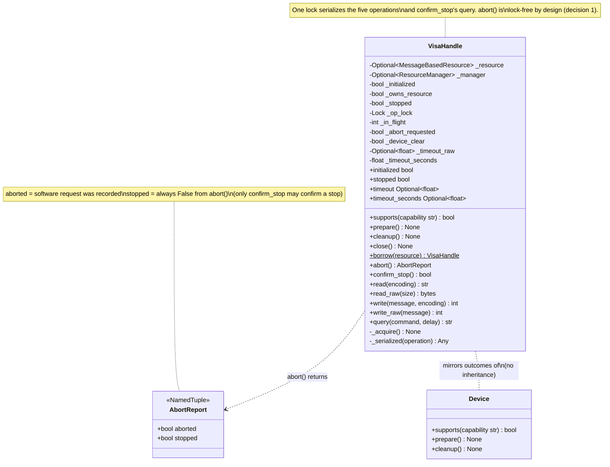
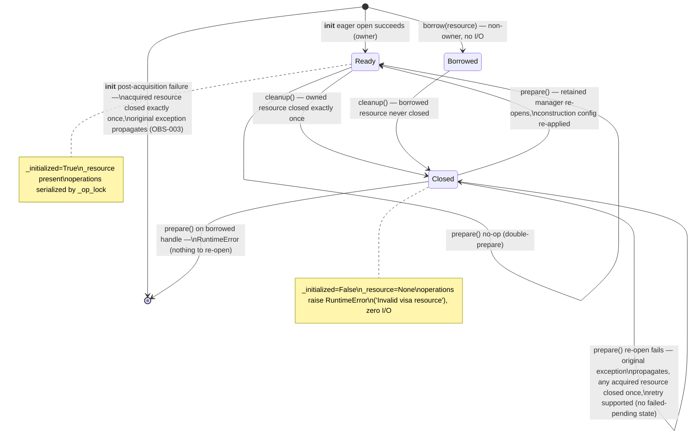

# TU-006 detailed design: VISA resource and operation outcome contracts

Designer: sw-celeste. Input: Release 1 PRD (TU-006 row), TU-006 approved test
contract (`log/release_1/tests/TU-006.md`, revised, 17 cases), acceptance
cases (`tests/test_tu_visa_contracts.py`), TU-006 implementability review
(`log/release_1/tests/TU-006-implementability.md`, both blocking rounds
CLOSED; four non-blocking observations resolved here), TU-004 detailed
design (`log/release_1/design/TU-004.md`, lifecycle contract being adopted),
TU-005 detailed design (`log/release_1/design/TU-005.md`, structure
precedent), TU-001 compatibility matrix (`log/release_1/compatibility.md`,
OBS-001/OBS-002/OBS-003), and current `softlab/tu/station/visa.py` sources
at branch tip `0874f87`. Status: proposed for architecture review with
**one blocking test-contract finding** (see below); no production
implementation exists at this gate.

## Blocking test-contract finding (handoff to sw-mike, prerequisite for step B)

While studying the accepted suite I found a latent contradiction of exactly
the Issue-1 class in **case 8**
(`test_timeout_seconds_default_and_constructor_keyword`):

```python
handle, resource, _, _ = make_resource(self, "TEST@sim")      # mock1
...
quick, _, _, _ = make_resource(self, "FAST@sim", timeout_seconds=1.5)  # mock2 discarded
self.assertEqual(quick.timeout_seconds, 1.5)
self.assertEqual(resource.timeout, 1500)   # asserts mock1, which holds 5000
```

`resource` on the last line is the **first** handle's mock, whose timeout
was set to 5000 by the first (default) construction and is never touched
again. The second `make_resource` call creates an independent mock
(verified empirically: two `Mock(spec=MessageBasedResource)` instances
share no attribute state), so the final assertion cannot pass under **any**
correct implementation. It is invisible in the red phase only because the
first `handle.timeout_seconds` access raises `AttributeError` before the
line is reached — precisely the failure mode of the closed Issue 1.

**Requested minimal fix (test only, production unchanged):** destructure
the second handle's resource and assert on it, mirroring the pair
structure of the default-construction block:

```python
quick, quick_resource, _, _ = make_resource(self, "FAST@sim", timeout_seconds=1.5)
self.assertEqual(quick.timeout_seconds, 1.5)
self.assertEqual(quick_resource.timeout, 1500)
```

The intent of case 8 (constructor keyword 1.5 s → 1500 ms on that handle's
resource) is unambiguous, so this design proceeds on the corrected reading
and pins the fix as a **green-condition prerequisite of step B** (see the
step split). No acceptance semantics change; no other case is affected
(full sweep of every `resource.timeout` assertion against its construction
was performed — cases 1/6 explicit-raw, 7/17 default-sentinel, 6 set/get
blocks are all internally consistent).

## Intent and compatibility

Make `VisaHandle` adopt the approved TU-004 lifecycle contract
**compatibly and by mirroring, not inheritance** (`VisaHandle` is not a
`Device`), resolve the three TU-001 observations assigned to TU-006
(OBS-001 timeout units, OBS-002 `write_raw` target, OBS-003 failed-init
cleanup), and add blocking/serialization/interruption semantics with a
strict separation between an abort *request* and a device-*confirmed*
stop.

The change is confined to `softlab/tu/station/visa.py`: additive members
on `VisaHandle` (`supports`, `initialized`, `stopped`, `prepare`,
`cleanup`, `borrow`, `abort`, `confirm_stop`, `timeout_seconds`), one
module-level report type (`AbortReport`), one constructor-signature change
(`timeout` default `5.0` → `None` sentinel; new keyword
`timeout_seconds: float = 5.0`), one behavior fix (`write_raw` targets
`resource.write_raw`, OBS-002), one delegation (`close()` → `cleanup()`),
and internal state/helpers. No new module, no new base class, no
`__init__.py` export change (`VisaHandle` is already exported;
`AbortReport` is returned by attribute access and does not require a
package export for the acceptance suite — see simplicity audit), no change
to `VisaParameter`/`VisaCommand`/`VisaIDN`.

Compatibility invariants this design must not disturb (TU-001 matrix and
TU-006 gate grounding):

- Eager construction (open + optional clear + configuration in
  `__init__`), `@`-suffixed address/library parsing, and the non-message
  resource rejection path (close once + `TypeError`) are unchanged.
- Explicit raw `timeout` forwarding is **never rescaled** (OBS-001; guards
  1 and 6 pin explicit-value forwarding on constructor, set and get).
- Transport errors propagate as the **identical exception object** on
  every path, old and new (guard 14; cases 4, 9, 12, 13, 16 `assertIs`).
- Legacy `open()`/`clear()` keep their silent no-op-if-no-resource
  behavior and stay outside the serialization guard (not part of the
  contract; no case exercises them).
- `VisaParameter`/`VisaCommand` call shapes through the handle
  (`write(message=..., encoding=...)`, `query(cmd, delay)` positional) are
  byte-identical (TU-001 `parameter_commands_codecs_and_snapshot`,
  `legacy_command_reads_execute_once_and_writes_denied`).

## Design decisions (implementability observations resolved)

The four non-blocking observations from the implementability review are
resolved as follows.

### 1. `abort()` is flag-based and never touches the operation lock

`abort()` performs **bookkeeping only**: it reads the in-flight counter,
sets the advisory `_abort_requested` flag when an operation is in flight,
and returns an `AbortReport` immediately. It never acquires `_op_lock`,
never touches the resource, and never writes to the device.

- **In-flight tracking**: a per-handle integer `_in_flight`, incremented
  inside `_op_lock` after the resource-validity check and decremented in
  a `finally` when the operation completes (success or raise). A plain
  `int` suffices: the serialization lock guarantees at most one operation
  is in flight, so the counter is 0 or 1 in practice; an int (not a bool)
  keeps the increment/decrement pairing exception-safe and self-evident.
- **Unsynchronized read**: `abort()` reads `_in_flight` without any lock.
  This is deliberate and documented: an int read cannot tear under the
  GIL, and a stale read at the exact boundary of operation completion only
  affects the advisory `aborted` flag of the report — never device state,
  never error identity. A second lock for the flag/counter was considered
  and rejected as an entity without necessity (simplicity audit).
- **Flag consumption**: the operation wrapper clears `_abort_requested`
  in its `finally`, so a request can never leak into the next operation.
- **Report semantics**: in-flight → `AbortReport(aborted=True,
  stopped=False)`; idle → `AbortReport(aborted=False, stopped=False)` —
  a quiet no-op (case 12). `report.stopped` is **always** `False`: an
  abort request never claims the equipment stopped, and `handle.stopped`
  is untouched by `abort()`.
- **Actual interruption is backend-honored**: the handle records the
  request; whether the in-flight call terminates early depends on the
  backend (the acceptance suite models this by releasing the mocked read,
  which then raises the identical `VisaIOError(VI_ERROR_ABORT)` object —
  which propagates unchanged through the wrapper, as the wrapper adds no
  `try/except` around the call itself).

### 2. `close()` delegates to `cleanup()` — idempotence change documented, blast radius verified zero

`close()` becomes a one-line alias: `def close(self): self.cleanup()`.
Consequences, both recorded in the `close()` docstring (verbatim mandate
below):

- **Idempotence change**: legacy `close()` called `resource.close()` on
  every invocation while a resource was present; under delegation a second
  `close()` is a no-op (the release ran exactly once).
- **Ownership awareness**: `close()` on a borrowed handle no longer closes
  the resource (legacy had no borrow concept, so no legacy caller can
  observe this).

**Blast-radius verification (performed, not merely claimed).** Grep of all
in-repo `VisaHandle` consumers and `.close()` call sites:

- Production: only `VisaParameter`, `VisaCommand`, `VisaIDN` hold handles;
  none of them ever calls `close()` (confirmed by the implementability
  review's grep and re-verified here). **Zero production blast radius.**
- Tests: `tests/test_compatibility.py:147` and
  `tests/test_tu_operations.py:24` close each handle exactly once;
  `tests/test_tu_contracts.py` registers `addCleanup(self.handle.close)`
  (line 206) *and* calls `self.handle.close()` explicitly (line 219), but
  the assertion `resource.close.assert_called_once_with()` (line 220)
  runs **before** the cleanup fires, and under delegation the cleanup-time
  second `close()` is a no-op — the characterization case stays green.
  `tests/test_visa.ipynb` uses a single explicit close (TU-001 row).

### 3. `prepare()` re-open: the resource manager is **retained** for the handle's lifetime

Decision: an owned handle retains the `ResourceManager` created in
`__init__` on `self._manager`; `prepare()` re-runs acquisition by calling
`self._manager.open_resource(self._address)` again through the shared
`_acquire()` procedure. Rationale:

- **Simplest correct option.** Retaining is one attribute and zero
  re-creation logic; recreating the manager per `prepare()` would re-run
  backend selection (`@`-parsing, `ResourceManager(lib)`) for no
  requirement. `@sim` tolerates both; retainment is the smaller entity.
- **Manager lifetime = handle lifetime**, matching the legacy posture
  (legacy code never closed the manager either; it was dropped). OBS-003's
  "resource-manager ownership unspecified" is thereby resolved
  explicitly: the handle owns its manager, retains it, and there is no
  manager-close API (PyVISA releases it with process teardown; no
  acceptance case or PRD criterion requires explicit manager release).
- **Re-open re-applies the full construction configuration**: address,
  `device_clear` flag, timeout rule (sentinel or raw), and both
  terminations — stored at construction and replayed by `_acquire()`.
  This is required for `@sim` correctness (case 17's Keithley resource
  needs `read_termination`/`write_termination` `\r` re-applied on the
  fresh session, and must **not** be cleared since it has no `*CLS`
  dialogue — the stored `device_clear=False` is honored on re-open).
- **Failed re-open**: if `_acquire()` raises during `prepare()`, the
  original exception object propagates unchanged; any resource acquired
  before the failure is closed exactly once by `_acquire()`'s own guard
  (same code path as failed-init, OBS-003); `initialized` stays `False`
  and the handle remains in the cleaned-up state (operations keep raising
  `RuntimeError('Invalid visa resource')` with zero I/O). A later
  `prepare()` retries — the repeatable cycle has no failed-pending state
  (mirror-divergence 2 below).
- **Borrowed handles cannot re-open**: `prepare()` on a cleaned-up
  borrowed handle raises `RuntimeError('Cannot re-open a borrowed visa
  resource')` — there is no address or manager to re-acquire from. This
  is a defined, documented outcome rather than an ambiguous one (no case
  exercises it; the explicit raise prevents a silent dead handle).

### 4. `confirm_stop()` parsing and `stopped` persistence

- **Query path**: `confirm_stop()` delegates to `self.query('*OPC?',
  None)` — inheriting the serialization guard, the post-cleanup
  `RuntimeError` rejection, and identical-object error propagation for
  free. Exactly one resource query per call (case 13 pins
  `resource.query.assert_called_once_with("*OPC?", None)`).
- **Parsing**: `str(response).strip() == '1'` — strip-then-equality, so
  the real `@sim` round trip (Weinschel answers `*OPC?` with `1`,
  terminated `\r`) passes in case 17. `str()` is a no-op for the string
  responses every case uses and keeps the comparison total for exotic
  return types.
- **Unexpected responses**: anything other than exactly `'1'` after
  stripping (e.g. `'0'`, `''`, `'2'`) returns `False` and leaves
  `stopped` unchanged. There is no third outcome and no exception for
  unexpected payloads — conservative confirmation: only an exact
  device-reported completion counts.
- **`stopped` persistence**: `stopped` is a **latch** — once set `True`
  by a device-confirmed `confirm_stop()`, a later `confirm_stop()`
  returning `False` or raising a transport error does **not** clear it.
  `cleanup()` resets `_stopped = False` (a new acquisition cycle begins
  fresh; a stale stop claim must not survive re-preparation). Initial
  value is `False`. Rationale for latching: `stopped` records "the device
  confirmed completion at least once in this acquisition cycle", which is
  the only interpretation consistent with case 13 (`'0'` → still `False`;
  `'1'` → `True`; a subsequent transport error propagates with `stopped`
  unexamined) and case 17 (set once, then cleanup).

### Mirror-divergences from TU-004 (decision 1 and friends), documented

`VisaHandle` mirrors TU-004's *outcomes* without inheriting `Device`
(the gate frames it this way; a `VisaHandle` is a connection handle, not
a device container). The deliberate divergences:

1. **Eager vs lazy failed-acquisition release** (TU-004 decision 1):
   TU-004's deferred-acquisition `Device` releases a failed preparation's
   partial acquisition lazily on the next `cleanup()`. `VisaHandle`'s
   acquisition is eager and self-contained: `_acquire()` closes a
   partially configured resource **immediately** in its own `except` path
   (OBS-003 fix), so there is **no `FailedPendingRelease` state** and no
   `_needs_cleanup` field — two booleans from TU-004 collapse to one
   (`_initialized`) plus one ownership flag (`_owns_resource`).
2. **No cleanup-first rule** (TU-004 decision 5): because a failed
   `prepare()` leaves nothing pending (divergence 1), re-preparation is
   always supported from the cleaned-up state; the lifecycle is a plain
   repeatable cycle.
3. **`supports('connection')` is `True`** (TU-004 base answers `False`):
   a `VisaHandle` *is* a connection; the vocabulary is
   `('connection', 'prepare', 'cleanup')`, case-sensitive, unknown/empty
   names `False`, detection never performs I/O and never raises.
4. **No subclass hooks** (`_prepare_impl`/`_cleanup_impl` are not
   mirrored): `VisaHandle` has exactly one fixed acquisition procedure
   (`_acquire`); no requirement justifies hook extensibility here.
5. **Threading split**: TU-004 decision 3 declared the *Device* lifecycle
   single-threaded and assigned VISA concurrency to TU-006. Accordingly:
   the **five operations and `confirm_stop()` are serialized** by
   `_op_lock`; `abort()` is the deliberate cross-thread entry point
   (lock-free, decision 1); lifecycle methods (`prepare()`, `cleanup()`,
   `supports`, `initialized`, `stopped`) remain single-threaded in the
   TU-004 sense — calling `cleanup()` while an operation is in flight is
   outside the contract and is documented as such (no locking is added to
   police it).

## Public surface and state model

```python
class AbortReport(NamedTuple):          # module level in visa.py
    aborted: bool
    stopped: bool

VisaHandle.__init__(address: str, visalib: Optional[str] = None,
                    timeout: Optional[float] = None,        # sentinel
                    timeout_seconds: float = 5.0,           # new keyword
                    read_termination: Optional[str] = '\n',
                    write_termination: Optional[str] = '\n',
                    device_clear: bool = True) -> None
VisaHandle.borrow(resource: MessageBasedResource) -> VisaHandle   # classmethod
VisaHandle.supports(capability: str) -> bool
VisaHandle.initialized -> bool          # read-only property
VisaHandle.stopped -> bool              # read-only property
VisaHandle.prepare() -> None
VisaHandle.cleanup() -> None
VisaHandle.close() -> None              # legacy alias of cleanup()
VisaHandle.abort() -> AbortReport
VisaHandle.confirm_stop() -> bool
VisaHandle.timeout_seconds -> Optional[float]   # property get/set
# legacy members unchanged in signature: address, timeout, read_termination,
# write_termination, open, clear, read, read_raw, write, write_raw, query
```

### State fields (private)

| Field | Type | Initial (owned / borrowed) | Meaning |
| --- | --- | --- | --- |
| `_resource` | `Optional[MessageBasedResource]` | set by `_acquire()` / the adopted resource | `None` exactly when the handle is cleaned up |
| `_manager` | `Optional[ResourceManager]` | created in `__init__` / `None` | retained for the handle's lifetime (decision 3); `None` for borrowed handles |
| `_initialized` | `bool` | `True` after successful `__init__` / `True` | readiness; `False` after `cleanup()` |
| `_owns_resource` | `bool` | `True` / `False` | non-owner never closes (TU-004 ownership outcome) |
| `_stopped` | `bool` | `False` / `False` | device-confirmed stop latch (decision 4) |
| `_op_lock` | `threading.Lock` | fresh | serializes the five operations + `confirm_stop()`'s query |
| `_in_flight` | `int` | `0` / `0` | operations currently inside `_op_lock` (0 or 1 by construction) |
| `_abort_requested` | `bool` | `False` / `False` | advisory abort request; consumed on operation completion |
| `_device_clear` | `bool` | constructor value / `False` | replayed by `_acquire()` on re-open |
| `_read_termination` | `Optional[str]` | constructor value / `None` | replayed by `_acquire()` on re-open |
| `_write_termination` | `Optional[str]` | constructor value / `None` | replayed by `_acquire()` on re-open |
| `_timeout_raw` | `Optional[float]` | constructor `timeout` / `None` | explicit raw value; `None` is the sentinel |
| `_timeout_seconds` | `float` | constructor `timeout_seconds` / `5.0` | applied (×1000) when `_timeout_raw is None` |

State invariant: `_resource is not None ⇔ _initialized` for owned handles
(after a successful `_acquire()`); borrowed handles enter with both set
and lose both together at `cleanup()`. Post-cleanup, `_resource is None`
is the single check behind the `RuntimeError('Invalid visa resource')`
rejection.

## Timeout construction contract (OBS-001 resolution)

- `timeout=None` (the new default) is the sentinel "not specified": the
  seconds default applies — the resource receives
  `timeout_seconds * 1000` milliseconds (default construction: 5000 ms;
  `timeout_seconds` reads back `5.0`). `timeout_seconds=None` disables
  the timeout (resource receives `None`).
- An **explicitly supplied** `timeout` is forwarded to the resource
  **unchanged** (the legacy raw path; OBS-001's "do not silently rescale
  existing callers"). Guards 1 and 6 pin explicit-value raw forwarding.
- **Precedence**: when `timeout` is not `None`, it wins and the
  constructor's `timeout_seconds` value is ignored. This is the only rule
  consistent with the accepted contract ("when `timeout` is given, the
  legacy raw path forwards it untouched") and with guard 6 (explicit
  `timeout=12.5` with a default `timeout_seconds` must yield raw 12.5).
  The docstring (verbatim mandate below) states this precedence.
- `timeout_seconds` property: get reads `self._resource.timeout` and
  divides by 1000 (`None` → `None`; no resource → `None`, mirroring the
  legacy `timeout` getter posture); set writes `value * 1000`
  (`None` → `None`). No rounding, no clamping, no locking (timeout
  properties are direct pass-throughs like their legacy sibling; they are
  not serialized operations). The legacy `timeout` property is byte-
  identical to its current form.

## Static view



No new module, no new base class, no mixin, no hooks. `VisaParameter`,
`VisaCommand` and `VisaIDN` gain **no code**.

## Dynamic view

### Lifecycle state machine



### Failed initialization cleanup (case 4, OBS-003)

```mermaid
sequenceDiagram
    actor Caller
    participant H as VisaHandle.__init__
    participant M as ResourceManager (retained)
    participant R as resource
    Caller->>H: VisaHandle("TEST@sim")
    H->>M: open_resource(address)
    M-->>H: resource
    Note over H: type check: not message-based →<br/>close once + TypeError (legacy path,<br/>outside the new guard)
    H->>R: clear()  (device_clear)
    R--xH: raise VisaIOError (original object)
    Note over H: except: close the acquired resource<br/>exactly once (one attempt; a close<br/>failure is logged, never masks the original)
    H->>R: close()
    H--xCaller: bare raise — identical exception object
```

### Abort request while an operation is in flight (case 12)

```mermaid
sequenceDiagram
    actor Main as caller thread
    participant H as VisaHandle
    participant L as _op_lock
    participant R as resource (backend)
    participant W as worker thread
    W->>H: read()
    H->>L: acquire
    Note over H: _in_flight = 1
    H->>R: read(encoding=None)  [blocks in backend]
    Main->>H: abort()
    Note over H: reads _in_flight WITHOUT the lock<br/>sets _abort_requested = True<br/>no device write, no waiting
    H-->>Main: AbortReport(aborted=True, stopped=False)
    Note over R: backend honors the request<br/>(test models by releasing the read)
    R--xH: raise VisaIOError(VI_ERROR_ABORT) — original object
    Note over H: finally: _in_flight = 0,<br/>_abort_requested consumed
    H--xW: identical exception object propagates
    Main->>H: abort()  [idle]
    H-->>Main: AbortReport(aborted=False, stopped=False)
    Note over Main: handle.stopped stays False throughout;<br/>an abort request never claims a stop
```

### Confirmed stop (cases 13, 17)

```mermaid
sequenceDiagram
    actor Caller
    participant H as VisaHandle
    participant R as resource
    Caller->>H: confirm_stop()
    H->>R: query('*OPC?', None)  [serialized, exactly once]
    R-->>H: '0'
    H-->>Caller: False  (stopped unchanged)
    Caller->>H: confirm_stop()
    H->>R: query('*OPC?', None)
    R-->>H: '1'  (real @sim may deliver '1\r' — strip()+equality)
    Note over H: _stopped = True (latch)
    H-->>Caller: True
    Caller->>H: confirm_stop()
    H->>R: query('*OPC?', None)
    R--xH: raise VisaIOError
    H--xCaller: identical object propagates; stopped latch unchanged
```

## Algorithms

### `_acquire()` (private; shared by `__init__` and `prepare()`)

- **Purpose**: single acquisition site — open, type-check, configure; on
  any post-acquisition failure close the resource exactly once and
  propagate the original exception object (OBS-003).
- **Pseudocode**:
  ```
  def _acquire(self) -> None:
      resource = self._manager.open_resource(self._address)
      if not isinstance(resource, visa.resources.MessageBasedResource):
          resource.close()                       # legacy rejection path
          raise TypeError(...)                   # unchanged message shape
      try:
          if self._device_clear:
              resource.clear()
          if self._timeout_raw is not None:
              resource.timeout = self._timeout_raw        # explicit raw path
          else:
              seconds = self._timeout_seconds
              resource.timeout = None if seconds is None else seconds * 1000
          resource.read_termination = self._read_termination
          resource.write_termination = self._write_termination
      except Exception:
          try:
              resource.close()                   # exactly one attempt
          except Exception:
              _logger.warning('Failed to close resource after '
                              'initialization failure', exc_info=True)
          raise                                  # bare: identical object
      self._resource = resource
      self._initialized = True
  ```
- **Edge cases**: the `try` is scoped strictly **after** the
  `MessageBasedResource` check — the legacy non-message rejection already
  closes once and must not be double-closed (implementability guard i).
  A failing `close()` during this cleanup is logged and suppressed so the
  original exception object still propagates identically ("exactly once"
  refers to the single close attempt; implementability guard ii).
  `open_resource` itself raising means nothing was acquired — no close.
- **Step-A note**: in step A the timeout branch is the legacy
  unconditional raw assignment (`resource.timeout = <constructor
  timeout>`, default 5.0); the sentinel branch above lands in step B with
  the signature change. The `try` scope is identical in both steps.

### `prepare()`

```
def prepare(self) -> None:
    if self._initialized:
        return                                   # no-op while initialized
    if not self._owns_resource:
        raise RuntimeError('Cannot re-open a borrowed visa resource')
    self._acquire()      # failure: initialized stays False, original
                         # exception propagates, nothing left pending
```

### `cleanup()` and `close()`

```
def cleanup(self) -> None:
    resource = self._resource
    self._resource = None              # discharge state BEFORE release
    self._initialized = False          # (TU-004 outcome: never retried)
    self._stopped = False              # new cycle begins fresh (decision 4)
    if resource is not None and self._owns_resource:
        resource.close()               # exactly once; non-owner never closes

def close(self) -> None:
    self.cleanup()                     # legacy alias (decision 2)
```

If `resource.close()` raises, the exception propagates unchanged and the
already-discharged state is not re-armed — a failing release is never
implicitly retried (same pinning as TU-004).

### `borrow(resource)` (classmethod)

```
@classmethod
def borrow(cls, resource) -> 'VisaHandle':
    if not isinstance(resource, visa.resources.MessageBasedResource):
        raise TypeError(...)           # mirrors the constructor policy
    handle = cls.__new__(cls)          # bypasses the eager open path
    handle._lib = None;  handle._backend = ''
    handle._manager = None             # nothing to re-open with
    handle._resource = resource
    handle._address = getattr(resource, 'resource_name', '') or ''
    handle._initialized = True
    handle._owns_resource = False
    handle._stopped = False
    handle._op_lock = threading.Lock()
    handle._in_flight = 0
    handle._abort_requested = False
    handle._device_clear = False
    handle._read_termination = None
    handle._write_termination = None
    handle._timeout_raw = None
    handle._timeout_seconds = 5.0
    return handle
```

- Adoption is **non-intrusive**: no `clear()`, no configuration writes, no
  I/O of any kind (case 5 asserts `resource.clear.assert_not_called()` on
  a fully recording mock).
- `_address` is informational only (the resource's `resource_name` when
  present, else `''`); no acceptance case asserts it (implementability
  recommendation adopted).
- The type check mirrors the constructor's `MessageBasedResource` policy —
  wrong-type adoption fails loudly at adoption time, not later at first
  I/O. Mocked `spec=MessageBasedResource` resources pass `isinstance`.

### `_serialized(operation)` (private; the concurrency guard)

```
def _serialized(self, operation):
    with self._op_lock:
        resource = self._resource
        if resource is None:
            raise RuntimeError('Invalid visa resource')   # zero I/O
        self._in_flight += 1
        try:
            return operation(resource)     # no try/except around the call:
        finally:                           # errors propagate identically
            self._in_flight -= 1
            self._abort_requested = False  # consume any request
```

The five operations route through it, preserving legacy call shapes
exactly (keyword forms where legacy used keywords — pinned by
`test_tu_contracts.py` and guard 10):

```
read(encoding)      -> self._serialized(lambda r: r.read(encoding=encoding))
read_raw(size)      -> self._serialized(lambda r: r.read_raw(size=size))
write(message, enc) -> self._serialized(lambda r: r.write(message=message, encoding=enc))
write_raw(message)  -> self._serialized(lambda r: r.write_raw(message))   # step D fix
query(command, dl)  -> self._serialized(lambda r: r.query(command, delay))
```

One helper, one audit site (the TU-004 "single release site" rationale
applied to the guard). The `RuntimeError` check sits **inside** the lock
so it is atomic with respect to operation boundaries; the rejected path
performs zero resource calls either way (case 15).

### `abort()`, `confirm_stop()`, `stopped`

```
def abort(self) -> AbortReport:                # never touches _op_lock
    if self._in_flight > 0:
        self._abort_requested = True
        return AbortReport(aborted=True, stopped=False)
    return AbortReport(aborted=False, stopped=False)

def confirm_stop(self) -> bool:
    response = self.query('*OPC?', None)       # serialized; exactly once
    confirmed = str(response).strip() == '1'
    if confirmed:
        self._stopped = True                   # latch; cleanup() resets
    return confirmed

@property
def stopped(self) -> bool:
    return self._stopped
```

## Implementation step split (A → B → C → D)

Strict order per the developer-recommended split; each step is an
independent green increment. **Guards 1, 6, 10, 14 and all six existing
suites must stay green after every step.**

| Step | Production delta (all in `softlab/tu/station/visa.py`) | Newly green | Green condition (full) |
| --- | --- | --- | --- |
| **A — lifecycle/ownership** | State fields `_initialized`, `_owns_resource`, `_manager` retention, stored construction config (`_device_clear`, terminations, `_timeout_raw`); `_acquire()` extraction with the failed-init guard; `supports`, `initialized`, `prepare`, `cleanup`, `borrow`; `close()` delegates to `cleanup()`. Constructor signature **unchanged** (legacy `timeout=5.0` raw default; `_acquire` applies it unconditionally). No `threading` import yet. | 2, 3, 4, 5 (15 also turns green early — see note) | Cases 1–6, 10, 14, 15 green; 7–9, 11–13, 16, 17 remain RED for their designed reasons (missing `timeout_seconds`/lock/`abort`/`confirm_stop`/OBS-002 fix). All six existing suites green. |
| **B — timeout sentinel/units** | Signature: `timeout: Optional[float] = None`, new keyword `timeout_seconds: float = 5.0`; `_timeout_seconds` field; `_acquire` sentinel branch (raw-when-explicit, seconds×1000 otherwise); `timeout_seconds` property. Legacy `timeout` property untouched. **Test prerequisite**: the case-8 fix and the TU-001 supersession (test-phase handoffs 1–2) must land with this step. | 7, 8, 9 | + guards 1, 6 (explicit raw `timeout=5.0` unaffected), 10, 14; cases 11–13, 16, 17 RED; existing suites green with the updated TU-001 assertion. |
| **C — serialization/abort/confirm_stop** | `import threading`; `AbortReport` NamedTuple; `_op_lock`, `_in_flight`, `_abort_requested`, `_stopped`; `_serialized` helper; five operations routed through it (legacy call shapes preserved); `abort()`, `stopped`, `confirm_stop()`. | 11, 12, 13 | + all prior green; guard 10 unchanged (lock adds no wrapping and no latency; `read(encoding=None)` shape preserved); case 16, 17 RED; existing suites green. |
| **D — error causes + @sim + OBS-002** | `write_raw` routes to `resource.write_raw(message)` (one-line fix inside `_serialized`); no other production change. `compatibility.md` dispositions recorded (docs commit): OBS-001 resolved (sentinel contract), OBS-002 fixed, OBS-003 closed. | 16, 17 | **All 17 cases green**, all existing suites green, `compileall` + import smoke clean, zero warnings under `-W error::SyntaxWarning`. |

**Early-green note**: case 15 (post-cleanup rejection + `prepare()`
recovery) requires only step-A semantics (cleanup sets `_resource=None`;
the legacy operations already raise `RuntimeError('Invalid visa
resource')` on a missing resource). It is expected to turn green at step A
and must then stay green. This does not weaken step D: case 16 (OBS-002)
and case 17 (`@sim` end-to-end, which exercises A+B+C together) are
genuinely D-gated.

## Docstring requirements

New/changed public members carry English docstrings in the surrounding
repo style (`Args:`, `Returns:`, `Errors:`, `Side-effects:` sections)
with type annotations. The developer must write the following contract
texts **verbatim in substance**:

- `__init__` — the sentinel semantics and precedence:

  > ``timeout=None`` (the default) means "not specified": the documented
  > seconds default applies and the resource receives
  > ``timeout_seconds * 1000`` milliseconds (5000 ms by default). An
  > explicitly supplied ``timeout`` is forwarded to the PyVISA resource
  > unchanged and is never rescaled; when both ``timeout`` and
  > ``timeout_seconds`` are supplied, the explicit raw ``timeout`` wins
  > and ``timeout_seconds`` is ignored. Note the legacy docstring
  > described ``timeout``'s unit as seconds while the value was forwarded
  > raw; that unit discrepancy is OBS-001, resolved by this sentinel
  > contract and the explicit ``timeout_seconds`` property.

  and the failed-initialization guarantee (OBS-003):

  > If anything after resource acquisition fails during construction
  > (device clear or a timeout/termination assignment), the acquired
  > resource is closed exactly once and the original exception object
  > propagates unchanged; no open resource is leaked.

- `supports(capability)` — state the vocabulary
  `('connection', 'prepare', 'cleanup')`, that `'connection'` is `True`
  because a VisaHandle *is* a connection (deliberate mirror-divergence
  from the `Device` base vocabulary), that detection performs no I/O and
  never raises for unknown names including `''`.
- `prepare()` — state the no-op-while-initialized semantics, the
  repeatable-cycle re-open through the **retained** resource manager with
  the construction-time configuration re-applied, the failed-re-open
  behavior (original exception propagates, `initialized` stays `False`,
  any acquired resource is closed exactly once, retry is supported), and
  the `RuntimeError` for borrowed handles. It must also state:

  > Lifecycle methods (``prepare``, ``cleanup``, ``supports``,
  > ``initialized``, ``stopped``) are single-threaded in the TU-004
  > sense: calling ``cleanup()`` while an operation is in flight is
  > outside the contract. Operation serialization applies to the five
  > I/O operations and ``confirm_stop()`` only.

- `cleanup()` — state idempotence, exactly-once release of the **owned**
  resource, that a borrowed resource is never closed, that state is
  discharged before the release so a failing release propagates and is
  never implicitly retried, and that `stopped` is reset for the next
  acquisition cycle.
- `close()` — the delegation and the legacy semantics change:

  > ``close()`` is the legacy alias of ``cleanup()``: it is idempotent
  > and ownership-aware. This differs from the pre-TU-006 behavior, where
  > a second ``close()`` invoked the resource's ``close()`` again; a
  > second ``close()`` is now a no-op. No production caller depended on
  > the old double-close behavior.

- `borrow(resource)` — state non-intrusive adoption (no I/O, no clear, no
  configuration changes; the borrower uses the resource exactly as the
  owner configured it), non-owner safety (`cleanup()`/`close()` never
  close it), `initialized is True`, that `prepare()` is unavailable
  (`RuntimeError`), and that `address` is informational.
- `timeout_seconds` — state seconds↔milliseconds ×1000 conversion in both
  directions, `None` disables both ways, the 5.0 s default, and that the
  legacy raw `timeout` property is undisturbed.
- `abort()` — the request/confirmation separation:

  > An abort request is advisory bookkeeping only: it never waits for the
  > in-flight operation, never acquires the operation lock, and never
  > writes to the device. ``report.stopped`` and ``handle.stopped`` are
  > always ``False`` after ``abort()`` — an abort request never claims
  > the equipment stopped. Only ``confirm_stop()`` may report a
  > device-confirmed stop. Whether the in-flight call terminates early is
  > backend-honored; the aborted call's underlying exception object
  > propagates unchanged.

- `confirm_stop()` — state that it is the only path that may report a
  physical stop, exactly one `'*OPC?'` query per call, the
  strip-then-equality-`'1'` parsing, that any other response returns
  `False` without setting `stopped`, that transport errors propagate
  unchanged, and that `stopped` latches until `cleanup()`.
- `stopped` — state the latch semantics: `False` initially, set `True`
  only by a device-confirmed `confirm_stop()`, never set by `abort()`,
  reset by `cleanup()`.
- `AbortReport` — state the two fields and that `stopped` is always
  `False` in an abort report (confirmation is `confirm_stop()`'s role).
- The `VisaHandle` class docstring gains the new members in its
  `Public Methods:`/`Properties:` lists, a note that the class mirrors
  the TU-004 lifecycle outcomes without inheriting `Device`, and the
  OBS-001 unit note.

No other docstrings change.

## Verification and dependencies

Acceptance coverage: case 1 (eager-open guard, explicit raw timeout), 2
(capability/readiness, zero I/O), 3 (idempotent cleanup, prepare
re-opens), 4 (failed-init cleanup, OBS-003, identical object), 5 (borrow
non-intrusive, non-owner never closes), 6 (legacy raw set/get guard), 7
(×1000 both directions, `None` disables, legacy path undisturbed), 8
(default + keyword; **requires the test-contract fix above**), 9 (timeout
error identity + `@sim` round trip), 10 (blocking guard), 11 (strict
serialization), 12 (abort report triad, no write, idle no-op, error
identity), 13 (confirm-stop parsing, latch, error identity), 14
(transport-error identity guard), 15 (post-cleanup zero-I/O rejection,
recovery), 16 (OBS-002 fix direction: identical bytes object, return
forwarded, error identity, `write` never called), 17 (`@sim` end-to-end:
borrow, `*OPC?`, non-owner session intact, real 5000 ms, recovery).

**Notes for the test phase (handoffs to sw-mike — do not add during
implementation):**

1. **Blocking (step-B prerequisite)**: the case-8 fix described at the
   top of this document (destructure the second handle's resource and
   assert `quick_resource.timeout == 1500`). Test-only, one line plus
   the binding; semantics unchanged.
2. **TU-001 supersession (step-B co-requisite)**:
   `tests/test_tu_contracts.py::test_timeout_values_are_forwarded_without_conversion`
   line 224 asserts `resource.timeout == 5.0` on **default** construction
   — the implicit legacy default that the accepted sentinel contract
   supersedes (explicitly: "the legacy implicit-default raw 5.0 is
   superseded by the sentinel path", implementability re-review). Update
   that single assertion to `5000` with a comment recording the
   supersession, and record OBS-001 as resolved (sentinel contract) in
   `compatibility.md`. The case's explicit raw set/get assertions
   (`12.5`, `25.0`, `37.5`, `None`) remain valid and unchanged.
3. **Optional pinnings** (documented here, unasserted by the suite):
   failed-`prepare()` re-open behavior (original exception identity,
   exactly-once close, `initialized` stays `False`, retry supported) and
   `confirm_stop()` unexpected-response/latch persistence. If sw-mike
   judges them worth executable coverage, add focused cases during the
   test phase only.

TU-001 baseline tests and the TU-002–TU-005 suites must stay green
(subject to handoff 2); no CI/testing completion is claimed at this gate.
All resources in tests are mocks or the `@sim` simulator (pyvisa-sim
0.7.1, simulated devices only); no real hardware access.

Scope: changes are confined to `softlab/tu/station/visa.py`. New imports:
`threading` (stdlib, step C) and `NamedTuple` from the already-imported
`typing` module (step C). No existing import, no `__init__.py`, no other
module changes.

| Dependency | Justification |
| --- | --- |
| *(none)* | `threading.Lock` and `typing.NamedTuple` are standard library. PyVISA is an existing dependency. No third-party module is introduced. |

Simplicity audit of rejected alternatives: a lifecycle state **enum**
(two booleans + one ownership flag express every reachable state, per the
TU-004 precedent); a **second lock** for `_in_flight`/`_abort_requested`
(the int read cannot tear; the report is advisory); `threading.Condition`
or event-based abort signaling (no requirement — interruption is
backend-honored); **manager recreation** per `prepare()` (retention is
strictly smaller); abort implemented as a **device clear or halt write**
(forbidden — case 12 pins zero writes, and the PRD forbids claiming a
physical stop); an **`Enum` or registry** for the capability vocabulary
(three pinned string literals, TU-004 precedent); **subclass hooks**
(`_prepare_impl`/`_cleanup_impl` — fixed acquisition procedure, no
requirement); a separate **`abort_report.py` module** or dataclass
(`NamedTuple` is one import from an already-imported module; the
acceptance suite accesses the report only through returned attributes, so
no package export is added — export can be revisited if TU-008 examples
need direct imports); defensive **copying** of the borrowed resource's
identity or the `write_raw` bytes (case 16 pins identical-object
pass-through); and locking the `timeout`/`timeout_seconds` properties
(direct pass-throughs like the legacy property; serializing them would
risk reentrancy surprises for no requirement).

## Design review

- **Reviewer**: sw-jerry
- **Review date**: (pending)
- **Status**: PENDING — submitted with one blocking test-contract finding
  (case 8 resource binding) handed off to sw-mike; the design itself is
  complete and internally consistent on the corrected reading.
