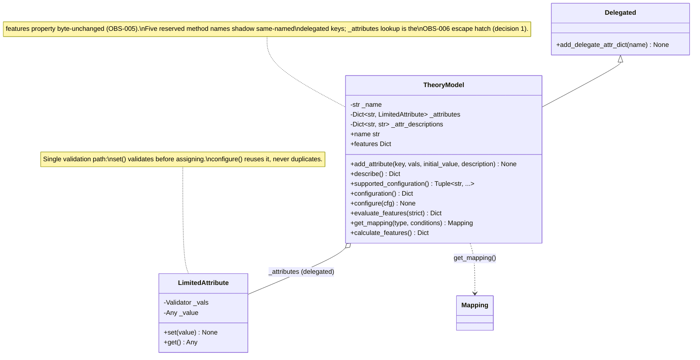
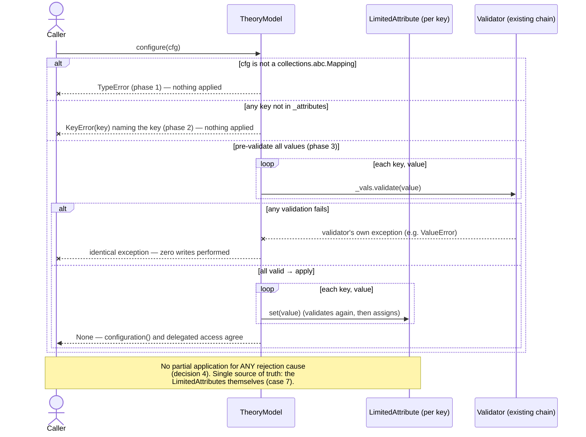

# TU-007 detailed design: theory-model description, configuration and strict evaluation contracts

Designer: sw-celeste. Input: Release 1 PRD (TU-007 row), TU-007 approved
test contract (`log/release_1/tests/TU-007.md`, 11 cases), acceptance
cases (`tests/test_tu_theory.py`), TU-007 implementability review
(`log/release_1/tests/TU-007-implementability.md`, sw-tom **ACCEPTED**;
five non-blocking observations resolved here), TU-001 compatibility
matrix (`log/release_1/compatibility.md`, theory rows, OBS-005, OBS-006),
TU-006 detailed design (`log/release_1/design/TU-006.md`, structure
precedent), and current `softlab/tu/theory/model.py` sources at branch
tip `82d8ccb`. Status: proposed for architecture review; no production
implementation exists at this gate.

## Intent and compatibility

Give model consumers an opt-in inspection and configuration surface on
`TheoryModel` — versioned semantic description, explicit supported
serializable configuration with a verified round trip, and an opt-in
strict evaluation path that exposes the original error — while the legacy
`features` property (OBS-005 characterized swallow), the `Mapping` /
`batch_mapping` shape-check layer, and all public imports remain
byte-unchanged.

The change is confined to `softlab/tu/theory/model.py`: one new private
field (`_attr_descriptions`), one backward-compatible keyword addition on
`add_attribute` (`description: str = ''`), five new methods
(`describe`, `supported_configuration`, `configuration`, `configure`,
`evaluate_features`), and docstring updates. `Mapping`, `batch_mapping`,
the legacy `features` property, `get_mapping`, `calculate_features`,
`name`, `__repr__` and the `Motion1D` example are untouched. No
`__init__.py` change (no new public names are exported; all additions are
methods on the already-exported `TheoryModel`). No `jin` change: the
existing `LimitedAttribute.set()` validator chain is the single
validation path and is reused, never duplicated.

Compatibility invariants this design must not disturb (TU-001 matrix and
TU-007 gate grounding):

- `TheoryModel.features` stays **byte-identical**: bare `try/except`
  around `calculate_features()`, `{}` on any exception (OBS-005
  disposition: the swallow survives only on the legacy property and the
  `strict=False` path; it is never certified as desirable).
- `add_attribute(key, vals, initial_value)` three-argument calls keep
  working unchanged; the duplicate-key `ValueError` message shape is
  preserved.
- Delegation precedence: `Delegated.__getattr__` fires only when normal
  lookup fails, so the five new real methods shadow delegated attribute
  keys of the same name (decision 1).
- All five `Mapping` check outcomes (`TypeError`/`ValueError`/
  `RuntimeError` variants) and `batch_mapping` are the only shape-check
  layer — the new contract adds none (guard 2).
- Public import identity of `Mapping`, `TheoryModel`, `batch_mapping`
  through `softlab.tu.theory` and `softlab.tu` is unchanged (guard 3).
- Description and configuration-declaration operations perform **no
  evaluation** and no I/O of any kind (pure in-memory metadata reads).

## Design decisions (implementability observations resolved)

The five non-blocking observations from the implementability review are
resolved as follows.

### 1. Reserved-name shadowing (observation 1) — documented, escape hatch stated

The five new method names (`describe`, `supported_configuration`,
`configuration`, `configure`, `evaluate_features`) become class-level
attributes of `TheoryModel` and therefore shadow any delegated attribute
key of the same name: `model.configuration` resolves to the method, not
to a delegated `LimitedAttribute` named `configuration`. This is the
OBS-006 collision category already characterized in the TU-001 matrix
("delegated names may collide with methods; explicit lookup remains
available").

Resolution: the names are declared **reserved** in the `TheoryModel`
class docstring (verbatim mandate below), and each affected model author
retains the OBS-006 escape hatch — explicit
`model._attributes['configuration']()` lookup bypasses normal attribute
resolution and reaches the delegated attribute regardless of shadowing.
In-repo impact is zero (verified by grep in the implementability review:
no in-repo attribute key or subclass uses any of the five names; the only
in-repo consumers are `theory/__init__.py` and the `Motion1D` example).
No name-mangling, no dynamic dispatch, no collision registry is added —
documentation is the smallest entity that resolves the observation.

### 2. Description registration ordering (observation 2) — duplicate check precedes recording

Semantic descriptions are stored in a parallel dict
`self._attr_descriptions: Dict[str, str]`, created in `__init__`
immediately after `self._attributes = {}`. `add_attribute` ordering is:

```
1. if key in self._attributes: raise ValueError(...)   # unchanged legacy check
2. self._attributes[key] = LimitedAttribute(vals, initial_value)
3. self._attr_descriptions[key] = description
```

The duplicate-key check **precedes** description recording, so a rejected
duplicate leaves no orphan entry that a later successful re-add would
contradict. Ordering step 2 before step 3 additionally guarantees that a
rejected *initial value* (`LimitedAttribute.__init__` runs
`set(initial_value)`, which validates and may raise) also leaves no
orphan description: the description is recorded only for an attribute
that was fully and successfully added. Invariant:
`set(self._attr_descriptions) == set(self._attributes)` after every
`add_attribute` call that returns normally, and both are unchanged after
every `add_attribute` call that raises.

A parallel dict (rather than a field on `LimitedAttribute`) keeps `jin`
untouched — TU-007 is confined to `model.py`, and attaching theory-layer
semantics to the generic `jin` attribute class would be an entity
without necessity.

### 3. Non-serializable attribute values (observation 3) — declared set is all attributes; JSON safety is the model author's responsibility

`supported_configuration()` returns **exactly the current attribute key
set**, value-independent:

```
def supported_configuration(self) -> Tuple[str, ...]:
    return tuple(self._attributes.keys())
```

- "Supported" is coextensive with "all registered attributes" — there is
  no filtering, no per-key metadata, no exclusion list. Insertion order
  is preserved (dict ordering), so the declaration is stable and equal
  before and after any value change (case 6 pins this).
- **Policy for non-JSON-safe values (stated, not policed):** a model
  whose attribute holds a non-serializable value (e.g. an ndarray) is
  still fully *configurable* — `configuration()`/`configure()` read and
  write it through the existing validator chain — but JSON safety of the
  returned values is the **model author's responsibility**, not enforced
  by `TheoryModel`. The declaration keys themselves are always strings
  and JSON-safe; the *values* returned by `configuration()` inherit
  whatever the attributes hold. This mirrors the PRD's serialization
  stance for TU-005 ("serialization limits are explicit rather than
  imposed on all values"): the contract documents the limit instead of
  adding a serialization layer. The `configuration()` docstring (verbatim
  mandate below) states this explicitly.
- Rationale: the alternative — excluding non-serializable keys from
  `supported_configuration()` — would make the declaration
  value-*dependent* (a key would appear or disappear as its value
  changes), violating the case-6 requirement that the declaration be
  independent of current values. Documentation is the only option
  consistent with the accepted tests.

### 4. `configure` atomicity (observation 4) — three-phase, pre-validate all, no partial application

`configure(cfg)` guarantees **no partial application for any rejection
cause**, including multi-key validation failure. Three phases, each
completing fully before the next begins:

```
Phase 1 — shape:    if not isinstance(cfg, collections.abc.Mapping):
                        raise TypeError(...)
Phase 2 — keys:     for key in cfg:
                        if key not in self._attributes: raise KeyError(key)
Phase 3 — values:   for key, value in cfg.items():
                        self._attributes[key]._vals.validate(value)   # pre-validate all
Apply:              for key, value in cfg.items():
                        self._attributes[key].set(value)              # then apply all
```

- Phase 3 pre-validates **every** value against its attribute's existing
  `Validator` (reached as `LimitedAttribute._vals`, the same validator
  object the attribute itself uses) before **any** value is applied.
  A failure anywhere in phase 3 raises the validator's own exception
  (e.g. `ValInt(0, 10)`'s `ValueError` for `11`, case 9) with **zero**
  writes performed — earlier keys in the same `cfg` are not left applied.
- The apply phase re-runs validation inside `LimitedAttribute.set()`
  (validate-then-assign is that class's fixed contract). The double
  validation is deliberate and harmless: validators are pure checks
  (`validate()` raises on failure, has no side effects, per the `jin`
  validator contract), and routing the final write through `set()` — not
  through a private `_value` poke — is what makes the configuration path
  **reuse** the existing chain rather than duplicate it (case 9's "same
  `ValueError`, changes nothing" falls out of the existing chain for
  free). Validating twice is the price of keeping exactly one validation
  implementation; a second validator layer is neither needed nor
  permitted.
- `KeyError(key)` is raised with the bare key so `str()` of the exception
  contains the key name (case 8: `assertIn("nope", str(raised.exception))`
  — `str(KeyError("nope"))` is `"'nope'"`).
- The non-mapping check accepts `collections.abc.Mapping`, not just
  `dict` (implementability recommendation adopted): the test's `str`
  rejection holds, and legitimate mapping arguments (e.g. `MappingProxyType`)
  are not over-restricted. `collections.abc` is standard library — no new
  dependency.
- Round-trip identity (case 7: re-applying the read configuration changes
  nothing) follows from idempotent `set()` of equal values through the
  same chain.

### 5. Optional guard enrichment (observation 5) — declined for the design; recorded as an optional test-phase handoff

Guard 1 could additionally pin the legacy `name` property directly and
the base `calculate_features` `NotImplementedError`. I decline to require
it: the implementability review correctly notes the current guards
already cover every regression vector an implementation confined to
`model.py` can introduce, and `describe()["name"]` (case 4) already
reaches the `name` property on the new path. Recorded as **test-phase
handoff 2** below — sw-mike may add these pinnings during the test phase
if judged worthwhile; they are not a design prerequisite and I do not
edit tests at this gate.

## Public surface and state model

All additions are on `TheoryModel` in `softlab/tu/theory/model.py`:

```python
TheoryModel.add_attribute(key: str, vals: Validator, initial_value: Any,
                          description: str = '') -> None        # new keyword
TheoryModel.describe() -> Dict[str, Any]
TheoryModel.supported_configuration() -> Tuple[str, ...]
TheoryModel.configuration() -> Dict[str, Any]
TheoryModel.configure(cfg: Mapping[str, Any]) -> None
TheoryModel.evaluate_features(strict: bool = False) -> Dict[str, Any]
# unchanged in signature and behavior: __init__ (gains one private field),
# name, features, get_mapping, calculate_features, __repr__
```

New import: `Tuple` added to the existing `typing` import line;
`collections.abc.Mapping` imported as the non-mapping check target. No
other import changes.

### State fields (private)

| Field | Type | Initial | Meaning |
| --- | --- | --- | --- |
| `_name` | `str` | constructor value (`''` default) | model identity (unchanged) |
| `_attributes` | `Dict[str, LimitedAttribute]` | `{}` | delegated attribute dict (unchanged) |
| `_attr_descriptions` | `Dict[str, str]` | `{}` | **new** — per-attribute semantic description, keyed identically to `_attributes` |

State invariant (decision 2): `_attr_descriptions` and `_attributes` have
identical key sets after every successful `add_attribute`; both are
untouched by every failed `add_attribute`. No field is added for
configuration or evaluation — configuration reads/writes go through the
existing `LimitedAttribute`s, which remain the single source of truth.

### `describe()` result schema (version 1)

```python
{
    'schema_version': 1,                       # int constant
    'name': self.name,                         # str ('' allowed)
    'model': type(self).__qualname__,          # JSON-safe class identity
    'attributes': {
        key: {'description': <str>}            # one entry per attribute,
        ...                                    # insertion order
    },
}
```

- `model` carries `type(self).__qualname__`: a plain string, JSON-safe by
  construction, containing the class name (case 4's
  `assertIn("Model", json.dumps(description))` passes for any qualname
  containing the class name; the fixture's qualname is
  `...<locals>.Model`).
- `describe()` reads only name/class/attribute metadata. It **never**
  calls `calculate_features`, `features`, `evaluate_features` or
  `get_mapping` — a model whose evaluation always raises is fully
  describable (case 5). Zero evaluation, zero I/O.
- Every attribute present in `_attributes` appears in `attributes`,
  including attributes added without a description (default `''`,
  case 4: `attributes["gain"]["description"] == ""`).
- The returned dict is freshly built on each call; callers may mutate it
  without affecting the model.

## Static view



No new module, no new base class, no mixin, no new public export.

## Dynamic view

### `configure(cfg)` three-phase rejection and apply (cases 7, 8, 9)



### Strict vs lenient evaluation (cases 10, 11; legacy property untouched)

```mermaid
sequenceDiagram
    actor Caller
    participant M as TheoryModel
    participant C as calculate_features()
    Caller->>M: evaluate_features(strict=True)
    M->>C: direct call — never routed through the features property
    alt success
        C-->>M: feature dict
        M-->>Caller: feature dict (equal to legacy features on success)
    else failure
        C--xM: raise E
        M--xCaller: bare raise — the IDENTICAL exception object E (assertIs)
    end
    Caller->>M: evaluate_features() / evaluate_features(strict=False)
    M->>C: direct call
    C--xM: raise E
    M-->>Caller: {} — OBS-005 lenient semantics preserved exactly
    Note over Caller,C: The legacy features property keeps its own\nbyte-identical try/except body; neither path\nis implemented in terms of the other.
```

## Algorithms

### `describe()`

- **Purpose**: versioned semantic description with zero evaluation.
- **Complexity**: Time O(n), space O(n) in the attribute count.
- **Pseudocode**:
  ```
  def describe(self) -> Dict[str, Any]:
      return {
          'schema_version': 1,
          'name': self.name,
          'model': type(self).__qualname__,
          'attributes': {
              key: {'description': self._attr_descriptions[key]}
              for key in self._attributes
          },
      }
  ```
- **Edge cases**: empty-name model yields `'name': ''` (existing
  constructor contract; case 4). Zero-attribute model yields
  `'attributes': {}`. Reads `_attr_descriptions[key]` directly (not
  `.get`): the decision-2 invariant guarantees the key exists; a direct
  index surfaces an invariant violation loudly instead of masking it.

### `add_attribute(..., description='')`

- **Pseudocode**: the three ordered steps of decision 2; the duplicate
  `ValueError` message keeps its legacy shape
  `f'Already has the attribute with key "{key}"'`.
- **Edge cases**: duplicate key → `ValueError`, no attribute added, no
  description recorded. Invalid initial value → the validator's exception
  from `LimitedAttribute.__init__`, no attribute added, no description
  recorded. `description` defaults to `''`; existing three-argument calls
  are byte-compatible.

### `supported_configuration()` / `configuration()`

```
def supported_configuration(self) -> Tuple[str, ...]:
    return tuple(self._attributes.keys())      # explicit, value-independent

def configuration(self) -> Dict[str, Any]:
    return {key: attr.get() for key, attr in self._attributes.items()}
```

- Both are fresh objects per call; mutating the results does not affect
  the model. Neither evaluates features; both are pure metadata/value
  reads with no I/O.

### `configure(cfg)`

- **Pseudocode**: the three phases of decision 4, exactly as written
  there.
- **Complexity**: Time O(n · v), space O(1) beyond the input, where n is
  the key count of `cfg` and v the cost of one `validate()`.
- **Edge cases**: non-mapping (including `str`, `list`, `None`) →
  `TypeError` naming the received type; empty mapping → no-op returning
  `None` (all phases vacuously pass); unknown key → `KeyError(key)`;
  any failed value → the validator's exception with zero writes; keys
  present in `cfg` but not in `supported_configuration()` are exactly the
  unknown-key case (the declaration and the accepted set are the same
  key set by construction).

### `evaluate_features(strict=False)`

```
def evaluate_features(self, strict: bool = False) -> Dict[str, Any]:
    if strict:
        return self.calculate_features()       # errors propagate: bare,
                                               # identical object
    try:
        return self.calculate_features()
    except Exception:
        return {}
```

- **Direct call, never via `features`** (implementability question 4):
  the legacy property swallows everything, so routing strict through it
  could never propagate anything. Cases 10–11 force the direct call; the
  docstring (verbatim mandate below) states it explicitly so the next
  maintainer does not re-derive it.
- **Strict path**: no `try`, no `raise ... from` — the original exception
  object propagates identically (`assertIs` in cases 10–11), consistent
  with the TU-006 error-cause policy.
- **Lenient path**: mirrors the legacy property's characterized OBS-005
  semantics — `{}` on failure. The `except Exception` form is used here
  (new code, so no blanket `BaseException` catch is introduced), which is
  behaviorally identical to the property for every evaluation failure
  (all exception types an evaluation can raise are `Exception`
  subclasses); the legacy property's own bare `except:` body stays
  byte-unchanged and is not "harmonized" — the swallow survives only on
  the legacy and `strict=False` paths and is certified nowhere.
- Neither path is implemented in terms of the other or of the property:
  three call sites (`features`, `evaluate_features` strict, lenient)
  share `calculate_features()` and nothing else.

## Implementation step split (A → B → C)

Strict order per the implementability review's recommended split; each
step is an independent green increment. **Guards 1–3 and all seven
pre-existing suites must stay green after every step.**

| Step | Production delta (all in `softlab/tu/theory/model.py`) | Newly green | Green condition (full) |
| --- | --- | --- | --- |
| **A — identity/description** | `_attr_descriptions` field in `__init__`; `add_attribute` gains `description: str = ''` with the decision-2 ordering; `describe()`. | 4, 5 | Cases 1–5 green; 6–11 RED for their designed reasons (missing configuration/strict API). All pre-existing suites green. |
| **B — configuration surface** | `Tuple` + `collections.abc.Mapping` imports; `supported_configuration()`, `configuration()`, `configure()` with the three-phase contract. | 6, 7, 8, 9 | + all prior green; 10–11 RED; pre-existing suites green. |
| **C — strict evaluation** | `evaluate_features(strict=False)`; class docstring reserved-names note; remaining docstring mandates. | 10, 11 | **All 11 cases green**, all pre-existing suites green, `compileall` + import smoke clean, zero warnings under `-W error::SyntaxWarning`. |

Steps are independent (no RED case in one group depends on another
group's API); the order above is the lowest-risk sequence, not a
contract.

## Docstring requirements

New/changed public members carry English docstrings in the surrounding
repo style (`Args:`, `Returns:`, `Errors:`, `Side-effects:` where
applicable) with type annotations. The developer must write the following
contract texts **verbatim in substance**:

- `TheoryModel` class docstring — append a reserved-names note:

  > The method names ``describe``, ``supported_configuration``,
  > ``configuration``, ``configure`` and ``evaluate_features`` are
  > reserved: they shadow any delegated attribute key of the same name,
  > because delegated lookup (``Delegated.__getattr__``) only fires when
  > normal attribute lookup fails. If a model registers an attribute
  > under one of these names, dotted-call access reaches the method, not
  > the attribute; explicit lookup through ``model._attributes[name]()``
  > remains available as the escape hatch (the OBS-006 convention). No
  > in-repo model uses any of these names as attribute keys.

- `add_attribute` — extend the existing docstring with the new keyword:

  > ``description`` (keyword-only in intent, positional-compatible by
  > default): optional semantic description of the attribute, default
  > ``''``. It is recorded only after the duplicate-key check and the
  > initial-value validation both succeed, so a rejected attribute never
  > leaves an orphan description. Existing three-argument calls are
  > unchanged.

- `describe()`:

  > Returns the versioned semantic description of this model
  > (``schema_version`` 1): the model ``name``, the model kind as the
  > class's ``__qualname__`` (JSON-safe), and one entry per attribute
  > carrying its semantic ``description`` (``''`` when none was given).
  > Performs no evaluation: ``calculate_features`` is never called, so a
  > model whose evaluation raises is still fully describable. The
  > returned dict is freshly built on each call; mutating it does not
  > affect the model.

- `supported_configuration()`:

  > Returns the supported configuration keys — exactly the registered
  > attribute keys, in registration order. The declaration is explicit
  > and independent of current attribute values: it does not change when
  > values change. The keys are strings and JSON-safe.

- `configuration()`:

  > Returns the current configuration as a fresh dict mapping each
  > supported key to its attribute's current value, read through the
  > existing ``LimitedAttribute.get()``. Values are JSON-serializable
  > exactly when the model's attribute values are: JSON safety of values
  > is the model author's responsibility and is not enforced — an
  > attribute holding a non-serializable value (e.g. an ndarray) is
  > still configurable, but the returned dict will not dump to JSON.
  > Performs no evaluation and no I/O.

- `configure(cfg)`:

  > Applies a configuration mapping. Three phases, each completing fully
  > before the next: (1) a non-``collections.abc.Mapping`` argument
  > raises ``TypeError`` naming the received type; (2) any key not in
  > ``supported_configuration()`` raises ``KeyError`` naming the key;
  > (3) every value is pre-validated against its attribute's existing
  > ``Validator`` before any value is applied. Rejection at any phase
  > leaves the previous configuration fully intact — no partial
  > application for any rejection cause, including multi-key validation
  > failure. Application writes each value through the existing
  > ``LimitedAttribute.set()`` (validate-then-assign), reusing the
  > existing validation chain rather than duplicating it. An empty
  > mapping is a no-op. Re-applying a dict read from ``configuration()``
  > is an identity.

- `evaluate_features(strict=False)`:

  > Evaluates model features by calling ``calculate_features()``
  > directly — never through the ``features`` property (the property
  > swallows all exceptions, so a strict path routed through it could
  > never propagate anything). With ``strict=True`` the original
  > exception object from ``calculate_features`` propagates unchanged
  > (no wrapping, no ``raise ... from``). With ``strict=False`` (the
  > default) the legacy lenient semantics are preserved: any evaluation
  > failure returns ``{}`` (the OBS-005 fallback). The legacy ``features``
  > property is a separate, unchanged code path.

No other docstrings change.

## Verification and dependencies

Acceptance coverage: guards 1 (legacy features/add_attribute/delegation),
2 (Mapping checks retained), 3 (import identity); RED cases 4
(identity + descriptions, empty name), 5 (zero-evaluation description),
6 (explicit value-independent JSON-safe declaration), 7 (round trip,
single source of truth, re-apply identity), 8 (KeyError naming the key,
TypeError, no partial application), 9 (validator reuse — same
`ValueError`, nothing changed), 10 (strict propagates the identical
object), 11 (lenient matrix beside strict; legacy property untouched).

**Notes for the test phase (handoffs to sw-mike — do not add during
implementation):**

1. **None blocking.** The accepted suite is internally consistent as
   committed; no test-contract fix is required by this design.
2. **Optional guard enrichment (implementability observation 5,
   declined as a design requirement):** guard 1 could additionally pin
   the legacy `name` property directly (currently reached only
   indirectly via case 4's `describe()["name"]`) and the base
   `calculate_features` `NotImplementedError`. If sw-mike judges these
   worth executable coverage, add them during the test phase only; the
   current guards already cover every regression vector an
   implementation confined to `model.py` can introduce.
3. **Optional pinnings** (documented here, unasserted by the suite): the
   multi-key no-partial-application guarantee (decision 4 — the suite
   pins single-key validation failure and unknown-key rejection only)
   and `configure({})` no-op. If sw-mike judges them worth executable
   coverage, add focused cases during the test phase only.

TU-001 baseline tests and the TU-002–TU-006 suites must stay green; no
CI/testing completion is claimed at this gate. All models in tests are
synthetic in-memory fixtures; no hardware, no files.

Scope: changes are confined to `softlab/tu/theory/model.py`. New imports:
`Tuple` (added to the existing `typing` line) and `collections.abc`
(standard library). No `__init__.py` change, no `jin` change, no other
module changes.

| Dependency | Justification |
| --- | --- |
| *(none)* | `typing.Tuple` and `collections.abc.Mapping` are standard library. NumPy is an existing dependency and is not needed by `model.py`. No third-party module is introduced. |

Simplicity audit of rejected alternatives: a **description schema
registry or per-attribute metadata objects** (a parallel `Dict[str, str]`
is the smallest structure satisfying the invariant); a **`__init__.py`
export** of anything new (all additions are methods on the
already-exported `TheoryModel`); **filtering non-serializable keys** out
of `supported_configuration()` (would make the declaration
value-dependent, violating case 6; documentation chosen instead,
decision 3); a **serialization/encoding layer** inside `configuration()`
(the PRD's TU-005 stance: limits are documented, not imposed);
**apply-in-order `configure`** (decision 4's pre-validate-all costs one
extra O(n) validation pass and removes the partial-application ambiguity
entirely); a **`validate()` helper added to `LimitedAttribute`** (would
touch `jin` beyond the authorized `model.py` scope; reaching the existing
validator object reuses the same chain without new API); implementing
**lenient `evaluate_features` via the `features` property** (would couple
the two paths and obscure the strict/lenient split; three independent
call sites share only `calculate_features()`); a **bare `except:`** in
the new lenient path (new code catches `Exception`; the legacy property's
bare except is preserved byte-identically, not propagated into new code);
a **`schema_version` class attribute or registry** (a pinned int literal
1; versioning machinery is an entity without necessity until a version 2
exists); **name-collision detection or mangling** for the five reserved
names (documentation plus the existing `_attributes` escape hatch is the
OBS-006 convention; zero in-repo impact); and **locking** around
configuration or description (theory models are single-threaded pure
computation; no concurrency requirement exists in the PRD or the suite).

## Design review

- **Reviewer**: sw-jerry
- **Review date**: (pending)
- **Status**: PENDING — submitted for architecture review; all five
  implementability observations resolved above (1: reserved names
  documented with `_attributes` escape hatch; 2: duplicate-key check
  precedes description recording; 3: declared set is all attributes, JSON
  safety documented as the model author's responsibility; 4:
  three-phase pre-validate-all with no partial application; 5: optional
  guard enrichment declined as a design requirement, recorded as a
  test-phase handoff).
