# TU-008 detailed design: release integration, user documentation and recorded verification

Designer: sw-celeste. Input: Release 1 PRD (TU-008 row and acceptance-status
section, `log/release_1/prd.md`), revised TU-008 test gate
(`log/release_1/tests/TU-008.md`, 7 cases + DC-1..DC-4 checklist + procedures
P1/P2 + DEFECT-1 two-file disposition), TU-008 implementability review
(`log/release_1/tests/TU-008-implementability.md`, sw-tom, issue 1 resolved by
the revised gate; the 10-section `docs/tu_extensions.md` checklist adopted here
as binding), TU-001 compatibility matrix (`log/release_1/compatibility.md`,
OBS-001..OBS-006 and DEFECT dispositions), TU-002..TU-007 detailed designs
(`log/release_1/design/TU-002.md` … `TU-007.md`, authoritative behavior
sources), architecture review (`log/release_1/design/TU-008-arch-review.md`,
CHANGES REQUESTED, 2 text-level issues corrected by this revision), and the
reviewed candidate chain `b65bd81` → this correction commit
(`docs(log): correct TU-008 design review issues`) on
`codex/tu-008-integration`. Status:
proposed for architecture review; no implementation exists at this gate.

## Intent and scope

TU-008 is an integration/documentation task. It delivers exactly three
artifact-level changes and records four manual verification procedures:

1. **DEFECT-1 fix** — raw-string conversion of two `__main__` example blocks
   (`softlab/tu/station/parameter.py:580-581`,
   `softlab/jin/validator/implements.py:470-471`), unblocking the P1
   zero-warning forced-compile gate.
2. **`docs/tu_extensions.md`** — the user-facing extension guide (DC-1),
   flipping gate case 7 from designed RED to GREEN.
3. **Optional README pointer** (DC-3, non-blocking).

Everything else the PRD TU-008 row requires is **recorded verification**, not
new artifacts: P1 (regression/compile/import), P2 (package-artifact
inspection), the DC-2 documentation consistency walk, and the DC-4
architecture-finalization record. The `arch.md` update itself is the
architect's release-end gate and is **out of TU-008's implementation scope**
(see "Step split and role boundaries").

Non-negotiable constraints from the gate and PRD:

- No production behavior change beyond the DEFECT-1 example-block literals
  (zero behavior change: the raw form is value-identical to the non-raw form;
  only the `SyntaxWarning` differs).
- No new runtime dependencies, no new tooling dependencies in
  `pyproject.toml`, no dev-dependency group. Installing `build` into `.venv`
  is a recorded end-of-sprint procedure, not a dependency change.
- Documentation describes **implemented behavior only** — merged code on
  `dev`, pinned by merged tests. No plans, no rejected alternatives, no
  future work may appear in `docs/tu_extensions.md`.
- Documentation is Markdown, English, in the repository's existing docstring
  prose style (terse, parameter/return/error oriented).

## Delivery flow

```mermaid
flowchart LR
    S1[Step 1: DEFECT-1 raw-string fix<br/>sw-tom, fix commits] --> S2[Step 2: docs/tu_extensions.md<br/>sw-tom, docs commit]
    S2 --> S3[Step 3: optional README pointer<br/>sw-tom, docs commit]
    S3 --> CR[Code review: sw-celeste<br/>this design as reference]
    CR --> TG[Testing gate: sw-mike<br/>P1 + P2 + DC-2 walk + DC-4 record]
    TG --> PC[Principle check + integration to dev]
    PC --> RE[Release end: sw-jerry<br/>arch.md update — separate gate]
    S1 -.->|self-check: forced compile exit 0| S2
```



## Step split and role boundaries

### Step 1 — DEFECT-1 fix (sw-tom)

Two scoped commits, one per file, per the implementability review's
`fix(jin)`/`fix(tu)` split (this also satisfies the gate record's "dedicated
commit" requirement; no other change may ride along):

1. `fix(jin): use raw-string regex literals in __main__ example`
2. `fix(tu): use raw-string regex literals in __main__ example`

Exact edits and verification are specified in "DEFECT-1 fix plan" below.

### Step 2 — `docs/tu_extensions.md` (sw-tom)

One commit, suggested message `docs(tu): add tu_extensions user guide`.
Creates `docs/` at repository root (no `docs/` exists today; confirmed at
`32dd5a7`). Content is bound by the 10-section outline in
"`docs/tu_extensions.md` structure" below. On landing, gate case 7
(`test_documentation_artifacts_exist_and_cover_added_apis`) flips GREEN and
the full suite reaches 99/99.

### Step 3 — README pointer (sw-tom, optional, non-blocking)

One-sentence pointer in `README.rst` to `docs/tu_extensions.md`. Per DC-3
this is recommended but not acceptance-blocking; if omitted, the omission is
recorded in the final evidence section.

### What TU-008 delivers vs. what the release-end arch update adds

| Item | Owner | When | TU-008 scope? |
| --- | --- | --- | --- |
| DEFECT-1 fix | sw-tom | step 1 | Yes |
| `docs/tu_extensions.md` (DC-1) | sw-tom | step 2 | Yes |
| README pointer (DC-3) | sw-tom | step 3 | Yes (optional) |
| P1/P2/DC-2 execution + evidence | sw-mike | testing gate | Yes (recorded) |
| DC-4 record: pinned path, owner, status | sw-mike | testing gate | Yes (record only) |
| `arch.md` update describing implemented behavior | **sw-jerry** | release end, after TU-008 integration, before release acceptance | **No** |
| `prd.md` acceptance-status update referencing evidence links | release acceptance (sw-camille) | release acceptance | No |

Rationale: the workflow assigns architecture to sw-jerry, and `arch.md`
describes the whole project's implemented state — finalizing it is meaningful
only once all release content is integrated on `dev`. TU-008's testing gate
records DC-4 as a **handoff record**, not an executed edit. Per
implementability observation 3, the concrete paths are pinned now:

- File to update: `arch.md` (repository root).
- Review evidence path: `log/release_1/arch-review.md`.

The release-end architecture update/review record is **appended** to
`log/release_1/arch-review.md` as a new section; the existing TU-001
review content is preserved (no replacement).

**Content the release-end `arch.md` update must add** (specification for
sw-jerry; TU-008 defines it so the release-end gate is auditable):

- The TU-002 description surface: versioned (`schema_version` 1)
  parameter/device/station descriptions; description operations perform no
  device I/O.
- The TU-003 explicit operation path: `VisaCommand.execute()` /
  `describe_operation()`; description lookup executes nothing.
- The TU-004 lifecycle contract: `prepare()`/`cleanup()`/`initialized`/
  `supports()`; idempotent prepare; repeated-cleanup safety; ownership and
  borrowed-resource rules.
- The TU-005 measurement contract: `read()` returning `Reading`
  (value/quality/error/acquired_at) and `describe_reading()`; legacy
  value-only access retained.
- The TU-006 VISA adoption: `VisaHandle` lifecycle/timeout/abort surface
  (`timeout_seconds`, `abort()`, `confirm_stop()`, `AbortReport`) and the
  OBS-001/OBS-002/OBS-003 resolutions.
- The TU-007 theory surface: `describe()` / `supported_configuration()` /
  `configuration()` / `configure()` / `evaluate_features()`; legacy
  `features` retained with its characterized `{}` fallback.
- The open observation dispositions recorded as known limitations /
  technical debt: **OBS-004** (`QuantizedParameter`/`VisaParameter`
  init-value hazard), **OBS-006** (delegated-name collisions with the
  explicit `_attributes`/`device()` escape hatch) and **DEFECT-2** (the
  deliberate neither-settable-nor-gettable warning), with their documented
  workarounds — an explicit cross-reference to `docs/tu_extensions.md`
  section 8 and `log/release_1/compatibility.md` is acceptable wording.
  The release-end record must not be silent where the user documentation
  is explicit.
- All phrased as **implemented behavior** (present tense, no "planned" /
  "will"); content sourced from the TU-002..TU-007 design documents and the
  merged test suites, consistent with `docs/tu_extensions.md`.

## `docs/tu_extensions.md` structure (binding outline)

The developer's 10-section checklist is adopted verbatim as the binding
outline. For each section, the **authoritative content source** is named;
behavior statements must trace to merged code and merged tests. Design
documents are the source for *semantics*; the test files are the source for
*runnable form*.

| # | Section | Authoritative content source |
| --- | --- | --- |
| 1 | Header: title, one-paragraph scope ("TU-002–TU-007 additions in softlab 0.3.0"), pointer back to `README.rst` | `log/release_1/prd.md` (release goal); version from `softlab/VERSION.txt` (0.3.0) |
| 2 | Parameter measurement contract: `Parameter.describe()`, `describe_reading()`, `read()` returning `Reading` (value/quality/error/acquired_at), `schema_version` 1 description shape; legacy `()`/`get()` value-only semantics explicitly retained | `log/release_1/design/TU-005.md` (reading contract), `log/release_1/design/TU-002.md` (description shape); pinned by `tests/test_tu_measurements.py`, `tests/test_tu_descriptions.py` |
| 3 | Device lifecycle: `Device.describe()`, `prepare()`, `cleanup()`, `initialized`, `supports()` — idempotent prepare, repeated-cleanup safety, `describe()` performs no I/O | `log/release_1/design/TU-004.md`; pinned by `tests/test_tu_lifecycle.py`, `tests/test_tu_descriptions.py` |
| 4 | Station: `Station.describe()` aggregate description | `log/release_1/design/TU-002.md`; pinned by `tests/test_tu_descriptions.py` |
| 5 | VISA lifecycle: `VisaHandle.initialized`, `supports()`, `prepare()`, `cleanup()`, `timeout_seconds` (seconds-based; `None` disables; default 5000 ms forwarding — resolved OBS-001 semantics), `abort()`, `confirm_stop()`, `AbortReport`; `VisaCommand.execute()`, `describe_operation()` | `log/release_1/design/TU-006.md` (handle lifecycle, timeout sentinel contract, abort), `log/release_1/design/TU-003.md` (operation path); OBS-001 resolution wording from `log/release_1/compatibility.md`; pinned by `tests/test_tu_visa_contracts.py`, `tests/test_tu_operations.py` |
| 6 | Theory model: `TheoryModel.describe()`, `supported_configuration()`, `configuration()` (JSON-serializable), `configure()` (unknown-key `KeyError`, non-mapping `TypeError`, validation rejection leaves values intact), `evaluate_features()` (default lenient `{}` fallback; `strict=True` re-raises the original error object) | `log/release_1/design/TU-007.md`; pinned by `tests/test_tu_theory.py` |
| 7 | Worked examples: (a) describe → prepare → `huo.count()` → cleanup on a virtual device; (b) legacy `scan()` beside `read()`; (c) model configuration round trip | Runnable form copied from `tests/test_tu_integration.py` cases 2, 3, 5 fixtures (copy-paste acceptable per the implementability review); prose semantics from the design documents cited above |
| 8 | Limitations (explicit section; mandatory entries listed below) | `log/release_1/compatibility.md` (all OBS/DEFECT dispositions), `log/release_1/tests/TU-008.md` (DEFECT-2 disposition), `log/release_1/design/TU-007.md` (serialization handoff) |
| 9 | Migration-free statement (verbatim wording below) | `log/release_1/prd.md` TU-008 row; pinned by gate case 6 and the guard suites |
| 10 | Versioning note: all description payloads are `schema_version` 1 | `log/release_1/design/TU-002.md` (description schema versioning) |

### Section 8 — Limitations: mandatory entries

The Limitations section must name **at minimum** the following, honestly
summarizing `compatibility.md` dispositions (resolved items recorded for
transparency, open items recorded as limitations — nothing silently dropped):

*Resolved observations (recorded for transparency):*

- **OBS-001 (resolved, TU-006):** timeout units. Default construction
  forwards `timeout_seconds * 1000` milliseconds (5000 ms); an explicit raw
  `timeout` is forwarded unchanged and never rescaled; the `timeout_seconds`
  property converts in both directions and `None` disables the timeout.
- **OBS-002 (fixed, TU-006):** `VisaHandle.write_raw` now routes to
  `resource.write_raw(message)` with the identical bytes object, return value
  forwarded, error identity preserved.
- **OBS-003 (closed, TU-006):** `_acquire()` is the single acquisition site;
  any post-acquisition failure closes the acquired resource exactly once and
  propagates the original exception object unchanged. The resource manager is
  retained for the handle's lifetime; there is no manager-close API.

*Known limitations:*

- **OBS-004:** `QuantizedParameter` and `VisaParameter` call base
  initialization before installing fields used by setting hooks/codecs; a
  non-None settable `init_value` can fail. Avoid non-None settable
  `init_value` on these classes.
- **OBS-005:** `TheoryModel.features` and `evaluate_features(strict=False)`
  catch all exceptions and fall back to `{}`; `evaluate_features(strict=True)`
  is the opt-in escape hatch that re-raises the original error object.
- **OBS-006:** delegated attribute names may collide with methods (`child`,
  `device`); explicit `_attributes`/`device()` lookup remains available for
  such names.
- **DEFECT-2:** constructing a `Parameter` that is neither settable nor
  gettable emits a warning. This is a deliberate, documented warning on a
  programmer-error path and is not silenced.
- **Description serialization limits:** description payloads contain
  JSON-safe scalar values; ndarray attribute values in model configuration
  are the model author's responsibility (per the TU-007 design handoff).

### Section 9 — Migration-free statement (verbatim, binding)

The following statement must appear in the document with this wording
(minor punctuation adaptation allowed; no semantic change):

> **Migration-free guarantee.** Existing code that calls none of the APIs
> listed in this guide requires no changes: all public import paths, the
> value-only records produced by `count()`/`scan()`, the legacy
> `TheoryModel.features` property (including its `{}` fallback on evaluation
> failure), and the builder helpers `register_device_builder`,
> `get_device_builder`, `set_default_station` and `default_station` behave
> exactly as before. Every extension described in this guide is opt-in.

### Document rules

- English, Markdown, repository docstring prose style.
- Every documented signature/semantics statement must match the live object —
  this is exactly what the DC-2 walk verifies; the doc author writes against
  the live objects, not against memory.
- No behavior may be documented that is not implemented on `dev`; no design
  alternative, rejected option, or future plan may appear.

## DEFECT-1 fix plan

### Exact edits

**`softlab/tu/station/parameter.py`, lines 580–581** (inside
`if __name__ == '__main__':`):

```python
# before
        (Parameter('email1', ValPattern('\w+(\.\w+)*@\w+(\.\w+)+')), 'a@b.com'),
        (Parameter('email2', ValPattern('\w+(\.\w+)*@\w+(\.\w+)+')), 'a_b.com'),
# after
        (Parameter('email1', ValPattern(r'\w+(\.\w+)*@\w+(\.\w+)+')), 'a@b.com'),
        (Parameter('email2', ValPattern(r'\w+(\.\w+)*@\w+(\.\w+)+')), 'a_b.com'),
```

**`softlab/jin/validator/implements.py`, lines 470–471** (inside
`if __name__ == '__main__':`):

```python
# before
        ('prettyage.new@gmail.com', ValPattern('\w+@\w+(\.\w+)+')),
        ('prettyage.new@gmail.com', ValPattern('\w+(\.\w+)*@\w+(\.\w+)+')),
# after
        ('prettyage.new@gmail.com', ValPattern(r'\w+@\w+(\.\w+)+')),
        ('prettyage.new@gmail.com', ValPattern(r'\w+(\.\w+)*@\w+(\.\w+)+')),
```

No other line in either file changes. No other file changes.

### Why this is zero-behavior-change

In current CPython an invalid escape sequence in a non-raw string is retained
literally: `'\w'` already evaluates to the two-character string `\w`,
identical to `r'\w'`; only the `SyntaxWarning` differs. The regex semantics
seen by `ValPattern` are byte-identical before and after. Both blocks are
`__main__` examples, never imported at runtime.

### Post-fix verification

1. **P1 step 1 (the unblocking check), run by sw-tom immediately after the
   two commits, from repository root, `.venv`, Python 3.13.15:**
   `.venv/bin/python -W error -m compileall -q -f softlab tests`
   — must exit 0 with zero output (zero errors, zero warnings). The `-f`
   flag is mandatory (cached bytecode masks the warning). Result recorded in
   the step-1 handoff note; sw-mike re-runs it at the testing gate.
2. **Suite unchanged:** `.venv/bin/python -W error -m unittest discover -s
   tests -p 'test_*.py'` — 99 tests, the single designed RED (case 7)
   remains until step 2 lands, zero warnings escalated, zero skips.
3. **Optional behavioral spot-check** (both example blocks print only — no
   file writes, no plotting, no device access; read and confirmed at design
   time): `python -m softlab.tu.station.parameter` and `python -m
   softlab.jin.validator.implements` from repository root produce unchanged
   output.

## P1/P2 execution responsibilities at the testing gate

Code review (sw-celeste) must PASS before any gate execution. At the testing
gate, **sw-mike runs everything** and records evidence in the final evidence
section of `log/release_1/tests/TU-008.md` (the same file that holds the
case-definition evidence; final results are appended/updated there, per the
DC-2 checklist's "recorded result per item in the final evidence section of
this file").

| Procedure | Executor | Timing | Evidence recorded |
| --- | --- | --- | --- |
| P1 step 1 — forced compile: `.venv/bin/python -W error -m compileall -q -f softlab tests` | sw-tom (self-check, step 1); sw-mike (authoritative, testing gate) | after step-1 commits; testing gate | exit code (must be 0), output (must be empty), environment (`.venv`, Python 3.13.15) |
| P1 step 2 — full suite: `.venv/bin/python -W error -m unittest discover -s tests -p 'test_*.py'` | sw-mike | testing gate | test count (expect 99 pass, 0 fail after step 2), warnings escalated (0), skips (0) |
| P1 step 3 — import smoke under `warnings.simplefilter('error')`: `import softlab`; `from softlab.tu.station import ...`; `from softlab.tu.theory import ...` | sw-mike | testing gate | imported names list, version (0.3.0), result |
| P2 — package-artifact inspection | sw-mike | testing gate | install command (`python -m pip install build`), build invocation (`python -m build`; **explicitly record any use of `--no-isolation`** and the offline reason), `dist/` listing showing sdist + wheel, confirmation both artifacts contain `softlab/tu/station/*`, `softlab/tu/theory/*` and `softlab/VERSION.txt`, wheel metadata version equals `softlab.__version__` (0.3.0), temporary build directory path, confirmation artifacts were never committed |
| DC-2 walk — items 1–8 (each documented API's signature/semantics against the live object; limitations present; migration statement present and accurate) | sw-mike | testing gate | per-item PASS/FAIL result in the final evidence section; any FAIL blocks the gate |
| DC-4 record | sw-mike | testing gate | pinned paths (`arch.md`, `log/release_1/arch-review.md`), owner (sw-jerry), status (pending release-end architect update) |

P2 environment note (binding, from the implementability review): `python -m
build` defaults to build isolation, which needs network access to fetch
setuptools/wheel. If the testing-gate environment is offline, use
`python -m build --no-isolation` and record that choice explicitly.

## Simplicity audit

- **No new dependencies.** `pyproject.toml` is untouched. `build` is a
  build frontend installed into `.venv` as a recorded procedure — the
  implementability review explicitly endorsed this over creating a
  dev-dependency group for a single end-of-sprint procedure.
- **No new tooling.** Verification uses the standard library (`compileall`,
  `unittest`, `warnings`) and the already-declared setuptools backend.
- **Minimal artifact set.** One new file (`docs/tu_extensions.md`), four
  edited lines across two files (DEFECT-1), one optional README sentence. No
  abstraction, no configuration, no scaffolding.
- **No scope growth.** `arch.md` and `prd.md` edits are explicitly deferred
  to their proper owners and gates rather than absorbed into this task.

## Implementation notes for sw-tom

- Implement strictly in step order: the DEFECT-1 fix first (it unblocks P1
  step 1 evidence), then the guide, then the optional README pointer.
- Write `docs/tu_extensions.md` against the **live objects** (import them,
  read signatures and docstrings) — DC-2 will walk every documented signature
  against the live object; drift fails the gate.
- Worked examples (section 7) must be runnable as written; copy the fixtures
  from `tests/test_tu_integration.py` cases 2, 3 and 5 and adapt prose
  around them. Do not invent new fixtures.
- The migration-free statement and the limitations entries are binding
  wording/content (above); do not paraphrase the substance.
- Do not edit `arch.md`, `prd.md`, `log/release_1/compatibility.md`, or any
  test file. The only test-visible effect of this task is case 7 flipping
  GREEN.

## Verification mapping

| Design element | Verified by |
| --- | --- |
| DEFECT-1 exact edits, zero-behavior-change | P1 step 1 (exit 0) + unchanged 99-test suite |
| 10-section guide, content correct | gate case 7 (tokens) + DC-2 walk (semantics) |
| Migration-free claim | gate case 6 + guard suites (already green) |
| Regression/compile/import | P1 steps 1–3 (recorded) |
| Package artifacts | P2 (recorded) |
| Final architecture handoff | DC-4 record; execution at release-end architect gate |

## Architect review

sw-jerry: PENDING — review this design against `arch.md`, the PRD TU-008 row,
and the revised gate; verdict, evidence and open issues to be recorded here.
