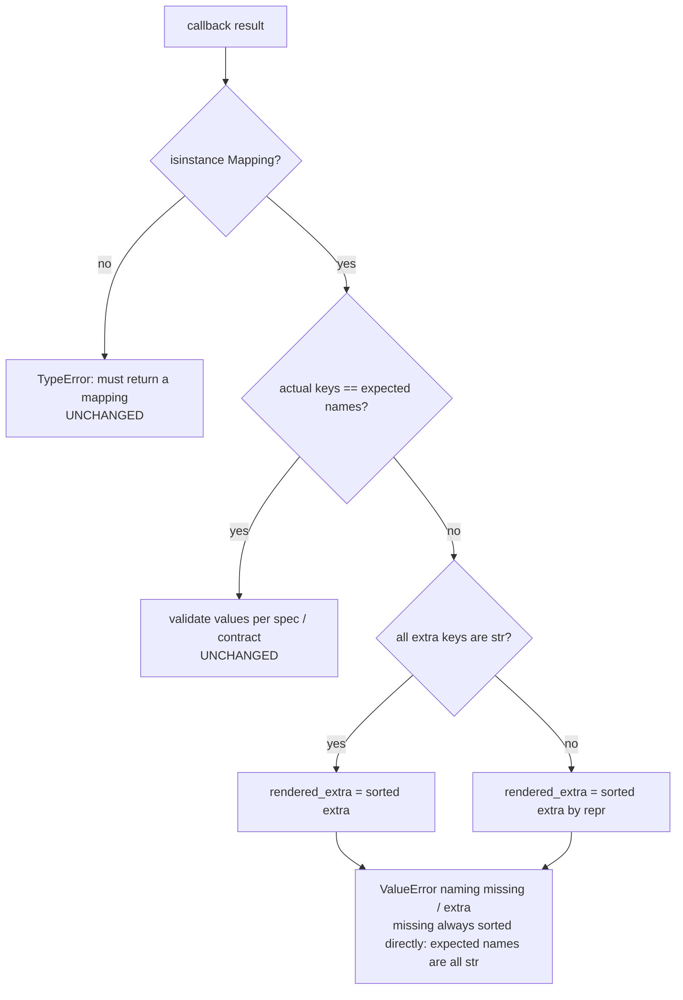

# Detailed Design — R3-001: Release 2 gap corrections and closure reconciliation

## Design Information

- **Designer**: sw-celeste
- **Date**: 2026-10-06
- **Task**: R3-001 — correct Release 2 standalone bridge readback, malformed
  callback-key errors and reset claims; reconcile closure records against commits
- **References**:
  - Requirements: [prd.md](../prd.md) (R3-AC-07; standalone portion of R3-AC-08)
  - Scope: [tasks.md](../tasks.md) (R3-001 row and scope constraints)
  - Architecture: [arch.md](../../../arch.md) and
    [architecture-plan.md](../architecture-plan.md) (context only — this task
    changes no planned architecture)
  - Approved test plan: [r3-001-test-plan.md](../test/r3-001-test-plan.md)
    (Revision 2)
  - Characterization baseline: [r3-001-baseline.md](../test/r3-001-baseline.md)
  - Convention reference:
    [sim-001-detailed-design.md](../../release_2/design/sim-001-detailed-design.md)

## Scope guard

Production runtime changes are confined to `softlab/tu/` — concretely, to
**one file**: `softlab/tu/simulation/object.py` (the callback-key fix and the
reset docstring corrections). The bridge readback fix requires **zero
production code changes**: it corrects the documented wiring pattern (user
guide §9) and the integration-test fixtures, using the already-existing
`Parameter.before_get` hook. Tests, guide, `arch.md` and process records
change outside `tu` per the PRD. No `huo`/`jin`/`shui`/`mu` changes, no
connected-simulation work (R3-003), no Release 1 debt fixes
(OBS-004/005/006, DEFECT-2 stay tracked), no dependency or Python-support
changes, no public API additions or removals.

## Overview

Four correction areas, four deliberately minimal mechanisms:

1. **Bridge readback** — the documented control-parameter wiring gains a
   `before_get=lambda stored: sim.get_input('u')` closure alongside the
   existing `before_set`. The object's input store becomes the single
   authoritative source for both writes (already true via `before_set`) and
   reads (new). No new production code: `Parameter.before_get` exists, is
   already the documented measurement-side mechanism, and its return value
   replaces the stored value, so the parameter store converges to the
   authoritative input on every read.
2. **Malformed callback keys** — one explicit key check in
   `_validate_callback_result`: sort extra keys directly when they are all
   strings (the common, documented rendering), otherwise sort by `repr`.
   The `sorted()` call can then never raise the incidental mixed-type
   `TypeError`; the documented `ValueError` always fires.
3. **Reset claims** — documentation-only correction. Code behavior is
   unchanged (owned-store restoration, build-then-swap atomicity and
   exception identity are all correct today and pinned by existing tests).
   Docstrings, guide and `arch.md` stop claiming equivalence to fresh
   construction and stop guaranteeing identical future observations;
   they state the owned-store promise plus the deterministic-callback /
   reproducible-factory condition.
4. **Closure reconciliation** — record-only edits to three Release 2
   documents, correcting the CI run reference (REC-1), the stale board
   acceptance status (REC-2) and the sprint-summary baseline reference
   (REC-3), each with a dated reconciliation note. Historical verdicts are
   not rewritten; no promotion is invented.

**No new interfaces, no new data structures, no new third-party modules.**
The design adds nothing to the public API; it corrects behavior to match
the already-documented contracts.

## Area 1 — Standalone bridge readback fix

### Decision: extend the documented closure wiring; change no production code

The defect (baseline §A): the guide §9 control wiring
(`before_set=lambda old, new: sim.set_input('u', new)`) writes through to
the object, but nothing re-reads the object on `get()`, so the parameter's
own stored value goes stale after (a) direct `obj.set_input`, (b) `reset()`,
(c) a write through a second controller sharing the object.

`Parameter` already provides the correction mechanism
(`softlab/tu/station/parameter.py:409–416`):

```
get():  permission check → self._value = before_get(self._value) → encode → return
```

`before_get`'s return **replaces** the stored value, so a single additional
closure makes every read authoritative and self-healing:

```python
ctrl = Parameter('drive', ..., validator=ValNumber(),
                 before_set=lambda old, new: sim.set_input('u', new),
                 before_get=lambda stored: sim.get_input('u'))
```

This is the same hook the guide already documents for measurement
parameters (`before_get=lambda stored: sim.observe_outputs()['y']`), and
the same pattern as the existing precedent in
`tests/test_tu_simulation_integration.py` (lines 72, 114, 159, 199). Per
the golden rule, reusing an existing,
documented hook beats introducing any bridge support class or new
`Parameter` behavior — both would be entities beyond necessity.

**Authoritative store**: the object's input store (`SimulatedObject._inputs`,
read via `get_input`, which returns a defensive copy). The parameter store
becomes a cache that is overwritten from the authoritative store on every
read; it never diverges observably.

### Dynamic behavior (corrected control read)

```mermaid
sequenceDiagram
    participant U as Caller
    participant P as Parameter (control)
    participant O as SimulatedObject
    Note over P,O: Set path (unchanged): permission → validate → decode → before_set → store → after_set
    U->>P: set(value)
    P->>P: validator.validate(value)  [gate 1]
    P->>O: before_set: set_input('u', value)  [gate 2: sim spec, authoritative]
    O-->>P: (rejection propagates before parameter store changes)
    P->>P: store value; after_set
    Note over P,O: Read path (corrected): permission → before_get → encode → return
    U->>P: get()
    P->>O: before_get: get_input('u')
    O-->>P: authoritative input (fresh copy for ndarray)
    P->>P: self._value = returned value (store converges)
    P-->>U: authoritative input
    Note over O: Direct set_input / reset() / second controller write
    Note over P,O: next get() still returns the authoritative input — no staleness possible
```

### Ordering analysis vs the pinned `Parameter.set` order

The pinned order — permission → validate → decode → `before_set` → store
→ `after_set` — is **untouched**; the fix lives entirely on the get path
(permission → `before_get` → encode → return). Consequences:

- **Validator-rejected sets (R3-TC-07d)**: `ValNumber` rejects
  `'not-a-number'` at the validate step, before `before_set`; the object is
  never touched. The subsequent read returns the authoritative input (1.0),
  identical to the parameter store — the baseline-consistent result is
  preserved, now by construction rather than by coincidence.
- **Two-gate asymmetry (guide §9)**: still exactly as documented — the
  parameter validator is gate 1 on the set path, the object's per-variable
  spec is gate 2 inside `before_set`, and a gate-2 rejection propagates
  before the parameter store changes. The `before_get` addition does not
  create a third gate: `get()` invokes no validator and `get_input` never
  raises for a declared input of a live object.
- **SIM-TC-06a**: its assertion `drive() == 1.0` immediately after
  `drive(1.0)` still passes under the corrected wiring (`before_get`
  returns `get_input('u') == 1.0`). The fixture gains the `before_get`
  closure (test-side rebind, expected by the approved test plan, risk 2);
  no assertion weakens.
- **No evolution on set or read**: `get_input` is pure (no callback
  invocation, no mutation) — pinned by R3-TC-07a and existing SIM-TC-03x.
- **`Parameter.read()`/`Reading`**: uses the identical `get()` chain, so
  the richer read reports the same authoritative value; no divergence
  between the two read APIs.
- **ndarray inputs**: `get_input` returns a fresh copy, so the parameter
  never aliases committed object storage; the copy-boundary contract
  (SIM-AC-05) is preserved.

### Guide §9 wording correction (pinned by R3-TC-07t)

- The wiring code block (guide lines 235–238) gains the `before_get` line
  shown above.
- The read-back sentence (lines 242–243, currently "Parameter read-back via
  `get()` returns the stored value, which equals the object's current
  (pending) input.") is replaced by:

  > `Parameter.set` order is permission → validate → decode → `before_set`
  > → store → `after_set`; `Parameter.get` order is permission →
  > `before_get` → encode → return. Exactly one `set_input` per parameter
  > set; no evolution occurs on set or read. Parameter read-back via
  > `get()` returns the object's **authoritative input store**
  > (`before_get`'s return replaces the stored value), so the read reflects
  > the object's current input after direct `set_input` changes, `reset()`
  > and writes through another controller sharing the same object.

- A new short paragraph in §9 distinguishes standalone from connected
  readback **without stating connected semantics** (deferred to R3-003):

  > **Standalone vs connected readback.** This section documents the
  > standalone pattern: every control read follows the object's
  > authoritative input store. A coordinated multi-participant simulation
  > (planned Release 3 work) defines different, pending-source and
  > delayed-edge readback semantics for connected participants; those
  > semantics are specified by that work and are intentionally not stated
  > here.

- R3-TC-07t(c) conditional check: the wiring change does not alter the
  implemented `Parameter.set` order or any error class, so the two-gate
  paragraph (guide lines 245–254) and the §6 error table remain accurate
  as written. Implementation must re-verify this and record the citations;
  no wording change is expected there.

## Area 2 — Malformed callback keys

### Decision: explicit key check in `_validate_callback_result`

Root cause (baseline §B): `object.py:775–776` sorts the discrepancy sets;
`expected` names are always strings, so `missing` sorting is always safe,
but `extra` may contain non-string keys, and sorting a mixed-type set
raises an incidental `TypeError: '<' not supported ...`.

Corrected logic (the only production code change in this task besides
docstrings):

```
if actual != expected:
    missing = sorted(expected - actual)          # all str — always safe
    extra = actual - expected
    if all(isinstance(key, str) for key in extra):
        rendered_extra = sorted(extra)           # existing documented rendering
    else:
        rendered_extra = sorted(extra, key=repr) # never compares keys
    raise ValueError(
        f'The {callback_name} callback must return exactly the declared '
        f'{"state" if specs is not None else "output"} names; '
        f'missing {missing}, extra {rendered_extra}')
```



### Behavior contract (exact)

- **Error type**: `ValueError` for *every* key discrepancy — missing,
  extra, wrong, mixed string/non-string — matching the documented contract
  (guide §6 error table; `evolve_once`/`observe_outputs` docstrings).
- **Message format unchanged**:
  `The {evolve|observe} callback must return exactly the declared
  {state|output} names; missing {missing}, extra {extra}`.
- **Preserved renderings** (pinned by R3-TC-07g/07h):
  - pure-string extra `{'z'}` → `extra ['z']`;
  - single non-string extra `{2}`, `{None}`, `{('a',)}` → `extra [2]`,
    `extra [None]`, `extra [('a',)]` — the `repr`-keyed sort of a
    single-element set yields the element itself, so these messages are
    byte-identical to today;
  - mixed `{'z', 2}` → `ValueError` with `extra ['z', 2]`
    (repr ordering: the leading apostrophe of `"'z'"`, U+0027, precedes
    the digit `'2'`, U+0032) — deterministic, names the discrepancy,
    never `TypeError`.
- **Non-mapping results remain `TypeError`** ("must return a mapping, got
  {type}") — checked before any key handling (R3-TC-07i).
- **Atomicity (R3-TC-07j)**: the `ValueError` raises inside
  `_validate_callback_result`, before `evolve_once`'s commit
  (`self._states = next_states`); the build-then-swap contract is
  structurally untouched, so committed state stays bit-identical.
- **Complexity**: O(k log k) in the discrepancy size, as before; the
  explicit check adds one O(k) pass.

### Why not try/except around `sorted`

Catching the incidental `TypeError` would work but would hide *which*
comparison failed and would still rely on an exception for control flow
in a documented-error path. The explicit `all(isinstance(key, str))` check
makes the contract obvious, keeps pure-string rendering byte-identical,
and covers even homogeneous-but-unorderable key types (e.g. complex),
which a type-homogeneity check would miss.

## Area 3 — Reset claims correction (documentation only)

### Chosen honest semantic

`reset()` promises **restoration of library-owned inputs/states from their
declared sources** — pristine copies for literal-declared variables, fresh
factory results for factory-declared variables — with build-then-swap
atomicity and identical-exception propagation on failure. It explicitly
does **not** promise equivalence to fresh construction, and a failed reset
does **not** guarantee identical future observations. Reproducible
observations require deterministic callbacks and reproducible factories.
Code behavior is unchanged; R3-TC-07l/07m pin the existing (correct)
semantics as characterization tests, and R3-TC-07k re-runs the existing
deterministic fixtures.

### Exact wording corrections

**Site C-1 — `softlab/tu/simulation/object.py:660–661`** (`reset()`
docstring, success claim). Replace:

> Never invokes ``evolve`` or ``observe``. On success the object is
> behaviorally identical to a newly constructed one, including any time
> inputs/states.

with:

> Never invokes ``evolve`` or ``observe``. On success the owned input and
> state stores are restored from their declared sources, including any
> time inputs/states. This is a restoration of owned stores only, not an
> equivalence to fresh construction: a factory with external state may
> return a different value on each invocation, and reproducible behavior
> additionally requires deterministic callbacks and reproducible
> factories.

**Site C-2 — `softlab/tu/simulation/object.py:666–669`** (failed-reset
claim). Replace:

> ... propagates as the identical original exception object and leaves
> the object in its complete, unmodified pre-reset committed state:
> inputs, states and therefore all subsequent observations are exactly
> as before the call, and the object remains fully usable (...)

with:

> ... propagates as the identical original exception object and leaves
> the owned inputs and states exactly as they were before the call.
> Subsequent observations are therefore unchanged under a deterministic
> ``observe``; a stateful ``observe`` follows its own external state,
> which is outside this guarantee. The object remains fully usable (...)

(The surrounding sentences — injection point, no-rollback rationale,
"external side effects of user factories are outside this guarantee" —
stay unchanged.)

**Site C-3 — `docs/user-guide/simulation.md:131–132`** (§5). Replace:

> It never invokes `evolve` or `observe`. On success the object is
> behaviorally identical to a newly constructed one.

with:

> It never invokes `evolve` or `observe`. On success the owned input and
> state stores are restored from their declared sources. This is not an
> equivalence to fresh construction: a factory with external state may
> return a different value on each reset, and reproducible observations
> require deterministic callbacks and reproducible factories.

**Site C-4 — guide §5 failed-reset paragraph (lines 134–141).** The
existing wording is already owned-store scoped ("complete, unmodified
pre-reset committed state"); append one sentence so the failed-reset
wording also states the observation condition (R3-TC-07n):

> Subsequent observations are unchanged under a deterministic `observe`;
> a stateful `observe` follows its own external state, which is outside
> this guarantee.

**Site C-5 — `arch.md:279`.** Replace:

> making the object behaviorally identical to a newly constructed one.

with:

> restoring the owned input and state stores from their declared sources;
> no equivalence to fresh construction is claimed, since factories with
> external state may return different values per invocation and
> reproducible observations require deterministic callbacks and
> reproducible factories.

**Site C-6 — `arch.md:291`** (same claim class, failed operations).
Replace:

> so a failed `set_input`, `evolve_once` or `reset()` leaves inputs,
> states and observations exactly as before, and the object remains fully
> usable after a failed `reset()` (a later `reset()` may succeed).

with:

> so a failed `set_input`, `evolve_once` or `reset()` leaves the owned
> inputs and states exactly as before (observations are therefore
> unchanged under a deterministic `observe`), and the object remains
> fully usable after a failed `reset()` (a later `reset()` may succeed).

C-6 is one sentence beyond the baseline's pinned claim sites; it carries
the identical failed-reset observation overclaim and leaving it would
contradict the R3-TC-07n checklist. Flagged here explicitly for the
architect review. No other sites: object.py:487 and guide:144 describe
failed `set_input`/`evolve_once` effects on *stores* and contain no reset
equivalence claim; they are out of the pinned scope.

## Area 4 — Release 2 closure reconciliation (record edits only)

Principle: correct factual references in living records in place with a
dated reconciliation note; do not rewrite the historical acceptance
verdict — append a dated addendum to it. All commit/run references below
were verified in the baseline (§D) via `git log`/`gh run view`; nothing is
invented. Acceptance (`c69272a`, ACCEPTED) and `main` promotion
(unrecorded, pending, separate user decision) are distinguished in every
corrected record.

### REC-1 — CI run reference (pre-merge vs post-merge)

Verified facts: pre-merge task-branch run **37298431248** (branch
`codex/sim-001-simulation-foundation`, head `cd90ff6`, both matrix jobs
success, created 2026-10-05T10:43:54Z); post-merge dev run **37298623628**
(branch `dev`, head `9408c79`, success). The records cite the latter as
"before the dev merge".

- `log/release_2/sprint-board.md` line 10 — replace
  `(CI run 37298623628 success on Python 3.9 + 3.13; task branch deleted
  after merge)` with `(pre-merge CI run 37298431248 on task tip cd90ff6
  success on Python 3.9 + 3.13; post-merge dev run 37298623628 on merge
  9408c79 also success; task branch deleted after merge)`.
- `log/release_2/sprint_summary.md` line 22 — replace
  `locally and in CI (run 37298623628, Python 3.9 + 3.13).` with
  `locally and in CI (pre-merge run 37298431248 on task tip cd90ff6 and
  post-merge dev run 37298623628, Python 3.9 + 3.13).`
- `log/release_2/acceptance.md` (lines 34, 41, 89) — **do not alter the
  committed verdict text**; append a dated addendum:

  > ## Reconciliation addendum (2026-10-06, R3-001)
  >
  > The CI references above cite run 37298623628 as "before the `dev`
  > merge". Verified via `gh run view`: run 37298623628 ran on branch
  > `dev` at head `9408c79` — i.e. *after* the merge. The pre-merge
  > evidence is run **37298431248** (branch
  > `codex/sim-001-simulation-foundation`, head `cd90ff6`, both matrix
  > jobs success, 2026-10-05T10:43:54Z, before the dev push of `9408c79`
  > at 10:45:40Z). The substance — green CI on Python 3.9 + 3.13 before
  > integration — stands with the corrected run reference; both runs are
  > green. This addendum corrects the reference only; the verdict and its
  > evidence are otherwise unchanged, and no `main` promotion is recorded
  > or implied.

### REC-2 — board acceptance status

- `log/release_2/sprint-board.md` line 3 — replace
  `Updated: 2026-10-05 | Integration branch: dev | Execution: SIM-001
  integrated into dev; release close pending` with
  `Updated: 2026-10-06 (R3-001 reconciliation) | Integration branch: dev |
  Execution: SIM-001 integrated into dev; release acceptance ACCEPTED at
  c69272a (2026-10-05); main promotion unrecorded/pending — a separate
  user decision`.
- The acceptance.md line 33 statement ("Sprint board ... release
  acceptance and `main` promotion correctly recorded as pending")
  described the board accurately *when committed*; it stays as historical
  record, and the addendum above cross-references the board correction.
- Append to the board a reconciliation note:

  > Reconciliation note (2026-10-06, R3-001): header status and CI run
  > reference corrected against committed evidence — acceptance verdict
  > ACCEPTED at `c69272a` ([acceptance.md](acceptance.md)); pre-merge CI
  > run 37298431248 (head `cd90ff6`) distinguished from post-merge dev run
  > 37298623628 (head `9408c79`). `main` promotion remains unrecorded and
  > pending; this note records no promotion.

### REC-3 — sprint summary baseline reference

- `log/release_2/sprint_summary.md` line 4 — replace
  `Integration branch: dev | Baseline: 80b0b05 | Final dev tip: c69272a`
  with
  `Integration branch: dev | Baseline: f04e783 (task branch created from
  dev @ f04e783 per sim-001-baseline.md; 80b0b05 is an earlier dev
  ancestor) | Final dev tip: c69272a`.
- Append a reconciliation note to the summary:

  > Reconciliation note (2026-10-06, R3-001): baseline reference corrected
  > from `80b0b05` (a Release 1 record commit, earlier dev ancestor) to
  > the actual task-branch parent `f04e783`; CI reference corrected to
  > distinguish pre-merge run 37298431248 from post-merge run 37298623628
  > (see acceptance.md addendum). Acceptance stands at `c69272a`; `main`
  > promotion is unrecorded.

### REC guardrails

- No other Release 2 record content changes; historical test results,
  verdicts and review records are not rewritten (R3-TC-07o/07s).
- `git log main..dev` evidence: no record may claim a `dev`→`main`
  promotion occurred (R3-TC-07s).

## Area 5 — Compatibility and scope guards

- **Public API**: unchanged. `SimulatedObject`'s constructor, methods and
  error classes keep their signatures; the only behavior change is the
  *documented* `ValueError` now firing for mixed-type callback-key
  discrepancies (previously an incidental `TypeError`), and the
  *documented* bridge pattern now delivering its already-promised
  read-back semantics. Both are the explicitly corrected gaps of
  R3-AC-08's "except" clause.
- **Import identity**:
  `softlab.tu.simulation.SimulatedObject is
  softlab.tu.simulation.object.SimulatedObject` — untouched (R3-TC-08c).
- **Existing suites**: all 135 baseline tests must pass unmodified except
  the SIM-TC-06a fixture rebind (adding the `before_get` closure — a test
  file change outside `tu`, expected by the approved plan). No assertion
  is weakened.
- **Dependencies**: none added, removed or upgraded; `pyproject.toml` /
  `setup.py` untouched (R3-TC-08d).
- **Scope diff gate**: production changes limited to
  `softlab/tu/simulation/object.py` (CHK-08-1).

## File-level change list

| # | File | Change | Area |
| --- | --- | --- | --- |
| 1 | `softlab/tu/simulation/object.py` | `_validate_callback_result` (lines 774–781): explicit all-str key check + `key=repr` fallback for `extra` | 2 |
| 2 | `softlab/tu/simulation/object.py` | `reset()` docstring: sites C-1 (660–661) and C-2 (666–669) | 3 |
| 3 | `tests/test_tu_simulation_integration.py` | Rebind control fixtures (SIM-TC-06a fixture, `build_bridge`) with `before_get=lambda stored: obj.get_input('u')`; add R3-TC-07a–07d | 1 |
| 4 | `tests/test_tu_simulation.py` | Add R3-TC-07e–07m (mixed-key errors, atomicity, reset characterization) | 2, 3 |
| 5 | `docs/user-guide/simulation.md` | §9 wiring block + read-back sentence (242–243) + standalone/connected paragraph; §5 sites C-3 (131–132) and C-4 (134–141); re-verify §6 error table and two-gate paragraph unchanged | 1, 3 |
| 6 | `arch.md` | Sites C-5 (279) and C-6 (291) | 3 |
| 7 | `log/release_2/sprint-board.md` | Line 3 status (REC-2), line 10 CI reference (REC-1), reconciliation note | 4 |
| 8 | `log/release_2/sprint_summary.md` | Line 4 baseline (REC-3), line 22 CI reference (REC-1), reconciliation note | 4 |
| 9 | `log/release_2/acceptance.md` | Append reconciliation addendum (REC-1); verdict text untouched | 4 |

## Third-Party Dependencies

| Module | Version | Purpose | Justification |
| --- | --- | --- | --- |
| — | — | — | — |

**Dependency Principle**: NO third-party modules are required beyond what
the package already uses (stdlib + NumPy, both existing required
dependencies). The corrections use only existing language features and the
existing `Parameter.before_get` hook.

## Implementation Notes

- **Order of implementation** (sw-tom): (1) `_validate_callback_result`
  fix + its new tests failing-then-passing per TDD; (2) docstring
  corrections (C-1/C-2); (3) test-fixture rebind + new bridge tests;
  (4) guide and `arch.md` wording; (5) Release 2 record reconciliation.
- The `_validate_callback_result` change is 4 lines; resist extracting a
  helper — the check is used once and inline keeps the error path
  readable.
- Do not "improve" the message format while touching the code: R3-TC-07g
  pins `extra [2]` byte-rendering.
- When rebinding SIM-TC-06a's fixture, keep every existing assertion
  intact; the rebind is recorded by the tester in the results document
  (test plan risk 2).
- Guide edits must keep the executed-example output (§11) byte-identical;
  the example does not use the bridge, so no re-execution is needed — but
  re-running it is a cheap sanity check.
- The C-6 (`arch.md:291`) edit is the only item beyond the baseline's
  pinned claim sites; it is flagged for architect confirmation.
- Manual record checks (R3-TC-07n/07o–07s/07t) verify against the
  corrected files with file/line citations; nothing is silently waived.

## Traceability

| Design element | Test cases | Acceptance criteria |
| --- | --- | --- |
| Area 1: `before_get` control wiring + guide §9 correction | R3-TC-07a, 07b, 07c, 07d (automated); R3-TC-07t (manual wording); SIM-TC-06a rebind | R3-AC-07 (bridge readback) |
| Area 2: explicit key check in `_validate_callback_result` | R3-TC-07e, 07f, 07g, 07h, 07i, 07j | R3-AC-07 (malformed callback keys) |
| Area 3: wording corrections C-1…C-6; unchanged reset semantics | R3-TC-07k, 07l, 07m (automated characterization); R3-TC-07n (manual wording) | R3-AC-07 (reset claims) |
| Area 4: REC-1/REC-2/REC-3 record edits + addenda | R3-TC-07o, 07p, 07q, 07r, 07s (manual record checks) | R3-AC-07 (closure evidence) |
| Area 5: scope/compatibility guards | R3-TC-08a, 08b, 08c, 08d; CHK-08-1 | R3-AC-08 (standalone portion) |

Every approved test case is enabled by exactly one design element; no
design element lacks a test.

## Design Review

- **Reviewer**: sw-jerry
- **Review Date**: 2026-10-06
- **Status**: APPROVED
- **Review record**:
  [r3-001-design-review.md](../reviews/r3-001-design-review.md) — verdict
  **APPROVED** at commit `24f129f` on `codex/r3-001-corrections`.
- **C-6 ruling**: ACCEPT — `arch.md:291` (failed-operation observation
  overclaim, sentence spanning lines 289–292) is ruled in scope for the
  reset-claims correction (same claim family as the baseline-pinned sites;
  required for an honest R3-TC-07n pass; within the authorized Release 2
  correction scope).
- **Minor issues 1–2: RESOLVED (2026-10-06, sw-celeste)** in the commit
  that records this closure (`docs(log): close r3-001 design review
  issues`): issue 1 — mixed-key example corrected to the actual
  deterministic rendering `extra ['z', 2]` (Area 2 "Preserved renderings");
  issue 2 — precedent citation corrected to
  `tests/test_tu_simulation_integration.py` (lines 72, 114, 159, 199).
  No test-plan change: R3-TC-07e asserts only a `ValueError` naming the
  discrepancy; the mixed rendering is not byte-pinned.
