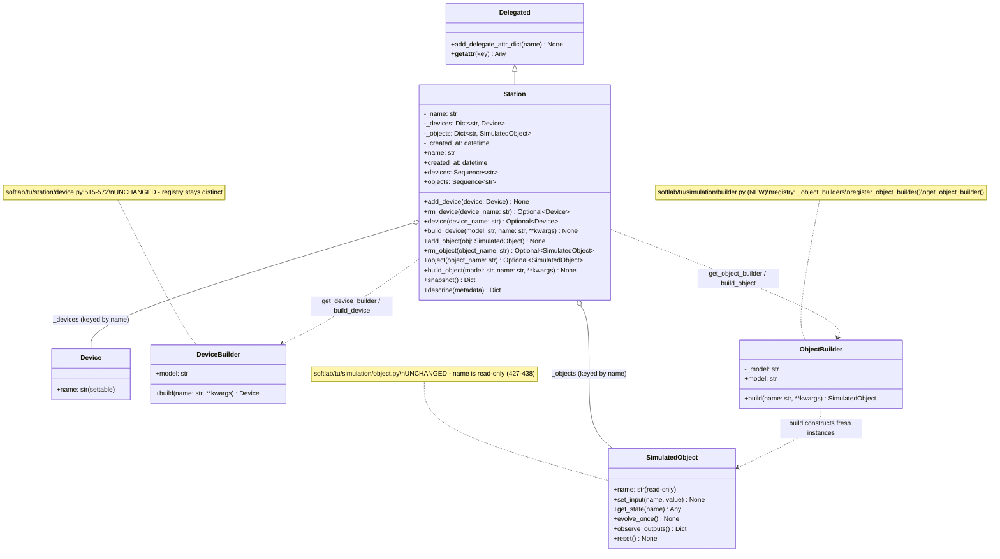
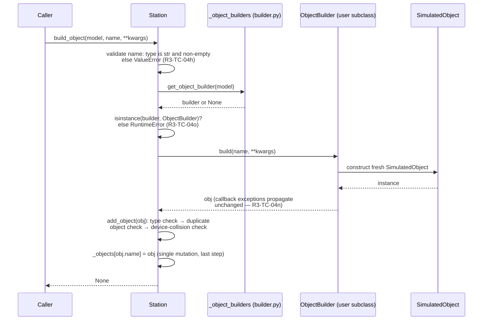
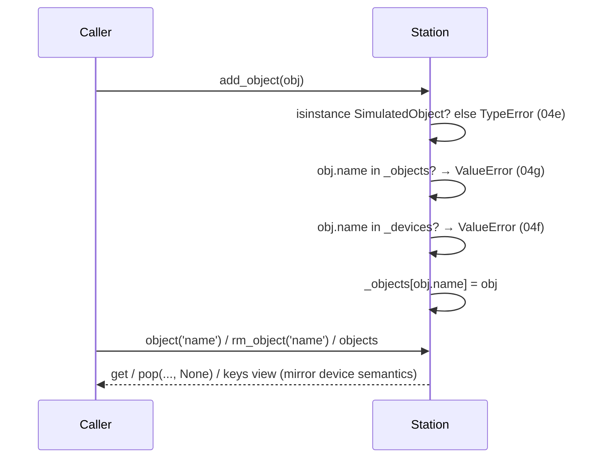

# Detailed Design — R3-002: Object builder/registry and station object membership

## Design Information

- **Designer**: sw-celeste
- **Date**: 2026-10-07
- **Task**: R3-002 — object builder/registry and station object membership,
  explicit lookup, naming, build failure safety and independent instances
  ([tasks.md](../tasks.md) row 2)
- **References**:
  - Requirements: [prd.md](../prd.md) — R3-AC-04 (membership/builder portion
    only; the connected-removal and shared-active-ownership clauses are
    R3-003/R3-004 scope) and the compatibility/evidence portion of R3-AC-08
  - Approved test plan:
    [r3-002-test-plan.md](../test/r3-002-test-plan.md) (Revision 2) —
    cases R3-TC-04a–04r, R3-TC-08a–08f, CHK-04-1
  - Characterization baseline: [r3-002-baseline.md](../test/r3-002-baseline.md)
    (GAP-1, GAP-2, GAP-3; C-1…C-6)
  - Architecture: [arch.md](../../../arch.md) (current) and
    [architecture-plan.md](../architecture-plan.md) lines 29–34 and 88–94
    (planned builder/registry/membership capability — realized here, not
    redesigned)
  - Design convention authority:
    [r3-001-detailed-design.md](r3-001-detailed-design.md)
  - Code under change: `softlab/tu/station/station.py`,
    `softlab/tu/simulation/` (new module + package exports);
    convention references `softlab/tu/station/device.py:515–572`
    (DeviceBuilder/registry) and `softlab/tu/simulation/object.py:282–296,
    427–438` (name validation, read-only name)

## Scope guard

Production runtime changes are confined to `softlab/tu/` — concretely to
**three files**, two edited and one new:

1. **NEW** `softlab/tu/simulation/builder.py` — `ObjectBuilder` and the
   model-keyed object-builder registry.
2. **EDIT** `softlab/tu/simulation/__init__.py` — re-export the new public
   names (currently re-exports `SimulatedObject` alone).
3. **EDIT** `softlab/tu/station/station.py` — object membership storage,
   `add_object`/`rm_object`/`object`/`objects`/`build_object`, one additive
   guard inside `add_device`, class-docstring update.

Explicitly **not** changed: `softlab/tu/simulation/object.py` (the
R3-001-corrected file stays untouched — zero regression risk to its 12
pinned cases), `softlab/tu/station/device.py` (DeviceBuilder and its
registry are preserved byte-for-byte; no refactor into any shared/fluent
builder), `softlab/jin/` (the existing `Delegated` mechanism is reused
as-is), `huo`/`shui`/`mu`. No connected-simulation code (no coordinator,
edges, ownership, `sim_dt`, tick or reset) — that is R3-003 scope, and
CHK-04-1 enforces its absence from this task's diff. No snapshot/describe
schema change. No new third-party dependencies; no Python-support change.
Release 1 debt (OBS-004/005/006, DEFECT-2, including the device-side
rename-after-add key orphaning C-3) stays tracked and untouched.

## Overview

The design mirrors the existing, characterized device-membership and
device-builder conventions for a second member kind — `SimulatedObject` —
with three deliberate tightenings where the device convention is either
inapplicable or defective:

1. **Membership**: `Station` gains a second member dict
   `self._objects: Dict[str, SimulatedObject]`, keyed by the object's
   (immutable) name, delegated for attribute access exactly like
   `_devices`. `add_object`/`rm_object`/`object`/`objects` mirror
   `add_device`/`rm_device`/`device`/`devices` semantics.
2. **One shared station namespace**: a name may denote at most one member
   across devices and objects; both insertion points reject cross-namespace
   collisions. This is stricter than the device side alone, and is forced
   by the delegation mechanics (see Decision D2) in addition to the PRD's
   no-silent-shadowing rule.
3. **Builder/registry**: a new `ObjectBuilder` base class plus a
   module-global, model-keyed registry in a new
   `softlab/tu/simulation/builder.py` module, mirroring
   `DeviceBuilder`/`_device_builders`/`register_device_builder`/
   `get_device_builder` (device.py:515–572) member for member. The
   registries are fully distinct; `DeviceBuilder` is not touched.
4. **Construction**: `Station.build_object(model, name, **kwargs)` mirrors
   `build_device` (station.py:134–145) with a validate→lookup→build→
   validate→insert ordering that makes every failure leave membership
   bit-identical, and adds entry-point name validation so the `name`
   argument itself is rejected before anything else happens (R3-TC-04h).

No rename-after-add defect can exist on the object side: `SimulatedObject.name`
is a read-only property with no setter (object.py:427–438), so the membership
key equals the object name for the object's entire lifetime (Decision D3).

## Design decisions

### D1 — Membership storage: a second dict on `Station`, delegated

`Station.__init__` gains `self._objects: Dict[str, SimulatedObject] = {}`
followed by `self.add_delegate_attr_dict('_objects')`, immediately after the
existing `_devices` setup (station.py:45–46). The key is always
`obj.name`; the value is the object itself.

- **Why a dict keyed by name**: mirrors `_devices` exactly; O(1) explicit
  lookup; the delegation machinery (`Delegated.__getattr__`,
  softlab/jin/misc/delegated.py:35–63) then gives objects the same
  attribute-access behavior devices already have, including the documented
  precedence rule (real members win because `__getattr__` only fires on
  normal-lookup failure) and the same `__dir__` enumeration.
- **Why delegation is included at all**: PRD line 81–83 ("Explicit lookup
  remains available for names colliding with station methods") only has
  meaning if attribute access otherwise exists for objects; it is the
  OBS-006 escape-hatch statement applied to a second member kind.
  R3-TC-04d pins the resulting precedence + explicit-lookup pair.
- **Class-level shared delegate sets**: `Delegated.__delegate_attr_dicts`
  is a class attribute shared by all `Delegated` subclasses; registering
  `'_objects'` from `Station.__init__` makes other subclasses' `__getattr__`
  probe a `_objects` attribute they do not have — harmless, because the
  probe is `getattr(self, name, None)` and a `None` result is skipped
  (delegated.py:45–48). This is exactly how `'_parameters'` already
  behaves for `Station` (which has no `_parameters`). No `jin` change.
- **Snapshot/describe unchanged**: `Station.snapshot()` and
  `Station.describe()` keep their legacy device-only shape (architecture
  plan line 93–94: "Preserve legacy device-only snapshot and description
  contracts; any simulation description must be additive and inert"). The
  object membership listing required by R3-TC-04a is the new `objects`
  property. Whether a future additive, inert simulation description node
  is added is R3-003+ design work, explicitly not decided here.

### D2 — Naming: one shared station namespace, enforced at both insertion points

A station name identifies at most one member, across both kinds:

- `add_object` rejects a name already present in `_objects` (duplicate
  object — R3-TC-04g) **or** in `_devices` (cross-namespace shadowing —
  R3-TC-04f).
- `add_device` gains one **additive** guard rejecting a name already
  present in `_objects`.

Justification, in decreasing weight:

1. **Delegation determinism.** `Delegated.__getattr__` iterates
   `__delegate_attr_dicts`, a `set` of `str`, in unspecified order
   (delegated.py:17, 40–49). Under CPython string-hash randomization
   (default `PYTHONHASHSEED`), that iteration order is stable only within
   one interpreter process; it is **not** guaranteed stable across runs.
   If the same key existed in both `_devices` and `_objects`,
   attribute-style access would resolve to one or the other
   nondeterministically — unspecified order that may vary across
   interpreter runs, order-dependent and unprincipled. The shared
   namespace makes the situation unreachable.
2. **PRD line 81**: "New object names cannot silently shadow devices or
   another object."
3. **R3-TC-04f** pins the object-side rejection; the device-side guard is
   the symmetric half that keeps the invariant total.

**Compatibility of the `add_device` guard (R3-AC-08)**: the guard fires only
when `device.name in self._objects`. Before this task `_objects` never
exists with content — no object could ever be a station member (GAP-1) — so
no existing call sequence can newly fail. Every existing test, including
R3-TC-04l's device-registry regression, is unaffected. This is an
error-path addition in a previously unreachable state, not a behavior
change. (Alternative considered and rejected: guard only `add_object` and
skip delegation — see D1; it forfeits attribute access the PRD presumes
and still leaves a reachable nondeterministic shadow if delegation were
later added without the guard.)

**Namespace verdict**: one shared namespace per station. Separate
namespaces would either silently shadow (PRD-forbidden) or require
arbitrary precedence rules with no requirement behind them — entities
beyond necessity.

### D3 — Rename: impossible by construction; key == name invariant

`SimulatedObject.name` is a read-only property (object.py:427–438); there
is no setter and `add_object` keys the dict by `obj.name`. Therefore the
membership key equals the object's name for its whole membership lifetime,
and the baseline C-3 device-side defect (rename after add orphans the key)
**cannot** be reproduced on the object side: there is no rename path to
orphan anything. Private-attribute circumvention (`obj._name = ...`) is
outside the public contract, exactly as for every other class in the
repository.

R3-TC-04i is satisfied by the "rename is forbidden for station members"
branch of its expectation — indeed forbidden for all `SimulatedObject`s,
members or not. The `add_object`/`object`/`rm_object` docstrings state the
key == name invariant explicitly so the guarantee is reviewable at the
station boundary rather than only at object.py.

No code is spent on rename handling (no key-follow logic, no rename hook):
the immutability that Release 2 already shipped makes it unnecessary.

### D4 — Builder module placement: new `softlab/tu/simulation/builder.py`

`ObjectBuilder`, `_object_builders`, `register_object_builder` and
`get_object_builder` live in a **new module**
`softlab/tu/simulation/builder.py`, not in `object.py`:

- `object.py` carries the R3-001 corrections and their 12 pinned tests;
  not touching it keeps this task's blast radius minimal (the golden rule
  applied to diffs).
- The module has one responsibility: the construction/registry convention
  for simulated objects — mirroring how `DeviceBuilder` sits next to, but
  separate in concern from, `Device` membership logic.
- **Import direction**: `builder.py` imports `SimulatedObject` from
  `softlab.tu.simulation.object` (type contract only); `station.py` imports
  from `softlab.tu.simulation.builder`. Nothing in `tu.simulation` imports
  `tu.station`, honoring architecture-plan lines 19–20 ("simulation core
  must not depend on Station; Station may compose simulation
  capabilities"). No cycle is created: `tu/__init__.py` imports `station`
  before `simulation`, but `station` importing `simulation.builder` is a
  one-directional edge.

### D5 — Construction ordering: validate → lookup → build → validate → insert

`Station.build_object(model, name, **kwargs)` performs, in order:

1. **Name validation** (R3-TC-04h): reject a non-`str` or empty `name`
   argument with `ValueError` — before any registry read, any build, any
   membership touch. Semantics mirror the `SimulatedObject` constructor
   guard (object.py:293–296: `type(name) is not str or len(name) == 0`),
   deliberately **without** the `str()` coercion the `Device` guard uses
   (device.py:143–145), so the object domain has one consistent name
   contract: names are strings, not stringified arbitrary objects.
2. **Registry lookup** (R3-TC-04o): `get_object_builder(model)`; if the
   result is not an `ObjectBuilder`, raise
   `RuntimeError(f'Failed to get object builder with model {model}')` —
   the verbatim analog of station.py:142–144. The docstring documents this
   error explicitly (CHK-04-1 pins a file/line citation of it).
3. **Build** (R3-TC-04n): `builder.build(name, **kwargs)`. Any exception
   propagates as the identical object — no try/except anywhere on this
   path — and no station state has been touched, so membership is
   bit-identical (`assertIs`-level pinning holds).
4. **Membership validation and insertion** (R3-TC-04p):
   `self.add_object(obj)` performs the type check and both name-collision
   checks before the single dict-store mutation. A rejection here (e.g.
   the built object collides with an existing device name) leaves
   membership unchanged and the pre-existing member untouched.

The composite is `add_object(builder.build(...))` preceded by two pure
checks — exactly the device path's accidental atomicity (baseline §5),
made explicit and extended by the entry-name guard.

### D6 — Already-owned builder results rejected via the key == name invariant

R3-TC-04r / architecture-plan lines 32–33: "a builder returning an
already owned participant is rejected." Mechanism: a builder that returns
the same `SimulatedObject` instance on every `build` call returns, on the
second station insertion, an instance whose (immutable) name is already a
key of `_objects` — the first insertion put it there. `add_object`'s
duplicate-name `ValueError` rejects it; the first member stays unmodified.

No separate identity scan (`obj in self._objects.values()`) is designed:
given D3's key == name invariant, an owned instance's name is always a
live key, so the name check already covers every aliasing path; an O(n)
identity pass would be an entity beyond necessity. The `build_object`
docstring states this reasoning so the guarantee is pinned at the public
entry, and the `ObjectBuilder.build` contract requires each call to return
a **fresh** instance (see interface contract below), making the
well-behaved path obvious and the misbehaving path explicitly rejected.

Instance independence for well-behaved builders (R3-TC-04q) needs no
station machinery at all: two `build` calls construct two
`SimulatedObject`s, and the Release 2 constructor already produces
independent input/state stores with defensive copies (baseline §6). The
design simply never hands out references that would alias.

### D7 — Registry: module-global, distinct, registration constructs nothing

`_object_builders: Dict[str, ObjectBuilder] = {}` is a module-global in
`builder.py`, exactly paralleling `_device_builders` (device.py:556–557):

- **Distinctness** (R3-TC-04k-b, R3-TC-08d): two unrelated dicts in two
  modules; a device builder and an object builder may share a model string
  without interference; existing device registrations are untouched.
- **Duplicate rejection** (R3-TC-04k-a): `ValueError` naming the model,
  mirroring device.py:564–566.
- **Type guard**: non-`ObjectBuilder` registration → `TypeError`,
  mirroring device.py:562–563.
- **No construction at registration** (R3-TC-04k-c): `register_object_builder`
  stores the builder and calls nothing on it; `build` invocation counts
  stay zero until `build_object` runs.
- **Global-state test hygiene**: testers isolate with
  `patch.dict(softlab.tu.simulation.builder._object_builders, {},
  clear=True)`, the established pattern from
  test_tu_contracts.py:184–186 (test-plan risk note 5). The design keeps
  the registry a plain module-level dict so that pattern works unchanged.

### D8 — Lookup/removal/listing semantics mirror the device side

- `object(name)` → `Optional[SimulatedObject]`: `dict.get`, `None` for a
  missing name — mirrors `device()` (station.py:130–132), including the
  OBS-006 escape-hatch role for method-name collisions (R3-TC-04d).
- `rm_object(name)` → `Optional[SimulatedObject]`: lenient
  `pop(name, None)`; removing a missing name is a no-op returning `None` —
  mirrors `rm_device` (station.py:126–128; R3-TC-04c, baseline C-4). No
  cleanup is performed on the removed object (PRD line 83–84: "removal
  performs no hardware cleanup"; objects hold no hardware anyway).
- `objects` property → `Sequence[str]`: `self._objects.keys()`, the live
  key view — mirrors `devices` (station.py:59–62; R3-TC-04a "appears
  exactly once in the membership listing"). A live view (not a snapshot
  tuple) is the existing convention; consistency beats novelty.
- Connected-removal rejection (removal of an object participating in an
  active coordinated simulation) is **not** part of `rm_object` in this
  task — it is R3-003/R3-004 scope per the test-plan scope split; the
  method's docstring carries a forward note only.

## Component/Module Structure

### Static structure



### Dynamic behavior

Successful construction (`build_object`):



Failure paths (all leave membership bit-identical):

```mermaid
sequenceDiagram
    participant U as Caller
    participant S as Station
    participant B as ObjectBuilder

    rect rgb(255, 240, 240)
        note over S,B: R3-TC-04n — builder raises in build
        U->>S: build_object(model, name)
        S->>B: build(name, **kwargs)
        B-->>S: raise E (original exception object)
        S-->>U: raise E unchanged (assertIs); _objects/_devices untouched
    end
    rect rgb(240, 240, 255)
        note over S,B: R3-TC-04p — membership validation fails after successful build
        U->>S: build_object(model, 'acc')  [device 'acc' exists]
        S->>B: build('acc', **kwargs)
        B-->>S: obj (valid)
        S->>S: add_object: 'acc' in _devices → ValueError
        S-->>U: ValueError; device 'acc' untouched; no insertion
    end
```

Membership operations:



## Interface Definitions

All new public interfaces follow the repository docstring convention
(Args / Returns / Errors / Side-effects) established in Release 1/2 and
used in the R3-001 design. Signatures below are the contract; sw-tom
implements them verbatim.

### Interface: `ObjectBuilder` — `softlab/tu/simulation/builder.py` (NEW)

- **Purpose**: builder interface to generate specific simulated objects;
  the direct analog of `DeviceBuilder` (device.py:515–553). Builders
  differ by their `model` identity; every concrete subclass implements
  `build`.
- **Module location**: `softlab/tu/simulation/builder.py`; re-exported by
  `softlab/tu/simulation/__init__.py`.

```python
class ObjectBuilder():
    def __init__(self, model: str) -> None: ...
    @property
    def model(self) -> str: ...
    def __repr__(self) -> str: ...
    def build(self, name: str, **kwargs: Any) -> SimulatedObject: ...
```

| Method | Parameters | Returns | Description |
| ------ | ---------- | ------- | ----------- |
| `__init__` | `model: str` | — | Stores the builder model identity. `model = str(model)` then reject empty with `ValueError('Empty object builder model')` — mirrors device.py:523–533. |
| `model` (property) | — | `str` | Builder model identity (read-only). |
| `__repr__` | — | `str` | `f'<ObjectBuilder>{self.model}'` — mirrors device.py:540–541. |
| `build` | `name: str`, `**kwargs: Any` | `SimulatedObject` | Construct an object; base raises `NotImplementedError` — mirrors device.py:543–553. |

- **`build` contract for subclasses** (stated in the base-class `build`
  docstring; the station relies on it):
  - MUST return a `SimulatedObject`.
  - MUST return a **fresh instance per call**, constructed within the
    call; MUST NOT return an instance already returned by an earlier
    `build` call or otherwise owned (e.g. already a station member).
    Station insertion rejects an already-owned result via the
    duplicate-name check (Decision D6), so non-conforming builders fail
    loudly on the second insertion rather than aliasing mutable state.
  - SHOULD honor the `name` argument as the constructed object's name;
    the station inserts under `obj.name`.
  - MAY raise any exception; the exception object propagates through
    `Station.build_object` unchanged and station membership is left
    untouched.
- **Contract invariants**: `model` is a non-empty string for the life of
  the builder; registration constructs nothing.

### Interface: object-builder registry — `softlab/tu/simulation/builder.py`

```python
_object_builders: Dict[str, ObjectBuilder] = {}
"""Global dictionary of object builders"""

def register_object_builder(builder: ObjectBuilder) -> None: ...
def get_object_builder(model: str) -> Optional[ObjectBuilder]: ...
```

| Function | Parameters | Returns | Description |
| -------- | ---------- | ------- | ----------- |
| `register_object_builder` | `builder: ObjectBuilder` | `None` | Register an object builder. `TypeError` if not an `ObjectBuilder`; `ValueError(f'Object builder with model {builder.model} has exist')` on duplicate model. Stores the builder; **constructs nothing** (no `build` call). Mirrors device.py:560–567. |
| `get_object_builder` | `model: str` | `Optional[ObjectBuilder]` | Return the registered builder for `model`, `None` if non-exist. Mirrors device.py:570–572. |

- **Contract**: the registry is fully distinct from `_device_builders`;
  identical model strings in the two registries do not collide
  (R3-TC-04k-b, R3-TC-08d). Registration is idempotent-safe only by
  rejection — re-registering the same model is an error, never an
  overwrite.

### Interface: `Station` object membership — `softlab/tu/station/station.py`

```python
class Station(Delegated):
    def __init__(self, name: str) -> None:
        # ... existing body unchanged ...
        self._objects: Dict[str, SimulatedObject] = {}
        self.add_delegate_attr_dict('_objects')

    @property
    def objects(self) -> Sequence[str]: ...

    def add_object(self, obj: SimulatedObject) -> None: ...
    def rm_object(self, object_name: str) -> Optional[SimulatedObject]: ...
    def object(self, object_name: str) -> Optional[SimulatedObject]: ...
    def build_object(self, model: str, name: str, **kwargs: Any) -> None: ...
```

| Method | Parameters | Returns | Description |
| ------ | ---------- | ------- | ----------- |
| `objects` (property) | — | `Sequence[str]` | Live key view of object member names (`self._objects.keys()`), mirroring `devices`. |
| `add_object` | `obj: SimulatedObject` | `None` | Add an object under `obj.name`. Errors below. |
| `rm_object` | `object_name: str` | `Optional[SimulatedObject]` | Lenient `pop(str(object_name), None)`; returns the removed object, `None` if non-exist. No cleanup of the removed object. |
| `object` | `object_name: str` | `Optional[SimulatedObject]` | Explicit lookup; `None` if non-exist. The escape hatch for names colliding with station methods (OBS-006 pattern). |
| `build_object` | `model: str`, `name: str`, `**kwargs: Any` | `None` | Validate `name`, look up builder, build, add. Errors below. |

**`add_object` contract**:

- Args: `obj` — the simulated object to add; inserted under its own
  (read-only) name.
- Returns: `None`.
- Errors:
  - `TypeError(f'Invalid object type {type(obj)}')` — `obj` is not a
    `SimulatedObject` (R3-TC-04e).
  - `ValueError(f'Object with name {obj.name} has exist')` — name already
    held by an object member (R3-TC-04g).
  - `ValueError(f'Object name {obj.name} collides with an existing device')`
    — name already held by a device member (R3-TC-04f).
- Side-effects: on success only, one insertion into `_objects`; on any
  error, membership is unchanged. Key == name invariant: because
  `SimulatedObject.name` is read-only, the membership key always equals
  the object's current name (Decision D3).

**`object` contract**: `self._objects.get(str(object_name), None)`; pure
lookup, never invokes object callbacks; mirrors `device()`.

**`rm_object` contract**: `self._objects.pop(str(object_name), None)`;
mirrors `rm_device`. Forward note in docstring: removal of an object
enrolled in an active coordinated simulation will be rejected by the
R3-003 ownership layer, not by this method.

**`build_object` contract** (the CHK-04-1-pinned docstring):

- Args:
  - `model` — builder model key in the object-builder registry.
  - `name` — object name for the constructed member; must be a non-empty
    `str`.
  - `kwargs` — builder-specific construction arguments.
- Returns: `None`.
- Errors (each leaves station membership — devices and objects —
  unchanged; nothing is partially registered or inserted):
  - `ValueError` — `name` is not a `str` or is empty, validated before
    any registry access or construction (R3-TC-04h).
  - `RuntimeError(f'Failed to get object builder with model {model}')` —
    no object builder registered under `model` (R3-TC-04o; this
    documented `RuntimeError` is the unknown-model error whose docstring
    citation CHK-04-1 records).
  - any exception raised by the builder's `build` — propagates as the
    identical exception object, never caught, wrapped or replaced
    (R3-TC-04n).
  - `TypeError`/`ValueError` from `add_object` — the built object fails
    membership validation (R3-TC-04p).
- Side-effects: on success only, the constructed object is inserted under
  `obj.name` and becomes retrievable via `object()` and attribute
  delegation. Exactly one `build` call per `build_object` call. A builder
  returning an already-owned instance is rejected by the duplicate-name
  check (Decision D6).

**`add_device` additive guard** (one `if`, inserted after the existing
type check, before the duplicate-device check):

- `ValueError(f'Device name {device.name} collides with an existing '
  f'object')` — the name is already held by an object member.
- Compatibility: fires only when an object member with that name exists,
  a state unreachable before this task (Decision D2); no existing call
  sequence changes behavior.

**Station class docstring** is updated additively: property list gains
`objects`; method list gains `add_object`, `rm_object`, `object`,
`build_object`; the shared-namespace rule and the device/object lookup
separation are stated in one paragraph.

## Data Structures

### `Station._objects`

| Field | Type | Description | Constraints |
| ----- | ---- | ----------- | ----------- |
| `Station._objects` | `Dict[str, SimulatedObject]` | Object membership store, key = member's read-only `name` | Keys are non-empty `str` (guaranteed by the `SimulatedObject` constructor); disjoint from `_devices` keys (shared namespace, Decision D2); inserted only via `add_object`/`build_object` after all validation passes |

### `_object_builders`

| Field | Type | Description | Constraints |
| ----- | ---- | ----------- | ----------- |
| `builder._object_builders` | `Dict[str, ObjectBuilder]` | Module-global model-keyed registry | Keys are non-empty `str` model identities; distinct from `device._device_builders`; written only by `register_object_builder`; registration never calls `build` |

No other data structures are introduced. No per-station registries, no
weak references, no identity indexes — the two dicts above are the
complete new state (Decisions D6, D7).

## Algorithms

### `Station.build_object` — ordered validation and insertion

- **Purpose**: construct a simulated object via the registry and insert
  it, with total failure atomicity for station membership.
- **Complexity**: Time O(1) plus the builder's own `build` cost; Space O(1)
  beyond the built object.
- **Pseudocode**:

  ```
  def build_object(model, name, **kwargs):
      # gate 1 — entry argument (R3-TC-04h); before any other access
      if type(name) is not str or len(name) == 0:
          raise ValueError('Object name must be a non-empty str, got '
                           + repr(name))
      # gate 2 — registry (R3-TC-04o)
      builder = get_object_builder(model)
      if not isinstance(builder, ObjectBuilder):
          raise RuntimeError('Failed to get object builder with model '
                             + str(model))
      # build — user code; original exception object propagates (04n)
      obj = builder.build(name, **kwargs)
      # gates 3-5 and the single mutation — inside add_object (04e/f/g/p)
      self.add_object(obj)
  ```

- **Edge cases**:
  - Invalid name **and** unknown model: the `ValueError` wins (gate order
    is part of the contract, so tests can rely on it).
  - Builder raises: gates 1–2 are pure reads; no mutation has occurred.
  - Builder returns a non-`SimulatedObject`: `add_object` `TypeError`
    before insertion.
  - Builder returns a valid object whose name collides (with an object or
    a device): `add_object` `ValueError` before insertion; the
    pre-existing member is untouched (R3-TC-04p).
  - Builder returns the same instance twice: second insertion hits the
    duplicate-name `ValueError` (Decision D6; R3-TC-04r).

### `add_object` — guarded single-store insertion

- **Pseudocode**:

  ```
  def add_object(obj):
      if not isinstance(obj, SimulatedObject):
          raise TypeError('Invalid object type ' + str(type(obj)))
      if obj.name in self._objects:
          raise ValueError('Object with name ' + obj.name + ' has exist')
      if obj.name in self._devices:
          raise ValueError('Object name ' + obj.name
                           + ' collides with an existing device')
      self._objects[obj.name] = obj
  ```

- **Complexity**: O(1). The mutation is the last statement; every check
  precedes it, so failure atomicity is structural, not try/finally-based.

## Third-Party Dependencies

| Module | Version | Purpose | Justification |
| ------ | ------- | ------- | ------------- |
| — | — | — | **None.** The design uses only the Python standard library (`typing`) and existing repository modules (`softlab.tu.simulation.object`, `softlab.jin.misc.Delegated`). |

**Dependency Principle**: only standard-library and in-repository modules
are used. R3-TC-08e (`git diff dev...HEAD -- pyproject.toml setup.py`
empty) must pass trivially.

## Implementation Notes

- **Order of implementation** (sw-tom):
  1. `softlab/tu/simulation/builder.py` (self-contained; no station
     dependency).
  2. `softlab/tu/simulation/__init__.py` re-exports.
  3. `softlab/tu/station/station.py` membership + `build_object` +
     `add_device` guard + class docstring.
  4. Run existing suite after each step (R3-TC-08a anchor: 147 tests OK).
- **Import placement in `station.py`**: import `SimulatedObject`,
  `ObjectBuilder` and `get_object_builder` from `softlab.tu.simulation`
  (the package `__init__`), keeping one import site; do not import
  `softlab.tu.station` from anything under `softlab/tu/simulation/`
  (architecture-plan import direction, Decision D4).
- **`__init__` ordering**: in `Station.__init__`, create `_objects` and
  register the delegate dict immediately after the existing `_devices`
  lines; `objects` must exist before any delegated attribute access can
  probe it, same as `_devices` today.
- **Do not touch `object.py` or `device.py`.** The only edits in
  `station.py` are additive except the one-line `add_device` guard; the
  `build_device` body must remain byte-identical (R3-TC-04l pins its
  behavior; R3-TC-08c pins unmodified existing suites).
- **Docstring style**: match the surrounding `station.py` style for the
  short member methods and the Release 2 structured style
  (Args/Returns/Errors/Side-effects) for `build_object`, `ObjectBuilder`
  and the registry functions. `build_object`'s docstring MUST name the
  unknown-model `RuntimeError` — CHK-04-1 cites it by file/line.
- **Pitfalls**:
  - Do not coerce `name` with `str()` in `build_object` gate 1 — the
    object domain rejects non-strings (Decision D5); coercing would make
    R3-TC-04h's `name=123` silently valid.
  - Do not add an `objects` node to `snapshot()`/`describe()` — the
    legacy device-only shape is pinned (Decision D1).
  - Do not register `'_objects'` as omitted delegate attrs; delegation
    must work for non-colliding names (Decision D1).
  - Black line width 80, target py39 (pyproject.toml); type annotations
    on all new public API.

## Traceability

| Design element | Test case(s) | Acceptance criterion |
| -------------- | ------------ | -------------------- |
| `Station._objects` dict + `add_object` + `object()` + `objects` property (D1, D8) | R3-TC-04a | R3-AC-04 object membership |
| Separate `object()`/`device()` lookups over separate dicts (D1) | R3-TC-04b | R3-AC-04 object membership |
| `rm_object` lenient pop (D8) | R3-TC-04c | R3-AC-04 object membership |
| `_objects` delegation + real-member precedence + explicit `object()` lookup (D1) | R3-TC-04d | R3-AC-04 explicit lookup |
| `add_object` `TypeError` type guard (D8) | R3-TC-04e | R3-AC-04 object membership |
| Shared namespace: `add_object` device-collision `ValueError` (D2) | R3-TC-04f | R3-AC-04 naming |
| `add_object` duplicate-object `ValueError` (D2) | R3-TC-04g | R3-AC-04 naming |
| `build_object` gate 1: non-str/empty `name` → `ValueError` before any mutation (D5) | R3-TC-04h | R3-AC-04 naming |
| Read-only `SimulatedObject.name` + key == name invariant; no rename path (D3) | R3-TC-04i | R3-AC-04 naming |
| `ObjectBuilder` model/build convention mirroring `DeviceBuilder` (D4) | R3-TC-04j | R3-AC-04 builder discovery/construction |
| Registry: duplicate `ValueError`, distinct dict, no construction at registration (D7) | R3-TC-04k | R3-AC-04 builder discovery/construction |
| `device.py` untouched; `build_device` body unchanged (scope guard) | R3-TC-04l | R3-AC-04 existing device use compatible; R3-AC-08 |
| `Station.build_object` = registry lookup + build + `add_object` (D5) | R3-TC-04m | R3-AC-04 builder discovery/construction |
| `build_object`: no try/except on build path; mutation only in final `add_object` store (D5) | R3-TC-04n | R3-AC-04 failed-build safety |
| `build_object` gate 2 `RuntimeError` + documented docstring (D5; CHK-04-1 citation target) | R3-TC-04o | R3-AC-04 failed-build safety |
| `add_object` validation precedes insertion; pre-existing member untouched (D5) | R3-TC-04p | R3-AC-04 failed-build safety |
| Fresh instance per `build` contract + Release 2 constructor independence; no aliasing machinery added (D6) | R3-TC-04q | R3-AC-04 independent instances |
| Already-owned rejection via key == name invariant + duplicate check (D6) | R3-TC-04r | R3-AC-04 independent instances |
| No production change beyond the three listed files; device paths untouched (scope guard) | R3-TC-08a, 08b, 08c | R3-AC-08 compatibility/evidence |
| `_object_builders` separate module-global; `device.py` byte-untouched (D7) | R3-TC-08d | R3-AC-08 compatibility |
| Zero third-party dependencies (Third-Party Dependencies table) | R3-TC-08e | R3-AC-08 compatibility |
| (CI run — process evidence, no design element) | R3-TC-08f | R3-AC-08 evidence |
| Diff confined to `softlab/tu/`; no coordinator/edge/clock code; `build_object` docstring names `RuntimeError` (scope guard, D5) | CHK-04-1 | R3-AC-08 scope gate |

Every [PLAN] case in the approved test plan maps to at least one design
element; every design element except the `add_device` additive guard maps
to at least one case. The `add_device` guard is justified by Decision D2
(delegation determinism + namespace totality) and verified indirectly by
R3-TC-04b/04f/08c.

## Open questions for the architect (sw-jerry)

1. **`add_device` additive guard** (Decision D2): the design adds one
   `ValueError` path to an existing public method. It is unreachable from
   any pre-R3-002 call sequence and required for delegation determinism,
   but it is technically a behavior addition to device-side code.
   Confirmation requested that this is preferred over the rejected
   alternative (object-side-only guard + no object attribute delegation),
   which would forfeit the attribute-access symmetry the PRD's
   explicit-lookup clause presumes.
2. **Snapshot/describe stay device-only** (Decision D1): object
   membership is listed via the `objects` property only in this task; any
   additive simulation node in `snapshot()`/`describe()` is deferred to
   R3-003. Confirmation requested that no Release 3 requirement needs an
   object entry in the legacy snapshot now.
3. **Unknown-model error class**: `RuntimeError` is chosen verbatim from
   the device analog (station.py:142–144) per test-plan risk note 3,
   which leaves the class to design. Flagging for visibility only; no
   change anticipated.

## Design Review

- **Reviewer**: sw-jerry
- **Review Date**: 2026-10-07
- **Status**: APPROVED at `6973d9b` — review report:
  [r3-002-design-review.md](../reviews/r3-002-design-review.md)
- **Architect rulings on the three open questions** (all **ACCEPT**):
  1. `add_device` additive cross-namespace guard (D2) — **ACCEPT**; the
     guard realizes planned architecture (architecture-plan.md lines
     90–92) and is an error-path addition in a previously unreachable
     state, preserving R3-AC-08. Companion ruling: sw-mike **may** extend
     the R3-TC-04b fixture at implementation time to attempt the
     device-side insertion (`add_device` with a name already held by an
     object) and assert rejection — this pins already-planned behavior
     and requires **no** test-plan revision; either disposition must be
     recorded in the results document.
  2. `snapshot()`/`describe()` remain device-only with additive
     simulation node deferred to R3-003 (D1) — **ACCEPT**; no Release 3
     requirement needs an object entry in the legacy snapshot now.
  3. `RuntimeError` for unknown model (D5 gate 2) — **ACCEPT**; verbatim
     analog of the device convention (station.py:142–144), authorized by
     test-plan risk note 3.
- **Issue 1 (minor, D2 justification 1) — CLOSED**: the parenthetical
  "run-to-run stable" understated the nondeterminism; under hash
  randomization the set iteration order can vary **across interpreter
  runs**. The D2 justification text is corrected in this commit
  (resolution order unspecified, may vary across runs). Architectural
  conclusion unaffected — strengthened. No test-plan impact
  (R3-TC-04f/04g pin rejection, not iteration order). Closed by
  sw-celeste, 2026-10-07.
